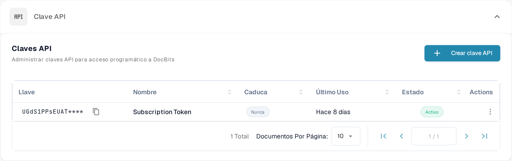

# Llamadas a la API y Ejemplos

Una solicitud de API permite que otro programa lea o actualice información en DocBits. Empieza con una solicitud de solo lectura para comprobar la conexión sin modificar documentos.

## Antes de enviar una solicitud

1. Pide acceso a un administrador de la organización y [crea una clave API](api-key-management.md) para la integración. Guarda la clave en un almacén de secretos; no la incluyas en una captura de pantalla, un documento ni un archivo de código fuente.
2. Abre la [referencia actual de la API de Sandbox](https://sandbox.api.docbits.com/docs). Enumera las operaciones disponibles, los valores obligatorios y las respuestas de ejemplo de ese entorno. Usa la referencia de tu propio entorno cuando dejes el Sandbox.

<figure><figcaption><p>Encuentra las claves API en Settings → Integration &amp; SSO. La imagen no contiene ningún valor de clave.</p></figcaption></figure>

## Ejemplo: leer tipos de documento

La referencia de Sandbox incluye **GET `/document_type/get_document_types`**. Devuelve los tipos de documento disponibles para tu organización. `GET` lee información; no crea ni modifica ningún documento.

Define tu clave API como variable de entorno local y envía la solicitud:

```sh
curl --fail-with-body \
  -H "X-API-KEY: ${DOCB...EY}" \
  "https://sandbox.api.docbits.com/sandbox-api/document_type/get_document_types"
```

Una respuesta correcta contiene `success: true` y una lista `data` con los tipos de documento. Una respuesta `401` significa que la solicitud no estaba autenticada; comprueba la clave y el entorno antes de reintentar. La URL de arriba es solo para el Sandbox.

## Encuentra la siguiente operación

En la referencia de la API, busca lo que quieras hacer, lee la descripción y los campos obligatorios de esa operación y comprueba si usa `GET`, `POST` u otro método. Usa la respuesta de ejemplo de la referencia para confirmar el resultado. Para un recorrido con Postman, consulta [Postman para DocBits](../../../../advanced-functions-and-tools/postman-for-docbits/README.md); verifica sus URLs de ejemplo más antiguas contra la referencia actual de la API antes de enviar una solicitud.

Las cuatro imágenes antiguas de esta página describían API genéricas de OCR, NLP, conversión de archivos y gestión de documentos sin mostrar endpoints verificados de DocBits. Se han eliminado; solo la operación documentada de DocBits de arriba se presenta como ejemplo ejecutable.
