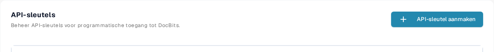

# API-aanroepen en voorbeelden

Met een API-aanraag kan een ander programma informatie in DocBits lezen of bijwerken. Begin met een alleen-lezen-aanraag, zodat u de verbinding kunt controleren zonder documenten te wijzigen.

## Voordat u een aanraag verzendt

1. Vraag een organisatiebeheerder om toegang en [maak een API-sleutel](api-key-management.md) voor de integratie. Bewaar de sleutel in een kluis voor geheime gegevens; zet hem niet in een screenshot, document of bronbestand.
2. Open de [actuele Sandbox API-referentie](https://sandbox.api.docbits.com/docs). Daar staan de beschikbare bewerkingen, de vereiste waarden en voorbeeldantwoorden voor die omgeving. Gebruik de referentie van uw eigen omgeving zodra u de Sandbox verlaat.

<figure><figcaption><p>U vindt API-sleutels onder Instellingen → Integratie en SSO. De afbeelding bevat geen sleutelwaarde.</p></figcaption></figure>

## Voorbeeld: documenttypen lezen

De Sandbox-referentie vermeldt **GET `/document_type/get_document_types`**. Deze geeft de documenttypen terug die voor uw organisatie beschikbaar zijn. `GET` leest informatie; het maakt of wijzigt geen document.

Stel uw API-sleutel in als lokale omgevingsvariabele en verzend daarna de aanraag:

```sh
curl --fail-with-body \
  -H "X-API-KEY: ${DOCB...EY}" \
  "https://sandbox.api.docbits.com/sandbox-api/document_type/get_document_types"
```

Een geslaagd antwoord bevat `success: true` en een `data`-lijst met documenttypen. Een `401`-antwoord betekent dat de aanraag niet is geverifieerd; controleer de sleutel en de omgeving voordat u het opnieuw probeert. De URL hierboven geldt alleen voor de Sandbox.

## De volgende bewerking vinden

Zoek in de API-referentie naar wat u wilt doen, lees de beschrijving en de verplichte velden van die bewerking en controleer of deze `GET`, `POST` of een andere methode gebruikt. Gebruik het voorbeeldantwoord in de referentie om het resultaat te bevestigen. Voor een Postman-handleiding zie [Postman for DocBits](../../../../advanced-functions-and-tools/postman-for-docbits/README.md); controleer de oudere voorbeeld-URL's ervan aan de hand van de actuele API-referentie voordat u een aanraag verzendt.

De vier oudere afbeeldingen op deze pagina beschreven generieke OCR-, NLP-, bestandsconversie- en documentbeheer-API's zonder geverifieerde DocBits-eindpunten te tonen. Ze zijn verwijderd; als uitvoerbaar voorbeeld wordt alleen de hierboven documenteerde DocBits-bewerking gepresenteerd.
