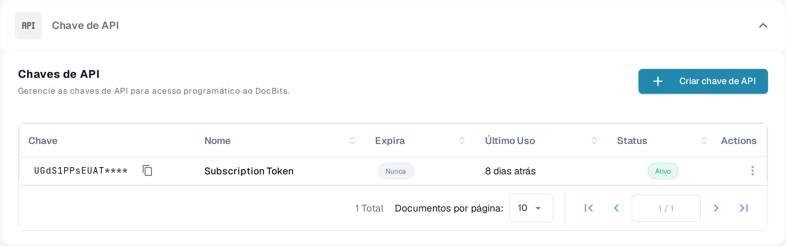

# Chamadas de API e Exemplos

Uma chamada de API permite que outro programa leia ou atualize informações no DocBits. Comece com uma chamada somente de leitura para verificar a conexão sem alterar documentos.

## Antes de enviar uma chamada

1. Peça acesso a um administrador da organização e [crie uma chave de API](api-key-management.md) para a integração. Guarde a chave num cofre de segredos; não a coloque numa captura de tela, documento ou arquivo de código-fonte.
2. Abra a [referência atual da API Sandbox](https://sandbox.api.docbits.com/docs). Ela lista as operações disponíveis, os valores obrigatórios e as respostas de exemplo desse ambiente. Use a referência do seu próprio ambiente quando sair do Sandbox.

<figure><figcaption><p>Você encontra as chaves de API em Configurações → Integração e SSO. A imagem não contém nenhum valor de chave.</p></figcaption></figure>

## Exemplo: ler tipos de documento

A referência do Sandbox lista **GET `/document_type/get_document_types`**. Ela retorna os tipos de documento disponíveis para a sua organização. O `GET` lê informações; ele não cria nem altera um documento.

Defina sua chave de API como uma variável de ambiente local e envie a chamada:

```sh
curl --fail-with-body \
  -H "X-API-KEY: ${DOCB...EY}" \
  "https://sandbox.api.docbits.com/sandbox-api/document_type/get_document_types"
```

Uma resposta bem-sucedida contém `success: true` e uma lista `data` com os tipos de documento. Uma resposta `401` significa que a chamada não foi autenticada; verifique a chave e o ambiente antes de tentar novamente. A URL acima é somente para o Sandbox.

## Encontre a próxima operação

Na referência da API, pesquise o que você quer fazer, leia a descrição e os campos obrigatórios dessa operação e verifique se ela usa `GET`, `POST` ou outro método. Use a resposta de exemplo da referência para confirmar o resultado. Para um passo a passo com Postman, veja [Postman para DocBits](../../../../advanced-functions-and-tools/postman-for-docbits/README.md); verifique as URLs de exemplo mais antigas dele na referência atual da API antes de enviar uma chamada.

As quatro imagens antigas desta página descreviam APIs genéricas de OCR, NLP, conversão de arquivos e gestão de documentos sem mostrar endpoints verificados do DocBits. Elas foram removidas; somente a operação DocBits documentada acima é apresentada como exemplo executável.
