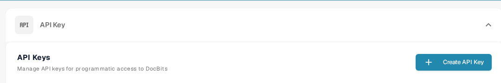

# API Calls and Examples

An API request lets another program read or update information in DocBits. Start with a read-only request so you can check the connection without changing documents.

## Before you send a request

1. Ask an organization administrator for access and [create an API key](api-key-management.md) for the integration. Keep the key in a secret store; do not put it in a screenshot, document, or source file.
2. Open the [current Sandbox API reference](https://sandbox.api.docbits.com/docs). It lists the available operations, required values, and example responses for that environment. Use the reference for your own environment when you leave the Sandbox.

<figure><figcaption><p>Find API keys under Settings → Integration &amp; SSO. The image contains no key value.</p></figcaption></figure>

## Example: read document types

The Sandbox reference lists **GET `/document_type/get_document_types`**. It returns the document types available to your organization. `GET` reads information; it does not create or change a document.

Set your API key as a local environment variable, then send the request:

```sh
curl --fail-with-body \
  -H "X-API-KEY: ${DOCBITS_API_KEY}" \
  "https://sandbox.api.docbits.com/sandbox-api/document_type/get_document_types"
```

A successful response contains `success: true` and a `data` list of document types. A `401` response means the request was not authenticated; check the key and the environment before retrying. The URL above is for the Sandbox only.

## Find the next operation

In the API reference, search for what you want to do, read that operation's description and required fields, and check whether it uses `GET`, `POST`, or another method. Use the reference's example response to confirm the result. For a Postman walkthrough, see [Postman for DocBits](../../../../advanced-functions-and-tools/postman-for-docbits/README.md); verify its older example URLs against the current API reference before sending a request.

The four older images on this page described generic OCR, NLP, file conversion, and document-management APIs without showing verified DocBits endpoints. They have been removed; only the documented DocBits operation above is presented as an executable example.
