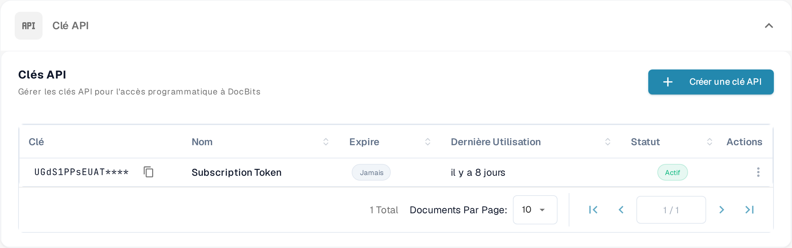

# Appels API et Exemples

Une requête API permet à un autre programme de lire ou de mettre à jour des informations dans DocBits. Commencez par une requête en lecture seule : vous vérifiez la connexion sans modifier de document.

## Avant d'envoyer une requête

1. Demandez l'accès à un administrateur de l'organisation et [créer une clé API](api-key-management.md) pour l'intégration. Conservez la clé dans un coffre secret ; ne la mettez jamais dans une capture d'écran, un document ou un fichier source.
2. Ouvrez la [référence API Sandbox actuelle](https://sandbox.api.docbits.com/docs). Elle liste les opérations disponibles, les valeurs requises et des exemples de réponse pour cet environnement. Utilisez la référence de votre propre environnement quand vous quittez le Sandbox.

<figure><figcaption><p>Vous trouvez les clés API sous Settings → Integration &amp; SSO. L'image ne contient aucune valeur de clé.</p></figcaption></figure>

## Exemple : lire les types de documents

La référence Sandbox liste **GET `/document_type/get_document_types`**. Elle renvoie les types de documents disponibles pour votre organisation. `GET` lit des informations ; il ne crée ni ne modifie aucun document.

Définissez votre clé API comme variable d'environnement locale, puis envoyez la requête :

```sh
curl --fail-with-body \
  -H "X-API-KEY: ${DOCB...EY}" \
  "https://sandbox.api.docbits.com/sandbox-api/document_type/get_document_types"
```

Une réponse réussie contient `success: true` et une liste `data` de types de documents. Une réponse `401` signifie que la requête n'a pas été authentifiée ; vérifiez la clé et l'environnement avant de réessayer. L'URL ci-dessus vaut uniquement pour le Sandbox.

## Trouver l'opération suivante

Dans la référence API, cherchez ce que vous voulez faire, lisez la description et les champs requis de cette opération, et vérifiez si elle utilise `GET`, `POST` ou une autre méthode. Servez-vous de l'exemple de réponse de la référence pour confirmer le résultat. Pour un mode d'emploi Postman, voir [Postman for DocBits](../../../../advanced-functions-and-tools/postman-for-docbits/README.md) ; vérifiez ses anciennes URLs d'exemple contre la référence API actuelle avant d'envoyer une requête.

Les quatre anciennes images de cette page décrivaient des API génériques d'OCR, de NLP, de conversion de fichiers et de gestion documentaire sans montrer de points d'entrée DocBits vérifiés. Elles ont été supprimées ; seule l'opération DocBits documentée ci-dessus est présentée comme exemple exécutable.
