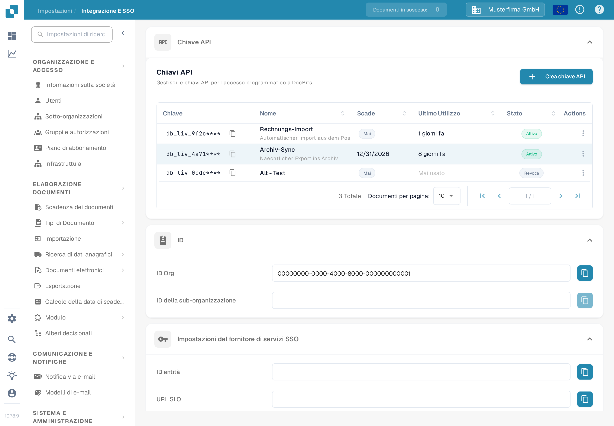

# Chiamate API ed Esempi

Una richiesta API consente a un altro programma di leggere o aggiornare le informazioni in DocBits. Inizia con una richiesta di sola lettura, così puoi verificare la connessione senza modificare i documenti.

## Prima di inviare una richiesta

1. Chiedi l'accesso a un amministratore dell'organizzazione e [crea una chiave API](api-key-management.md) per l'integrazione. Conserva la chiave in un caveau segreto; non inserirla in screenshot, documenti o file sorgente.
2. Apri il [riferimento corrente all'API Sandbox](https://sandbox.api.docbits.com/docs). Elenca le operazioni disponibili, i valori richiesti e gli esempi di risposta per quell'ambiente. Quando lasci il Sandbox, usa il riferimento del tuo ambiente.

<figure><figcaption><p>Trovi le chiavi API in Impostazioni → Integrazione e SSO. L'immagine non contiene alcun valore di chiave.</p></figcaption></figure>

## Esempio: leggere i tipi di documento

Il riferimento Sandbox elenca **GET `/document_type/get_document_types`**. Restituisce i tipi di documento disponibili per la tua organizzazione. `GET` legge le informazioni; non crea né modifica alcun documento.

Imposta la tua chiave API come variabile d'ambiente locale, poi invia la richiesta:

```sh
curl --fail-with-body \
  -H "X-API-KEY: ${DOCB...EY}" \
  "https://sandbox.api.docbits.com/sandbox-api/document_type/get_document_types"
```

Una risposta riuscita contiene `success: true` e un elenco `data` di tipi di documento. Una risposta `401` significa che la richiesta non è stata autenticata; controlla la chiave e l'ambiente prima di riprovare. L'URL qui sopra vale solo per il Sandbox.

## Trovare l'operazione successiva

Nel riferimento API, cerca ciò che vuoi fare, leggi la descrizione e i campi obbligatori di quell'operazione e verifica se usa `GET`, `POST` o un altro metodo. Usa l'esempio di risposta del riferimento per confermare il risultato. Per una guida passo-passo con Postman, vedi [Postman for DocBits](../../../../advanced-functions-and-tools/postman-for-docbits/README.md); verifica i suoi URL di esempio più vecchi rispetto al riferimento API corrente prima di inviare una richiesta.

Le quattro immagini più vecchie di questa pagina descrivevano API generiche di OCR, NLP, conversione file e gestione documentale, senza mostrare endpoint DocBits verificati. Sono state rimosse; come esempio eseguibile viene presentata solo l'operazione DocBits documentata qui sopra.
