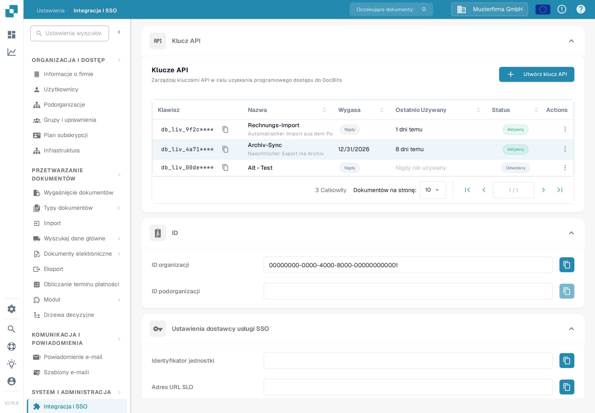

# Wywołania API i przykłady

Żądanie API pozwala innemu programowi odczytywać lub aktualizować informacje w DocBits. Zacznij od żądania tylko do odczytu, aby sprawdzić połączenie bez zmieniania dokumentów.

## Zanim wyślesz żądanie

1. Poproś administratora organizacji o dostęp i [utwórz klucz API](api-key-management.md) dla integracji. Przechowuj klucz w sejfie na sekrety; nie umieszczaj go w zrzucie ekranu, dokumencie ani pliku źródłowym.
2. Otwórz [bieżącą referencję Sandbox API](https://sandbox.api.docbits.com/docs). Znajdziesz w niej dostępne operacje, wymagane wartości i przykładowe odpowiedzi dla tego środowiska. Po opuszczeniu Sandbox korzystaj z referencji właściwej dla Twojego środowiska.

<figure><figcaption><p>Klucze API znajdziesz w Ustawienia → Integracja i SSO. Obraz nie zawiera wartości klucza.</p></figcaption></figure>

## Przykład: odczyt typów dokumentów

Referencja Sandbox wymienia **GET `/document_type/get_document_types`**. Zwraca ona typy dokumentów dostępne dla Twojej organizacji. `GET` odczytuje informacje; nie tworzy ani nie zmienia dokumentu.

Ustaw swój klucz API jako lokalną zmienną środowiskową, a następnie wyślij żądanie:

```sh
curl --fail-with-body \
  -H "X-API-KEY: ${DOCB...EY}" \
  "https://sandbox.api.docbits.com/sandbox-api/document_type/get_document_types"
```

Pomyślna odpowiedź zawiera `success: true` oraz listę `data` z typami dokumentów. Odpowiedź `401` oznacza, że żądanie nie zostało uwierzytelnione; przed ponowieniem sprawdź klucz i środowisko. Powyższy adres URL dotyczy wyłącznie Sandbox.

## Znajdź kolejną operację

W referencji API wyszukaj to, co chcesz zrobić, przeczytaj opis tej operacji i jej wymagane pola oraz sprawdź, czy używa ona metody `GET`, `POST` czy innej. Użyj przykładowej odpowiedzi z referencji, aby potwierdzić wynik. Przewodnik Postman znajdziesz w artykule [Postman dla DocBits](../../../../advanced-functions-and-tools/postman-for-docbits/README.md); przed wysłaniem żądania zweryfikuj jego starsze przykładowe adresy URL z aktualną referencją API.

Cztery starsze obrazy na tej stronie opisywały ogólne API OCR, NLP, konwersji plików i zarządzania dokumentami bez pokazania zweryfikowanych endpointów DocBits. Zostały usunięte; jako wykonalny przykład prezentowana jest wyłącznie udokumentowana operacja DocBits powyżej.
