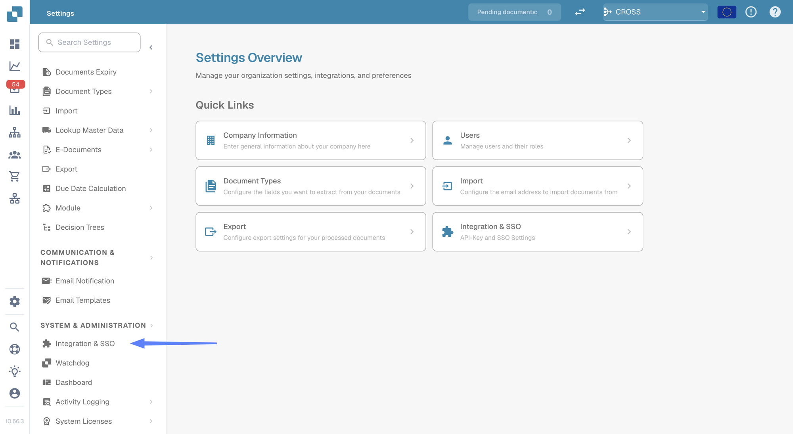
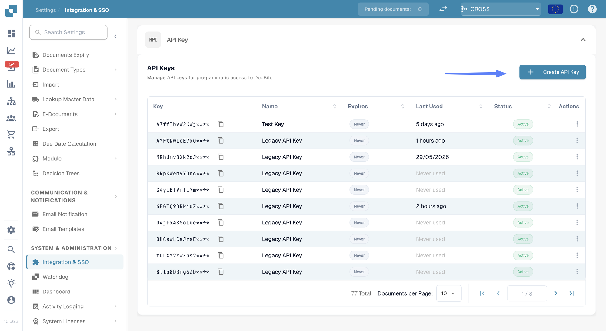
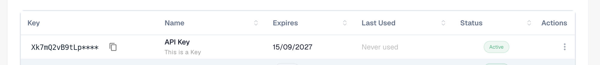
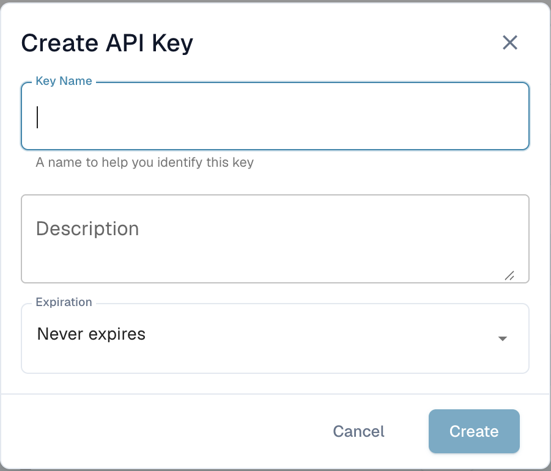
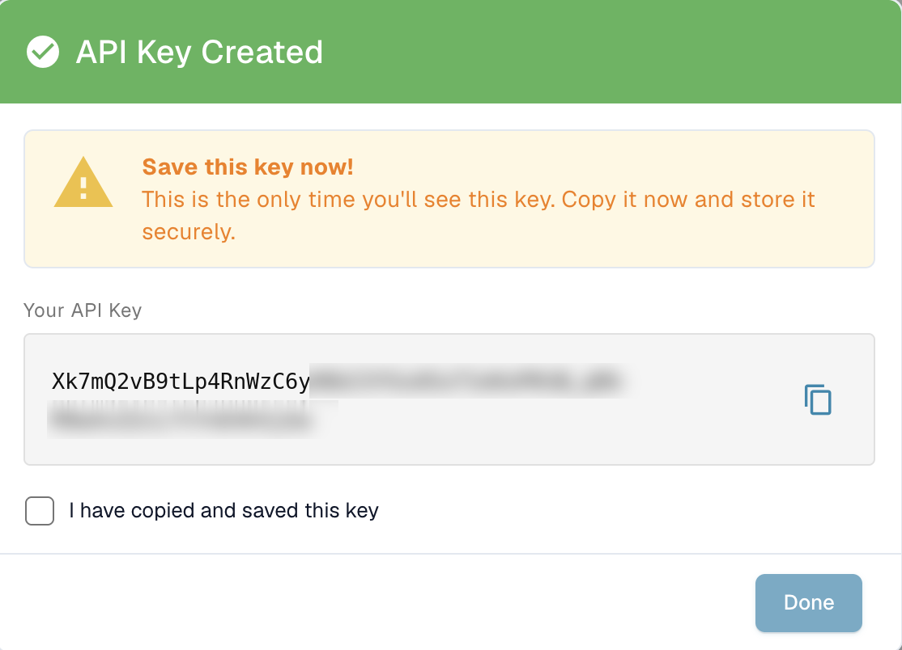

# API Key Management

An API key lets another system — your ERP, a script, or a partner application — talk to DocBits without a user logging in. Your organization can hold as many keys as you need, and each one is managed separately: give it its own name, decide whether it expires, and revoke it on its own if it is ever exposed.

Because each integration can have its own key, you can switch one off without disturbing any of the others.

## Opening API key management

Go to **Settings** and select **Integration & SSO** under **System & Administration**.

<figure><figcaption>
Settings → Integration &#x26; SSO
</figcaption></figure>

The **API Key** section at the top of the page lists every key your organization has.

<figure><figcaption>
The API Keys list
</figcaption></figure>

## Understanding the list

<figure><figcaption>
Each row shows one key
</figcaption></figure>

| Column | What it tells you |
| --- | --- |
| **Key** | The first few characters of the key, followed by `****`. The rest is never shown again after you create it — see [Creating an API key](#creating-an-api-key). |
| **Name** | The name you gave the key, with its description underneath. |
| **Expires** | The date the key stops working, or **Never** if you did not set one. |
| **Last Used** | When a request last arrived with this key. **Never used** means no system has used it yet — useful for spotting keys you can safely remove. |
| **Status** | **Active** means the key works. A revoked key is switched off permanently. |
| **Actions** | The three-dot menu, where you can revoke the key. |

If you have more keys than fit on one page, use the paging controls at the bottom of the list.


**Last Used** is the quickest way to find keys nobody needs any more. A key that has never been used, or has not been used in months, is a good candidate for revoking.


## Creating an API key

1. Click **+ Create API Key** at the top right of the API Keys section.
2. Fill in the dialog:

<figure><figcaption>
Creating a new key
</figcaption></figure>

| Field | What to enter |
| --- | --- |
| **Key Name** | Required. Name it after the system that will use it — `M3 Production`, `Invoice Import Script` — so you can tell later which integration a key belongs to. |
| **Description** | Optional. Room for a note about what the key is for or who set it up. |
| **Expiration** | Choose an expiry date, or leave it on **Never expires**. An expiry date is the safer choice: the key retires itself if the integration is ever forgotten. |

3. Click **Create**. DocBits shows you the new key:

<figure><figcaption>
This is the only time the full key is shown
</figcaption></figure>

4. Copy the key with the copy icon and paste it straight into the system that will use it, or into your password manager.
5. Tick **I have copied and saved this key** and click **Done**.


**The full key is shown only once.** DocBits stores it in a scrambled form that cannot be turned back into the original, so nobody — not your administrators, not DocBits support — can look it up again afterwards. If you lose it, revoke the key and create a new one.


Treat the key like a password. Anyone who has it can act on your organization's documents and data.
