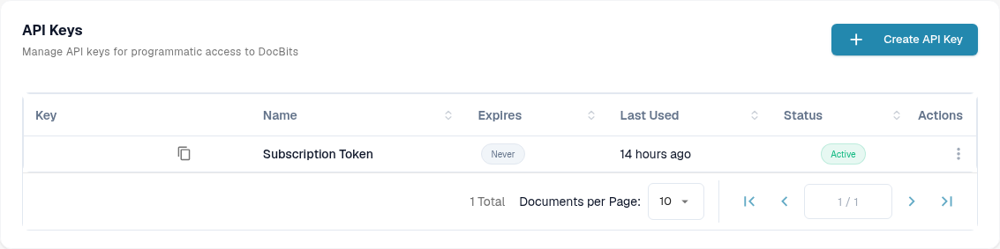

# API Key

<figure><figcaption>
Settings → Integration &amp; SSO → API Key. The key prefix is hidden in this screenshot.
</figcaption></figure>

The **API Key** section at the top of the Integration & SSO page lists every API key your organization has created. An API key lets another system — your ERP, a script, or a partner application — access DocBits without a user logging in. For step-by-step instructions, see [API Key Management](api-key-management.md).

### API Key list

* **Key:** The first few characters of the key, followed by `****`. The full key is shown only once, when it is created, so it cannot be viewed again later. The copy icon next to the key copies the visible prefix to your clipboard.
* **Name / Expires / Last Used / Status:** Each row shows the key's name, when it stops working, when a request last used it, and whether it is still active.
* **Create API Key:** Opens a dialog to create a new key for an integration. See [API Key Management](api-key-management.md) for the fields and the one-time key display.
* **Actions (three-dot menu):** Opens the actions for a key, where you can edit its name, revoke it, or delete a key that has already been revoked. Revoking switches the key off permanently.

### SSO (Single Sign-On) Service Provider Settings

These are the values your Identity Provider needs in order to let users sign in to DocBits with your company login. For the full setup guide, see [Configuring Single Sign-On (SSO)](configuring-single-sign-on-sso/).

* **Entity ID:** The identifier for DocBits as a service provider in the SSO configuration. The copy icon copies the value to your clipboard.
* **SLO (Single Logout) URL:** The URL used to log a user out of all applications connected through SSO at the same time. The copy icon copies the value.
* **SSO URL:** The URL used for initiating the single sign-on process. The copy icon copies the value.
* **Download Certificate:** Downloads the security certificate your Identity Provider needs to trust DocBits.
* **Download Metadata:** Downloads the SAML metadata file that can be imported directly into most Identity Providers.

### Identity Service Provider Settings

Configure DocBits to use your external Identity Provider (IdP) for login. For the full guide, see [Identity Service Provider Configuration](identity-service-provider-configuration.md).

* **Tenant ID:** Your Identity Provider's tenant identifier, used when DocBits integrates with cloud services that manage access per tenant.
* **Upload file:** Uploads the metadata or configuration file you received from your Identity Provider.
* **Configure:** Saves the settings and applies the uploaded configuration. Enter the Tenant ID or upload the file first, then click **Configure**.
