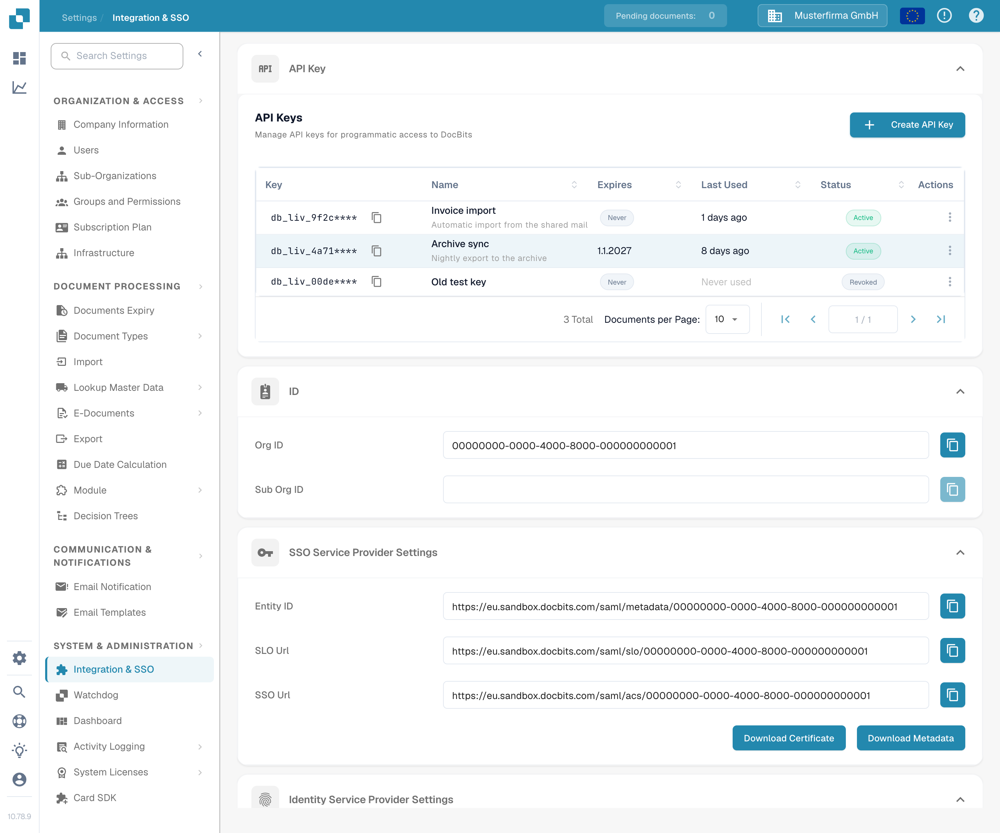

# Microsoft Entra SSO

Use this guide if your organisation wants users to sign in to DocBits through Microsoft Entra ID. You need an administrator for both DocBits and the Microsoft Entra tenant. Test with one assigned user before changing sign-in for everyone.

## 1. Get the DocBits service provider details

In DocBits, open **Settings → Integration & SSO**. Under **SSO Service Provider Settings**, copy the **Entity ID**, **SSO Url** and **SLO Url** with the buttons beside them, or choose **Download Metadata** to obtain the service provider metadata XML. **Download Certificate** provides the DocBits certificate if your identity provider asks for it. Use the values from your own organisation and environment; the Sandbox values in the image are examples only.

<figure><figcaption>
Current DocBits SSO settings in the English Sandbox. No Microsoft tenant is configured in this test organisation.
</figcaption></figure>

## 2. Create the Microsoft Entra application

In the [Microsoft Entra admin center](https://entra.microsoft.com/), create an **Enterprise application** using **New application → Create your own application** and the non-gallery option. Open **Single sign-on → SAML**. In **Basic SAML Configuration**, use the DocBits **Entity ID** as the Microsoft **Identifier (Entity ID)** and the DocBits **SSO Url** as the **Reply URL (ACS URL)**. Set the logout URL from DocBits **SLO Url** if your configuration requires it. Check any additional sign-on URL and claims requirements with your identity administrator.

Assign a test user or group under **Users and groups**. Microsoft's [current SAML setup and user assignment guide](https://learn.microsoft.com/en-us/entra/identity/enterprise-apps/validate-saml-single-sign-on-app-gallery) shows the Entra portal steps and explains these fields. Its portal images are maintained by Microsoft; the old Azure AD screenshots have been removed from this page.

## 3. Import Microsoft metadata into DocBits

In the Entra application's SAML setup, download **Federation Metadata XML**. Microsoft documents this file in its [federation metadata guide](https://learn.microsoft.com/en-us/entra/identity/enterprise-apps/add-application-portal-setup-sso-rpsts). Return to **Settings → Integration & SSO → Identity Service Provider Settings** in DocBits. Enter the Microsoft **Tenant ID**, choose the XML file with **Import**, then select **Configure**. The file must be XML. Keep a working admin sign-in available while you test SSO.

## 4. Test the sign-in

Ask the assigned test user to start a new browser session and sign in through the configured Microsoft account. Check that the user reaches the intended DocBits organisation and has the expected access. If sign-in fails, compare the Entity ID, ACS URL, tenant, assignments, claims and metadata in both systems before changing the configuration.

The Sandbox image verifies only the current DocBits settings screen. No Microsoft Entra application was created, no metadata was uploaded, and no SSO sign-in was tested for this documentation update.
