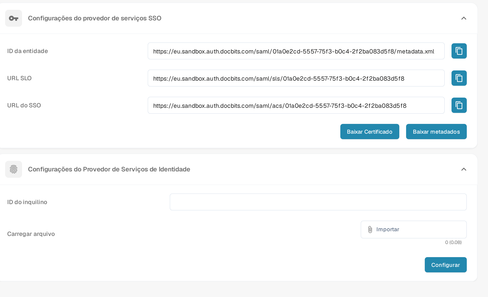

# V1: SSO do Infor Ming.le Portal

Este guia é para o **Infor Ming.le Portal V1** com LN ou uma interface M3 mais antiga. Se o seu tenant usa um Infor OS Portal mais recente, pergunte ao seu administrador da Infor qual procedimento de federação se aplica antes de usar estas etapas. Você precisa de acesso de administrador ao seu tenant da Infor e à sua organização no DocBits. Mantenha um login de administrador existente disponível até que um usuário de teste consiga entrar pelo SSO.

## 1. Obter os valores do provedor de serviços do DocBits

Entre no ambiente e na organização corretos do DocBits. Abra **Configurações → Integração e SSO → Configurações do provedor de serviços SSO**. Copie o **ID da entidade**, a **URL do SSO** e a **URL SLO** usando os botões ao lado de cada valor. Use **Baixar Certificado** se a Infor exigir o certificado de assinatura do DocBits. **Baixar metadados** exporta os metadados de *provedor de serviços* do DocBits. As URLs do Sandbox neste exemplo são específicas da organização de teste; não as copie para outro tenant.

## 2. Registrar o DocBits na Infor

No seu tenant do **Infor Ming.le Portal V1**, abra **User Management → Security Administration → Service Provider** e adicione um provedor de serviços SAML para o DocBits. Seu administrador da Infor deve confirmar se esta é a tela e o tipo de aplicação corretos para o seu tenant. Mapeie os valores da seguinte forma:

| Campo do provedor de serviços na Infor | Valor do DocBits |
| --- | --- |
| Entity ID | ID da entidade |
| SSO Endpoint | URL do SSO (endpoint de consumo de afirmação) |
| SLO Endpoint | URL SLO (endpoint de logout) |
| Signing Certificate | Certificado obtido com Baixar Certificado, se necessário |
| Name ID Format / Mapping | Endereço de e-mail, após confirmar que o identificador do usuário na Infor corresponde ao usuário no DocBits |

**Não cole a URL SLO no campo SSO Endpoint.** São endpoints diferentes. Salve o provedor de serviços. O [guia de configuração do provedor de serviços](https://docs.infor.com/inforos/2026.09/en-us/useradminlib_cloud/minceag_cloud_osm/vxs1562872848076.html) da Infor descreve as funções dos campos e a ação **Export SAML Metadata**. Os menus e as permissões da Infor podem variar conforme o tenant e a versão.

## 3. Importar os metadados do provedor de identidade da Infor para o DocBits

Na Infor, abra o provedor de serviços do DocBits salvo, escolha **View** em **Identity Provider Information** e clique em **Export SAML Metadata**. Este arquivo contém os dados do *provedor de identidade da Infor*. Ele é diferente dos metadados de provedor de serviços do DocBits baixados na etapa 1.

No DocBits, volte para **Configurações → Integração e SSO → Configurações do Provedor de Serviços de Identidade**. Digite o **ID do inquilino** (Tenant ID) da Infor, escolha o arquivo XML de metadados da Infor em **Carregar arquivo** e selecione **Configurar**. Confirme o ID do inquilino e o XML com o seu administrador da Infor antes de salvar; a captura de tela do Sandbox não representa o seu tenant de produção.

## 4. Verificar o acesso

Atribua um usuário adequado da Infor à aplicação do DocBits no Ming.le e teste o acesso com esse usuário. Verifique se o identificador de e-mail do usuário corresponde a um usuário do DocBits. Mantenha a sessão original de administrador aberta durante o teste. Se o login ou o logout falhar, compare os endpoints do provedor de serviços, os metadados da Infor, o certificado e o mapeamento de Name ID com os dois administradores.

**Escopo da verificação:** A tela e a navegação do DocBits descritas acima foram verificadas na organização de teste do Sandbox em português. Nenhum tenant da Infor estava disponível para esta atualização, portanto as telas da Infor, a troca de metadados e o acesso real não foram testados. As capturas de tela anteriores da Infor foram removidas porque seu estado atual não pôde ser verificado; use a documentação vinculada da Infor e o administrador do seu tenant para conferir a interface real.
