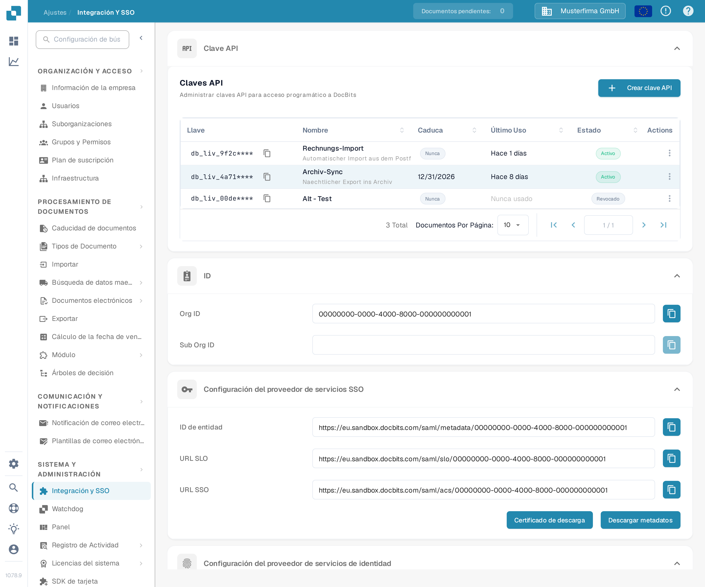

# V1: SSO de Infor Ming.le Portal

Esta guía es para **Infor Ming.le Portal V1** con LN o una interfaz M3 más antigua. Si su inquilino usa un Infor OS Portal más reciente, pregunte a su administrador de Infor qué procedimiento de federación corresponde antes de usar estos pasos. Necesita acceso de administrador a la vez a su inquilino de Infor y a su organización de DocBits. Mantenga disponible una sesión de administrador existente hasta que un usuario de prueba pueda iniciar sesión mediante SSO.

## 1. Obtenga los valores de proveedor de servicios de DocBits

Inicie sesión en el entorno y la organización de DocBits correctos. Abra **Ajustes → Integración y SSO → Configuración del proveedor de servicios SSO**. Copie el **ID de entidad**, la **URL SSO** y la **URL SLO** con los botones situados junto a cada valor. Use **Certificado de descarga** si Infor necesita el certificado de firma de DocBits. **Descargar metadatos** exporta los metadatos de *proveedor de servicios* de DocBits. Las URL de Sandbox de este ejemplo son específicas de la organización de prueba; no las copie en otro inquilino.

## 2. Registre DocBits en Infor

En su inquilino de **Infor Ming.le Portal V1**, abra **User Management → Security Administration → Service Provider** y añada un proveedor de servicios SAML para DocBits. Su administrador de Infor debe confirmar que esta es la pantalla y el tipo de aplicación correctos para su inquilino. Asigne los valores de la siguiente manera:

| Campo del proveedor de servicios de Infor | Valor de DocBits |
| --- | --- |
| Entity ID | ID de entidad |
| SSO Endpoint | URL SSO (endpoint de consumidor de aserciones) |
| SLO Endpoint | URL SLO (endpoint de cierre de sesión) |
| Signing Certificate | Certificado obtenido con Certificado de descarga, si es necesario |
| Name ID Format / Mapping | Dirección de correo electrónico, tras confirmar que el identificador de usuario de Infor coincide con el usuario de DocBits |

**No pegue la URL SLO en SSO Endpoint.** Son endpoints distintos. Guarde el proveedor de servicios. La [guía de configuración de proveedores de servicios](https://docs.infor.com/inforos/2026.09/en-us/useradminlib_cloud/minceag_cloud_osm/vxs1562872848076.html) de Infor describe las funciones de cada campo y la acción **Export SAML Metadata**. Los menús y permisos de Infor pueden variar según el inquilino y la versión.

## 3. Importe los metadatos del proveedor de identidad de Infor en DocBits

En Infor, abra el proveedor de servicios de DocBits guardado, elija **View** en **Identity Provider Information** y luego **Export SAML Metadata**. Este archivo contiene los datos del *proveedor de identidad de Infor*. Es distinto de los metadatos de proveedor de servicios de DocBits descargados en el paso 1.

En DocBits, vuelva a **Ajustes → Integración y SSO → Configuración del proveedor de servicios de identidad**. Introduzca el **ID de inquilino** de Infor, seleccione el XML de metadatos de Infor en **Subir archivo** y elija **Configurar**. Confirme el ID de inquilino y el XML con su administrador de Infor antes de guardar; la captura de Sandbox no representa su inquilino de producción.

## 4. Compruebe el inicio de sesión

Asigne en Ming.le un usuario adecuado de Infor a la aplicación de DocBits y pruebe el inicio de sesión con ese usuario. Compruebe que el identificador de correo del usuario coincide con un usuario de DocBits. Mantenga abierta la sesión de administrador original mientras realiza la prueba. Si el inicio o el cierre de sesión fallan, compare los endpoints del proveedor de servicios, los metadatos de Infor, el certificado y el mapeo de Name ID con ambos administradores.

**Alcance de la verificación:** La pantalla y la navegación de DocBits anteriores se comprobaron en la organización de prueba de Sandbox en español. No hubo un inquilino de Infor disponible para esta actualización, por lo que las pantallas de Infor, el intercambio de metadatos y el inicio de sesión real no se probaron. Las capturas anteriores de Infor se eliminaron porque no se pudo verificar su estado actual; use la documentación enlazada de Infor y el administrador de su inquilino para conocer su interfaz real.
