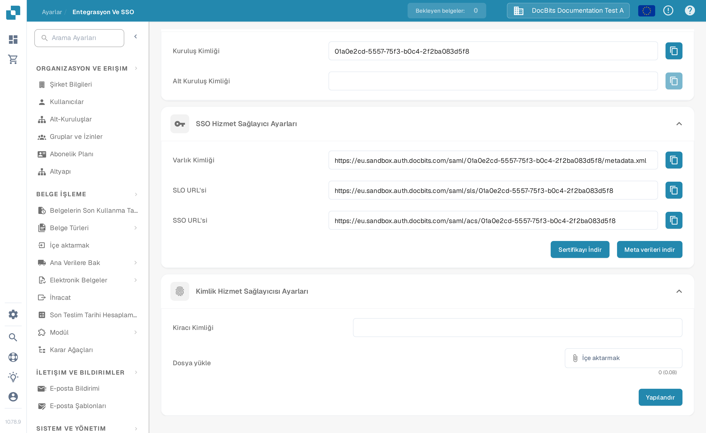

# V1: Infor Ming.le Portal SSO

Bu kılavuz, **Infor Ming.le Portal V1** kullanan ve LN veya daha eski bir M3 arayüzüne sahip kiracılar içindir. Kiracınız daha yeni bir Infor OS Portal kullanıyorsa, bu adımları uygulamadan önce Infor yöneticinize hangi federasyon prosedürünün geçerli olduğunu sorun. Hem Infor kiracınıza hem de DocBits kuruluşunuza yönetici erişiminiz olmalıdır. Bir test kullanıcısı SSO üzerinden giriş yapabildiği anda mevcut bir yönetici girişi açık kalmaya devam etsin.

## 1. DocBits hizmet sağlayıcı değerlerini alın

Doğru DocBits ortamına ve kuruluşuna giriş yapın. **Ayarlar → Entegrasyon ve SSO → SSO Hizmet Sağlayıcı Ayarları** bölümünü açın. Her değerin yanındaki düğmeleri kullanarak **Varlık Kimliği**, **SSO URL'si** ve **SLO URL'si** değerlerini kopyalayın. Infor, DocBits imzalama sertifikasını istiyorsa **Sertifikayı İndir** seçeneğini kullanın. **Meta Verileri İndir**, DocBits *hizmet sağlayıcı* meta verilerini dışa aktarır. Bu örnekteki Sandbox URL'leri yalnızca test kuruluşuna özgüdür; bunları başka bir kiracıya kopyalamayın.

## 2. DocBits'i Infor'da kaydedin

**Infor Ming.le Portal V1** kiracınızda **User Management → Security Administration → Service Provider** (Kullanıcı Yönetimi → Güvenlik Yönetimi → Hizmet Sağlayıcı) bölümünü açın ve DocBits için bir SAML hizmet sağlayıcı ekleyin. Infor yöneticiniz, bu ekranın ve uygulama türünün kiracınız için doğru olduğunu onaylamalıdır. Değerleri aşağıdaki gibi eşleştirin:

| Infor hizmet sağlayıcı alanı | DocBits değeri |
| --- | --- |
| Varlık Kimliği (Entity ID) | Varlık Kimliği |
| SSO Uç Noktası | SSO URL'si (ifade tüketici uç noktası) |
| SLO Uç Noktası | SLO URL'si (çıkış uç noktası) |
| İmzalama Sertifikası | Gerekirse Sertifikayı İndir ile alınan sertifika |
| Name ID Biçimi / Eşlemesi | Infor kullanıcı tanımlayıcısının DocBits kullanıcısıyla eşleştiği doğrulandıktan sonra e-posta adresi |

**SLO URL'sini SSO Uç Noktası alanına yapıştırmayın.** Bunlar farklı uç noktalardır. Hizmet sağlayıcıyı kaydedin. Infor'un [hizmet sağlayıcı yapılandırma kılavuzu](https://docs.infor.com/inforos/2026.09/en-us/useradminlib_cloud/minceag_cloud_osm/vxs1562872848076.html) alan rollerini ve **Export SAML Metadata** (SAML Meta Verilerini Dışa Aktar) işlemini açıklar. Infor menüleri ve izinleri kiracıya ve sürüme göre farklılık gösterebilir.

## 3. Infor kimlik sağlayıcı meta verilerini DocBits'e içe aktarın

Infor'da kaydedilmiş DocBits hizmet sağlayıcısını açın, **Kimlik Sağlayıcı Bilgileri** için **View** (Görüntüle) seçin ve **Export SAML Metadata** (SAML Meta Verilerini Dışa Aktar) işlemini uygulayın. Bu dosya *Infor kimlik sağlayıcı* bilgilerini içerir; 1. adımda indirilen DocBits hizmet sağlayıcı meta verilerinden farklıdır.

DocBits'te **Ayarlar → Entegrasyon ve SSO → Kimlik Hizmet Sağlayıcı Ayarları** bölümüne dönün. Infor **Kiracı Kimliği** (Tenant ID) değerini girin, **Dosya Yükle** altında Infor meta veri XML dosyasını seçin, ardından **Yapılandır** seçeneğini belirleyin. Kaydetmeden önce kiracı kimliğini ve XML dosyasını Infor yöneticinizle doğrulayın; Sandbox görüntüsü üretim kiracınızı temsil etmez.

## 4. Girişi kontrol edin

Ming.le içinde uygun bir Infor kullanıcısını DocBits uygulamasına atayın ve girişi bu kullanıcıyla test edin. Kullanıcının e-posta tanımlayıcısının bir DocBits kullanıcısıyla eşleştiğini kontrol edin. Test sırasında orijinal yönetici oturumunu açık tutun. Giriş veya çıkış başarısız olursa, hizmet sağlayıcı uç noktalarını, Infor meta verilerini, sertifikayı ve Name ID eşlemesini her iki yöneticiyle birlikte karşılaştırın.

**Doğrulama kapsamı:** Yukarıdaki DocBits ekranı ve gezinme, Sandbox test kuruluşunda Türkçe arayüzle kontrol edilmiştir. Bu güncelleme için bir Infor kiracısı mevcut değildi; bu nedenle Infor ekranları, meta veri değişimi ve canlı giriş test edilemedi. Geçerliliği doğrulanamadığı için eski Infor ekran görüntüleri kaldırılmıştır; Infor arayüzünün güncel hâli için bağlantılı Infor belgelerini ve kiracınızın yöneticisini kullanın.
