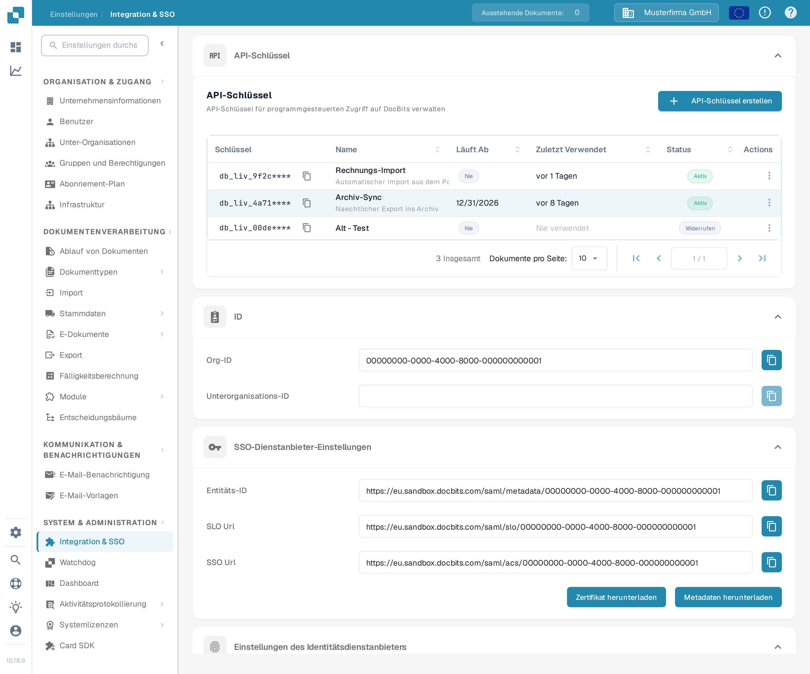

# V1: Infor Ming.le Portal SSO

Diese Anleitung gilt für **Infor Ming.le Portal V1** mit LN oder einer älteren M3-Schnittstelle. Wenn Ihr Mandant ein neueres Infor OS Portal nutzt, fragen Sie Ihren Infor-Administrator, welches Föderationsverfahren zutrifft, bevor Sie diese Schritte verwenden. Sie benötigen Administratorzugriff auf sowohl Ihren Infor-Mandanten als auch Ihre DocBits-Organisation. Halten Sie eine bestehende Administrator-Anmeldung verfügbar, bis ein Testbenutzer sich über SSO anmelden kann.

## 1. Die DocBits-Dienstprovider-Werte abrufen

Melden Sie sich in der richtigen DocBits-Umgebung und Organisation an. Öffnen Sie **Einstellungen → Integration & SSO → SSO-Dienstanbieter-Einstellungen**. Kopieren Sie die **Entitäts-ID**, die **SSO Url** und die **SLO Url** über die Buttons neben den jeweiligen Werten. Nutzen Sie **Zertifikat herunterladen**, falls Infor das DocBits-Signaturzertifikat benötigt. **Metadaten herunterladen** exportiert die DocBits-*Dienstprovider*-Metadaten. Die Sandbox-URLs in diesem Beispiel gelten nur für die Testorganisation; übernehmen Sie sie nicht in einen anderen Mandanten.

## 2. DocBits in Infor registrieren

Öffnen Sie in Ihrem **Infor Ming.le Portal V1**-Mandanten **User Management → Security Administration → Service Provider** und fügen Sie einen SAML-Dienstprovider für DocBits hinzu. Ihr Infor-Administrator sollte bestätigen, dass dies der richtige Bildschirm und Anwendungstyp für Ihren Mandanten ist. Ordnen Sie die Werte wie folgt zu:

| Infor-Dienstprovider-Feld | Wert aus DocBits |
| --- | --- |
| Entitäts-ID | Entitäts-ID |
| SSO Endpoint | SSO Url (Assertion-Consumer-Endpoint) |
| SLO Endpoint | SLO Url (Logout-Endpoint) |
| Signaturzertifikat | Zertifikat aus Zertifikat herunterladen, falls erforderlich |
| Name ID Format / Mapping | E-Mail-Adresse, nachdem bestätigt wurde, dass die Infor-Benutzerkennung zur DocBits-Benutzerkennung passt |

**Fügen Sie die SLO Url nicht im SSO Endpoint ein.** Das sind unterschiedliche Endpunkte. Speichern Sie den Dienstprovider. Die [Konfigurationsanleitung für Dienstprovider](https://docs.infor.com/inforos/2026.09/en-us/useradminlib_cloud/minceag_cloud_osm/vxs1562872848076.html) von Infor beschreibt die Feldrollen und die Aktion **Export SAML Metadata**. Infor-Menüs und Berechtigungen können je nach Mandant und Release abweichen.

## 3. Die Infor-Identitätsprovider-Metadaten in DocBits importieren

Öffnen Sie in Infor den gespeicherten DocBits-Dienstprovider, wählen Sie **View** bei **Identity Provider Information** und dann **Export SAML Metadata**. Diese Datei enthält die *Infor-Identitätsprovider*-Daten. Sie unterscheidet sich von den in Schritt 1 heruntergeladenen DocBits-Dienstprovider-Metadaten.

Kehren Sie in DocBits zu **Einstellungen → Integration & SSO → Einstellungen des Identitätsdienstanbieters** zurück. Geben Sie die Infor-**Mandanten-ID** ein, wählen Sie die Infor-Metadaten-XML unter **Datei hochladen** aus und wählen Sie **Konfigurieren**. Bestätigen Sie die Mandanten-ID und die XML-Datei mit Ihrem Infor-Administrator, bevor Sie speichern; der Sandbox-Screenshot stellt nicht Ihren Produktionsmandanten dar.

## 4. Anmeldung prüfen

Weisen Sie in Ming.le einen geeigneten Infor-Benutzer der DocBits-Anwendung zu und testen Sie die Anmeldung mit diesem Benutzer. Prüfen Sie, dass die E-Mail-Kennung des Benutzers zu einem DocBits-Benutzer passt. Halten Sie die ursprüngliche Administrator-Sitzung während des Tests offen. Wenn An- oder Abmeldung fehlschlagen, vergleichen Sie die Dienstprovider-Endpunkte, die Infor-Metadaten, das Zertifikat und das Name-ID-Mapping mit beiden Administratoren.

**Prüfumfang:** Der DocBits-Bildschirm und die Navigation oben wurden in der deutschen Sandbox-Testorganisation geprüft. Für diese Aktualisierung stand kein Infor-Mandant zur Verfügung, daher wurden die Infor-Bildschirme, der Metadatenaustausch und die Live-Anmeldung nicht getestet. Die früheren Infor-Screenshots wurden entfernt, weil ihr aktueller Zustand nicht bestätigt werden konnte; nutzen Sie die verlinkte Infor-Dokumentation und den Administrator Ihres Mandanten für dessen aktuelle Oberfläche.
