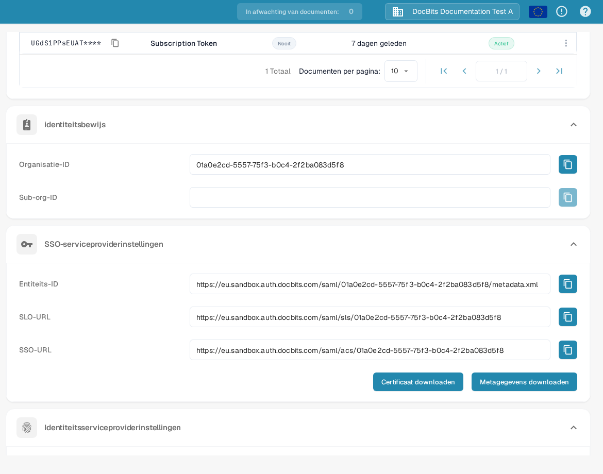

# V1: Infor Ming.le Portal SSO

Deze handleiding is voor **Infor Ming.le Portal V1** met LN of een oudere M3-interface. Gebruikt uw tenant een nieuwer Infor OS Portal, vraag dan uw Infor-beheerder welke federatieprocedure geldt voordat u deze stappen gebruikt. U heeft beheerderstoegang nodig tot zowel uw Infor-tenant als uw DocBits-organisatie. Houd een bestaande beheerdersaanmelding beschikbaar totdat een testgebruiker via SSO kan inloggen.

## 1. De serviceproviderwaarden van DocBits opvragen

Meld u aan bij de juiste DocBits-omgeving en -organisatie. Open **Instellingen → Integratie en SSO → SSO Service Provider Settings**. Kopieer de **Entity ID**, **SSO Url** en **SLO Url** met de knoppen naast elke waarde. Gebruik **Download Certificate** als Infor het ondertekeningscertificaat van DocBits vereist. **Download Metadata** exporteert de *serviceprovider*-metadata van DocBits. De Sandbox-URL's in dit voorbeeld gelden alleen voor de testorganisatie; kopieer ze niet naar een andere tenant.

## 2. DocBits registreren in Infor

Open in uw **Infor Ming.le Portal V1**-tenant **User Management → Security Administration → Service Provider** en voeg daar een SAML-serviceprovider voor DocBits toe. Laat uw Infor-beheerder bevestigen dat dit het juiste scherm en applicatietype voor uw tenant is. Wijs de waarden als volgt toe:

| Veld bij Infor-serviceprovider | Waarde uit DocBits |
| --- | --- |
| Entity ID | Entity ID |
| SSO Endpoint | SSO Url (assertion consumer endpoint) |
| SLO Endpoint | SLO Url (logout endpoint) |
| Signing Certificate | Certificaat uit Download Certificate, indien vereist |
| Name ID Format / Mapping | E-mailadres, nadat u heeft bevestigd dat de Infor-gebruikersidentificatie overeenkomt met de DocBits-gebruiker |

**Plak de SLO Url niet in SSO Endpoint.** Het zijn verschillende endpoints. Sla de serviceprovider op. De [handleiding voor serviceproviderconfiguratie van Infor](https://docs.infor.com/inforos/2026.09/en-us/useradminlib_cloud/minceag_cloud_osm/vxs1562872848076.html) beschrijft de veldfuncties en de actie **Export SAML Metadata**. Infor-menu's en rechten kunnen per tenant en release verschillen.

## 3. De identity provider-metadata van Infor importeren in DocBits

Open in Infor de opgeslagen DocBits-serviceprovider, kies **View** bij **Identity Provider Information** en klik op **Export SAML Metadata**. Dit bestand bevat de gegevens van de *Infor identity provider*. Het verschilt van de DocBits-serviceprovider-metadata die u in stap 1 heeft gedownload.

Keer in DocBits terug naar **Instellingen → Integratie en SSO → Identity Service Provider Settings**. Voer de Infor **Tenant ID** in, kies het Infor-metadata-XML-bestand bij **Upload file** en selecteer vervolgens **Configure**. Bevestig de tenant-ID en het XML-bestand met uw Infor-beheerder voordat u opslaat; de Sandbox-screenshot geeft niet uw productietenant weer.

## 4. De aanmelding controleren

Wijs in Ming.le een geschikte Infor-gebruiker toe aan de DocBits-applicatie en test de aanmelding met die gebruiker. Controleer of de e-mailidentificatie van de gebruiker overeenkomt met een DocBits-gebruiker. Houd de oorspronkelijke beheerderssessie open tijdens de test. Lukt het inloggen of uitloggen niet, vergelijk dan de serviceprovider-endpoints, de Infor-metadata, het certificaat en de Name ID-mapping samen met beide beheerders.

**Controleomvang:** Het DocBits-scherm en de navigatie hierboven zijn gecontroleerd in de Nederlandse Sandbox-testorganisatie. Er was geen Infor-tenant beschikbaar voor deze update, dus de Infor-schermen, de metadata-uitwisseling en de live-aanmelding zijn niet getest. De eerdere Infor-screenshots zijn verwijderd omdat de huidige staat niet geverifieerd kon worden; gebruik de gekoppelde Infor-documentatie en de beheerder van uw tenant voor de actuele interface.
