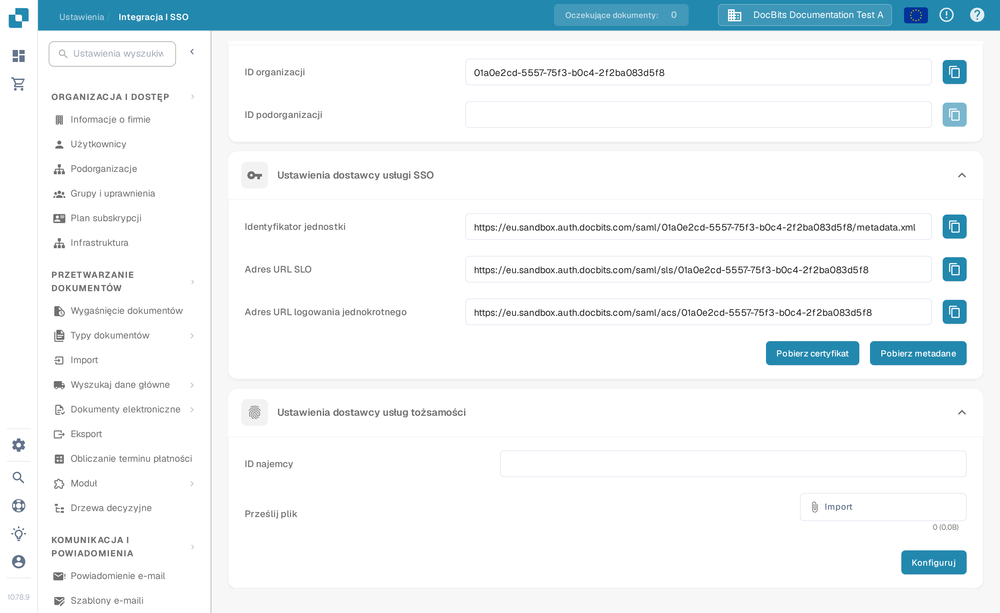

# V1: Infor Ming.le Portal SSO

Ten przewodnik dotyczy **Infor Ming.le Portal V1** z systemem LN lub starszym interfejsem M3. Jeśli Twój najemca korzysta z nowszego portalu Infor OS Portal, zapytaj administratora Infor, która procedura federacji ma zastosowanie, zanim wykonasz te kroki. Potrzebujesz dostępu administratorskiego zarówno do swojego najemcy Infor, jak i do swojej organizacji DocBits. Zachowaj działające zalogowanie istniejącego administratora do czasu, aż użytkownik testowy zaloguje się przez SSO.

## 1. Pobierz wartości dostawcy usług DocBits

Zaloguj się do właściwego środowiska i organizacji DocBits. Otwórz **Ustawienia → Integracja i SSO → Ustawienia dostawcy usługi SSO**. Skopiuj **Identyfikator jednostki**, **Adres URL logowania jednokrotnego** oraz **Adres URL SLO** za pomocą przycisków obok każdej wartości. Użyj **Pobierz certyfikat**, jeśli Infor wymaga certyfikatu podpisującego DocBits. **Pobierz metadane** eksportuje metadane *dostawcy usług* DocBits. Adresy URL z Sandbox w tym przykładzie dotyczą wyłącznie organizacji testowej; nie kopiuj ich do innego najemcy.

## 2. Zarejestruj DocBits w Infor

W swoim najemcy **Infor Ming.le Portal V1** otwórz **User Management → Security Administration → Service Provider** (Zarządzanie użytkownikami → Administracja bezpieczeństwem → Dostawca usług), a następnie dodaj dostawcę usług SAML dla DocBits. Twój administrator Infor powinien potwierdzić, że to właściwy ekran i typ aplikacji dla Twojego najemcy. Mapuj wartości w następujący sposób:

| Pole dostawcy usług Infor | Wartość z DocBits |
| --- | --- |
| Entity ID | Identyfikator jednostki |
| SSO Endpoint | Adres URL logowania jednokrotnego (punkt odbioru atrybutów) |
| SLO Endpoint | Adres URL SLO (punkt wylogowania) |
| Signing Certificate | Certyfikat z „Pobierz certyfikat”, jeśli wymagany |
| Name ID Format / Mapping | Adres e-mail, po potwierdzeniu, że identyfikator użytkownika Infor odpowiada użytkownikowi DocBits |

**Nie wklejaj Adresu URL SLO do pola SSO Endpoint.** To są różne punkty końcowe. Zapisz dostawcę usług. [Przewodnik konfiguracji dostawcy usług](https://docs.infor.com/inforos/2026.09/en-us/useradminlib_cloud/minceag_cloud_osm/vxs1562872848076.html) firmy Infor opisuje role pól oraz akcję **Export SAML Metadata**. Menu i uprawnienia w Infor mogą się różnić w zależności od najemcy i wersji.

## 3. Zaimportuj metadane dostawcy tożsamości Infor do DocBits

W Infor otwórz zapisanego dostawcę usług DocBits, wybierz **View** (Wyświetl) przy **Identity Provider Information** (Informacje o dostawcy tożsamości) i kliknij **Export SAML Metadata** (Eksportuj metadane SAML). Ten plik zawiera dane *dostawcy tożsamości Infor*. Różni się od metadanych dostawcy usług DocBits pobranych w kroku 1.

W DocBits wróć do **Ustawienia → Integracja i SSO → Ustawienia dostawcy usług tożsamości**. Wprowadź **ID najemcy** Infor, wskaż metadane XML Infor pod **Prześlij plik**, a następnie wybierz **Konfiguruj**. Potwierdź identyfikator najemcy i plik XML z administratorem Infor przed zapisaniem; zrzut z Sandbox nie odzwierciedla Twojego najemcy produkcyjnego.

## 4. Sprawdź logowanie

Przypisz odpowiedniego użytkownika Infor do aplikacji DocBits w Ming.le i przetestuj logowanie tym użytkownikiem. Sprawdź, czy identyfikator e-mail użytkownika odpowiada użytkownikowi DocBits. Podczas testów utrzymuj otwartą oryginalną sesję administratora. Jeśli logowanie lub wylogowanie się nie powiedzie, porównaj z oboma administratorami punkty końcowe dostawcy usług, metadane Infor, certyfikat i mapowanie Name ID.

**Zakres weryfikacji:** Ekran DocBits i nawigacja powyżej zostały sprawdzone w polskiej organizacji testowej Sandbox. Dla tej aktualizacji nie był dostępny żaden najemca Infor, dlatego ekrany Infor, wymiana metadanych i rzeczywiste logowanie nie zostały przetestowane. Poprzednie zrzuty z Infor zostały usunięte, ponieważ nie można było zweryfikować ich aktualnego stanu; w sprawie aktualnego interfejsu skorzystaj z podłączonej dokumentacji Infor i administratora swojego najemcy.
