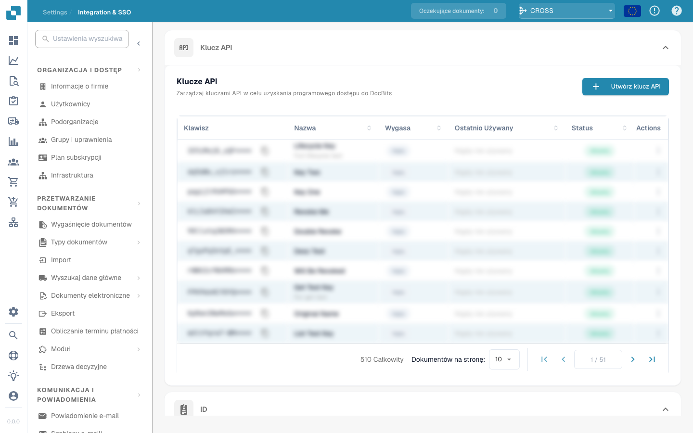

# V2

## Pré-requisitos

| Informação Necessária          | Descrição                                                                                                                                          |
| ------------------------------ | ------------------------------------------------------------------------------------------------------------------------------------------------- |
| Dados de Login na Cloud        | As credenciais são obrigatórias para acessar o ambiente Infor Cloud. O usuário deve ter as funções "Infor-SystemAdministrator" e "UserAdmin".     |
| Dados do Config Admin (DocBits) | Você deve ter recebido um e-mail da FellowPro AG com os dados de login da página de Configurações de SSO do DocBits. Você precisará de um login e senha. |
| Certificado                    | Você pode baixar o certificado no DocBits em SSO Service Provider Settings                                                                         |

## Obter acesso à Cloud e verificar o seu acesso

A URL começa com https://mingle-portal.eu1.inforcloudsuite.com/\<TENANT\_NAME> seguida da sua extensão pessoal

Escolha a opção Cloud Identities e use os seus dados de login

No novo Portal, a forma de acessar esse menu agora é selecionando a opção OS no menu à esquerda. Se você não a vir no menu, clique em See More para visualizar todas as aplicações.

## Adicionar um novo Service Provider

Selecione Security, no menu OS, para ser levado à área de adição de um novo service provider. As etapas são as mesmas a partir deste ponto.

Em seguida, você precisa selecionar no menu do lado esquerdo a opção Security Administration e Service Provider.

Você verá esta janela com os Service Providers.

Agora clique no sinal de "+" e adicione o nosso DocBits como Service Provider.

## Acessar as SSO SERVICE PROVIDER SETTINGS no DocBits

* Faça login na URL https://app.docbits.com/ com os dados de login que você recebeu de nós.
* Acesse SETTINGS (na barra superior) e selecione INTEGRATION, em SSO Service Provider Settings você encontrará todas as informações necessárias para as etapas a seguir.
* Faça o download do certificado

Preenchendo o Service Provider com a ajuda das SSO Service Provider Settings no DocBits

| Campo                      | Valor                                                                                       |
| -------------------------- | ------------------------------------------------------------------------------------------ |
| Application Type           | DEFAULT\_SAML                                                                              |
| Display Name               | DocBits                                                                                    |
| Entity ID                  | Veja o Entity ID em SSO SERVICE SETTINGS                                                   |
| SSO Endpoint               | Copie a SSO URL de SSO SERVICE SETTINGS e cole-a no campo SSO Endpoint.                    |
| SLO Endpoint               | Copie a SLO URL de SSO SERVICE SETTINGS e cole-a no campo SSO Endpoint.                    |
| Signing Certificate        | Faça o upload do arquivo .cer apropriado que você baixou na etapa 3c) de SSO SERVICE SETTINGS |
| Name ID Format and Mapping | endereço de e-mail                                                                         |

* Quando tiver preenchido tudo, lembre-se de salvar com o ícone de disco acima de Application Type
* Acesse o service provider DocBits novamente.
* Clique em view the Identity Provider Information abaixo.

## Exportar os SAML METADATA.

O arquivo se parece com isto: ServiceProviderSAMLMetadata\_10\_20\_2021.xml

Importe os SAML METADATA nas SSO Settings.

Acesse IDENTITY SERVICE PROVIDER SETTINGS, que está localizada em INTEGRATIONS dentro de SETTINGS. Insira o seu Tenant ID (por exemplo, FELLOWPRO\_DEV) e abaixo dessa linha você verá o Upload file e o botão IMPORT, onde você precisa fazer o upload do arquivo SAML METADATA exportado anteriormente.

* Clique em IMPORT e então escolha o arquivo METADATA que você já baixou de SSO SERVICE PROVIDER SETTINGS
* Clique em CONFIGURE

## Adicionar uma Nova Aplicação no INFOR Ming.le

Clique em OS no menu à esquerda (como antes), você será levado a um menu onde precisará selecionar Portal. Em seguida, clique em + Add Application à direita.\
\
\
Preencha as seguintes informações; o campo URL é a SSO Endpoint URL da área de Integration nas suas configurações do DocBits. Um Logical ID também será gerado para você; quando concluir, clique em save.

**Etapa Final**

* Faça logout do DocBits.
* Volte ao menu à esquerda no Infor e selecione a aplicação que você acabou de criar.

<figure><figcaption></figcaption></figure>

* Você será levado ao Dashboard do DocBits.
