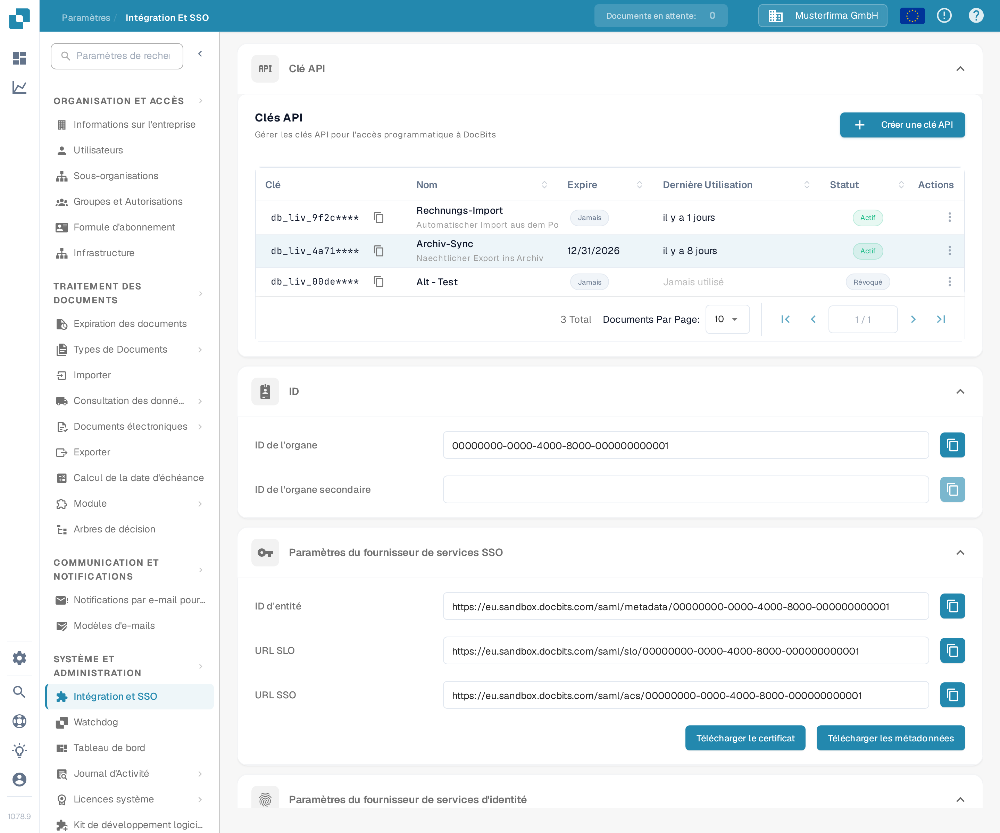

# V2 : SSO du portail Infor OS Portal

Utilisez ce guide si votre organisation lance DocBits depuis **Infor OS Portal V2**. Un administrateur à la fois pour Infor et pour DocBits est nécessaire. Gardez une session ouverte d'un administrateur DocBits existant pendant les tests du SSO. Les noms des menus et des champs d'Infor dépendent de la version du locataire ; confirmez-les avec votre administrateur Infor.

## 1. Récupérer les valeurs SAML de DocBits

Dans la bonne organisation DocBits, ouvrez **Paramètres → Intégration et SSO → Paramètres du fournisseur de services SSO**. Copiez **ID d'entité**, **URL SSO** et **URL SLO**. Utilisez **Télécharger le certificat** si le formulaire du fournisseur de services Infor exige le certificat de signature. **Télécharger les métadonnées** contient le XML DocBits en tant que *fournisseur de services* ; ce ne sont pas les métadonnées du fournisseur d'identité Infor utilisées à l'étape 3. Les URL de l'image Sandbox appartiennent uniquement à cette organisation de test.

## 2. Ajouter DocBits comme fournisseur de services dans Infor

Dans Infor OS Portal, ouvrez **OS → Security → Security Administration → Service Provider** si c'est le chemin utilisé par votre locataire. Ajoutez un fournisseur de services SAML et utilisez la correspondance suivante :

| Champ Infor | Valeur DocBits |
| --- | --- |
| Entity ID | ID d'entité |
| SSO Endpoint | URL SSO, le point de terminaison de consommation d'assertions |
| SLO Endpoint | URL SLO, le point de terminaison de déconnexion |
| Signing Certificate | Télécharger le certificat, si requis |
| Name ID Format / Mapping | Adresse e-mail, après avoir vérifié qu'elle correspond à l'utilisateur DocBits |

L'ancien guide demandait de saisir l'**URL SLO** dans **SSO Endpoint**. C'est incorrect : chaque URL doit être saisie dans son champ correspondant. Enregistrez le fournisseur de services. Le [guide des fournisseurs de services d'Infor](https://docs.infor.com/inforos/latest/en-us/useradminlib_cloud/inforos_security/jho1449385888462.html) explique la navigation et le rôle requis ; son [guide des champs SAML](https://docs.infor.com/inforos/2026.09/en-us/useradminlib_cloud/mineeag/min1772650388038.html) explique le rôle de chaque point de terminaison.

## 3. Importer les métadonnées du fournisseur d'identité d'Infor

Ouvrez le fournisseur de services enregistré dans Infor et choisissez **View → Export SAML Metadata** pour le fournisseur d'identité Infor. De retour dans DocBits, ouvrez **Paramètres → Intégration et SSO → Paramètres du fournisseur de services d'identité**. Saisissez l'**ID du locataire** d'Infor, choisissez le XML Infor sous **Téléverser un fichier**, puis sélectionnez **Configure**. Confirmez l'identifiant du locataire et les métadonnées avec votre administrateur Infor. Ne téléversez pas ici le XML du fournisseur de services DocBits de l'étape 1.

## 4. Ajouter une tuile DocBits dans Infor OS Portal

Dans Infor OS Portal, ouvrez **Portal → Applications → Add Application**. Enregistrez DocBits comme application non-Infor pour votre locataire, fournissez un nom d'affichage, une icône et un Logical ID unique, et définissez l'**URL de l'application** sur votre URL habituelle de connexion ou de lancement DocBits. L'URL de l'application du portail ouvre l'interface utilisateur ; ce n'est **pas** le point de terminaison SAML SSO/ACS de l'étape 2. Suivez le [guide des applications non-Infor d'Infor](https://docs.infor.com/inforos/latest/en-us/useradminlib_cloud/inforospag/lsm1436532874794.html) pour le formulaire actuel, les options de navigation et les autorisations. Accordez à l'utilisateur de test l'accès à l'application du portail.

## 5. Vérifier avec un utilisateur

Déconnectez-vous dans une session navigateur séparée, ouvrez la tuile DocBits depuis Infor, et confirmez que l'adresse e-mail de l'utilisateur assigné correspond au bon compte et à la bonne organisation DocBits. Vérifiez également la déconnexion. En cas d'échec, comparez les métadonnées Infor, les URL SSO/SLO, le certificat, le Name ID et l'URL de la tuile du portail avec les deux administrateurs. Conservez la session administrateur d'origine jusqu'à la fin du test.

**Périmètre de vérification :** l'écran DocBits ci-dessus a été capturé dans l'organisation de test Sandbox en français. Aucun locataire Infor n'était disponible, donc les menus du portail Infor, l'import des métadonnées, la création de la tuile et le SSO en conditions réelles n'ont pas été testés pour cette mise à jour. Les anciennes images Infor hébergées en externe, y compris des pièces jointes privées d'e-mails, ont été supprimées ; utilisez la documentation liée d'Infor et votre administrateur locataire pour cette interface.
