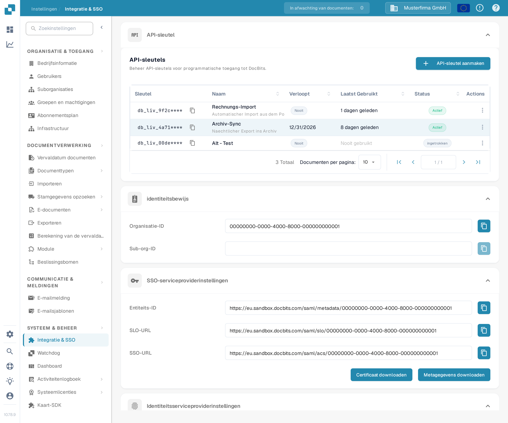

# V2: Infor OS Portal SSO

Gebruik deze handleiding als uw organisatie DocBits start vanuit **Infor OS Portal V2**. Er is een beheerder voor zowel Infor als DocBits nodig. Houd tijdens het testen van SSO een actieve sessie van een bestaande DocBits-beheerder open. De menu's en veldnamen van Infor hangen af van de release van uw tenant; laat deze door uw Infor-beheerder bevestigen.

## 1. De SAML-waarden van DocBits ophalen

Open in de juiste DocBits-organisatie **Instellingen → Integratie & SSO → SSO-serviceproviderinstellingen**. Kopieer **Entiteits-ID**, **SSO-URL** en **SLO-URL**. Gebruik **Certificaat downloaden** als het formulier voor de Infor-serviceprovider het ondertekeningscertificaat vereist. **Metagegevens downloaden** is de XML van DocBits als *serviceprovider*; het is niet de identiteitsprovider-metadata van Infor die in stap 3 wordt gebruikt. De URL's in de sandboxafbeelding behoren uitsluitend tot deze testorganisatie.

## 2. DocBits toevoegen als serviceprovider in Infor

Open in Infor OS Portal **OS → Security → Security Administration → Service Provider** als dit de route in uw tenant is. Voeg een SAML-serviceprovider toe en gebruik de volgende toewijzing:

| Infor-veld | Waarde van DocBits |
| --- | --- |
| Entiteits-ID | Entiteits-ID |
| SSO Endpoint | SSO-URL, het assertion consumer-endpoint |
| SLO Endpoint | SLO-URL, het logout-endpoint |
| Signing Certificate | Certificaat downloaden, indien vereist |
| Name ID Format / Mapping | E-mailadres, nadat u hebt gecontroleerd dat dit overeenkomt met de DocBits-gebruiker |

De vorige handleiding instrueerde gebruikers om de **SLO-URL** in het veld **SSO Endpoint** te zetten. Dat is onjuist: elke URL gaat in het bijbehorende veld. Sla de serviceprovider op. De [serviceprovider-handleiding](https://docs.infor.com/inforos/latest/en-us/useradminlib_cloud/inforos_security/jho1449385888462.html) van Infor legt de navigatie en de vereiste rol uit; de [SAML-veldhandleiding](https://docs.infor.com/inforos/2026.09/en-us/useradminlib_cloud/mineeag/min1772650388038.html) legt de rollen van de endpoints uit.

## 3. De identiteitsprovider-metadata van Infor importeren

Open de opgeslagen serviceprovider in Infor en kies **View → Export SAML Metadata** voor de identiteitsprovider van Infor. Ga terug naar DocBits en open **Instellingen → Integratie & SSO → Identiteitsserviceproviderinstellingen**. Voer de Infor-**Tenant-ID** in, kies de XML van Infor onder **Bestand uploaden** en selecteer **Configureren**. Bevestig de tenant-ID en de metadata met uw Infor-beheerder. Upload hier niet de serviceprovider-XML van DocBits uit stap 1.

## 4. Een DocBits-tegel toevoegen in Infor OS Portal

Open in Infor OS Portal **Portal → Applications → Add Application**. Registreer DocBits als een niet-Infor-toepassing voor uw tenant, geef een weergavenaam, pictogram en unieke Logical ID op, en stel de **applicatie-URL** in op uw normale DocBits-aanmeldings- of start-URL. De applicatie-URL van de portal opent de gebruikersinterface; het is **niet** het SAML SSO/ACS-endpoint uit stap 2. Volg de [handleiding voor niet-Infor-toepassingen](https://docs.infor.com/inforos/latest/en-us/useradminlib_cloud/inforospag/lsm1436532874794.html) van Infor voor het huidige formulier, de navigatieopties en machtigingen. Geef de testgebruiker toegang tot de portaltoepassing.

## 5. Controleren met één gebruiker

Meld u af in een aparte browsersessie, open de DocBits-tegel vanuit Infor en bevestig dat het e-mailadres van de toegewezen gebruiker naar het juiste DocBits-account en de juiste organisatie leidt. Controleer ook het afmelden. Als een van beide mislukt, vergelijk dan de Infor-metadata, de SSO/SLO-URL's, het certificaat, de Name ID en de URL van de portaltegel samen met de twee beheerders. Houd de oorspronkelijke beheerderssessie open totdat de test is voltooid.

**Controleomvang:** Het DocBits-scherm hierboven is vastgelegd in de Nederlandse sandbox-testorganisatie. Er was geen Infor-tenant beschikbaar, dus de Infor-portalmenu's, de metadata-import, het aanmaken van de tegel en live SSO zijn voor deze update niet getest. Oude extern gehoste Infor-afbeeldingen, waaronder privé e-mailbijlagen, zijn verwijderd; gebruik de gelinkte Infor-documentatie en uw tenant-beheerder voor die interface.
