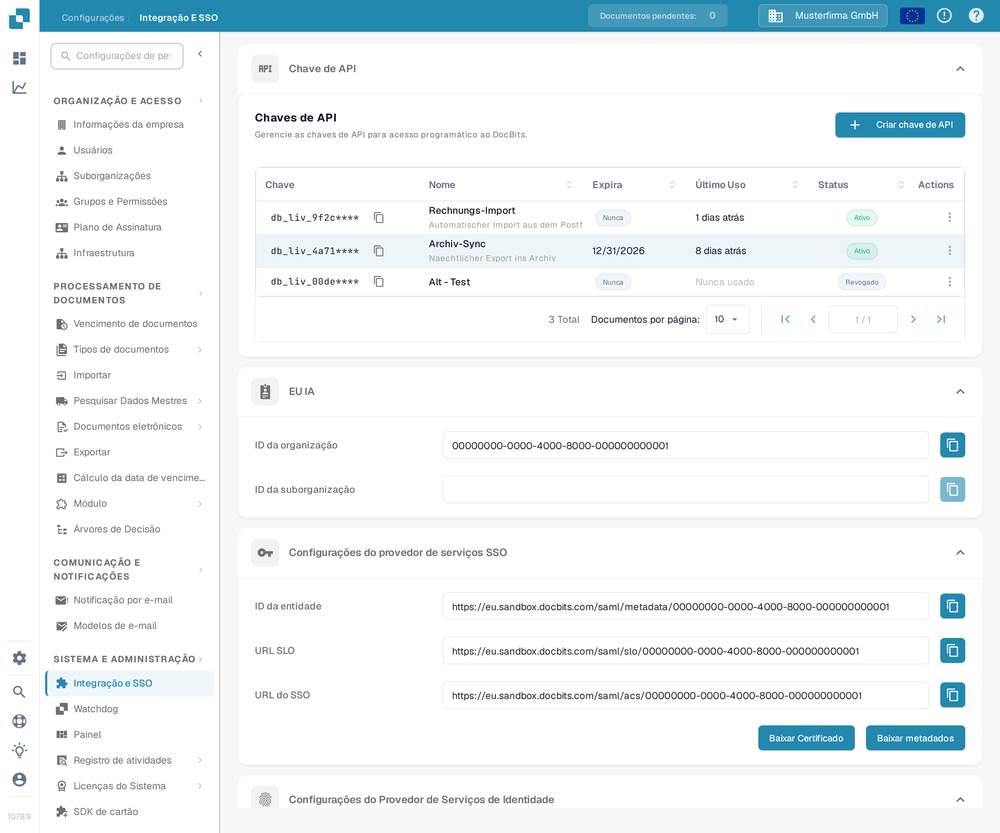

# V2: SSO do Infor OS Portal

Use este guia se a sua organização inicia o DocBits a partir do **Infor OS Portal V2**. É necessário um administrador tanto para o Infor quanto para o DocBits. Mantenha uma sessão aberta de um administrador existente do DocBits enquanto testa o SSO. Os nomes do menu e dos campos do Infor dependem da versão do tenant; confirme-os com o seu administrador do Infor.

## 1. Obter os valores SAML do DocBits

Na organização correta do DocBits, abra **Settings → Integration & SSO → SSO Service Provider Settings** (no DocBits em português: **Configurações → Integração e SSO → Configurações do provedor de serviços SSO**). Copie o **ID da entidade** (Entity ID), a **URL do SSO** e a **URL SLO**. Use **Baixar Certificado** se o formulário de provedor de serviços do Infor exigir o certificado de assinatura. **Baixar metadados** exporta o XML do DocBits como *provedor de serviços*; não são os metadados de provedor de identidade do Infor usados na etapa 3. As URLs na imagem da Sandbox pertencem apenas a esta organização de teste.

## 2. Adicionar o DocBits como provedor de serviços no Infor

No Infor OS Portal, abra **OS → Security → Security Administration → Service Provider** se este for o caminho do seu tenant. Adicione um provedor de serviços SAML e use o seguinte mapeamento:

| Campo no Infor | Valor do DocBits |
| --- | --- |
| Entity ID (ID da entidade) | ID da entidade |
| SSO Endpoint | URL do SSO, o endpoint de consumo de asserção |
| SLO Endpoint | URL SLO, o endpoint de logout |
| Signing Certificate (Certificado de assinatura) | Baixar Certificado, se exigido |
| Name ID Format / Mapping | Endereço de e-mail, após confirmar que corresponde ao usuário do DocBits |

O guia anterior instruía os usuários a colocar a **URL SLO** no **SSO Endpoint**. Isso está incorreto: cada URL deve ir no seu campo correspondente. Salve o provedor de serviços. O [guia de provedor de serviços da Infor](https://docs.infor.com/inforos/latest/en-us/useradminlib_cloud/inforos_security/jho1449385888462.html) explica a navegação e a função necessária; o [guia de campos SAML](https://docs.infor.com/inforos/2026.09/en-us/useradminlib_cloud/mineeag/min1772650388038.html) explica as funções dos endpoints.

## 3. Importar os metadados do provedor de identidade do Infor

Abra o provedor de serviços salvo no Infor e use **View → Export SAML Metadata** para o provedor de identidade do Infor. De volta ao DocBits, abra **Configurações → Integração e SSO → Configurações do Provedor de Serviços de Identidade**. Informe o **ID do inquilino** (Tenant ID) do Infor, escolha o XML do Infor em **Carregar arquivo** e selecione **Configurar**. Confirme o ID do tenant e os metadados com o seu administrador do Infor. Não faça o upload aqui do XML de provedor de serviços do DocBits da etapa 1.

## 4. Adicionar um tile do DocBits no Infor OS Portal

No Infor OS Portal, abra **Portal → Applications → Add Application**. Registre o DocBits como uma aplicação não-Infor para o seu tenant, informe um nome de exibição, um ícone e um Logical ID único, e defina a **URL da aplicação** como a sua URL normal de login ou inicialização do DocBits. A URL da aplicação do portal abre a interface do usuário; ela **não** é o endpoint SAML SSO/ACS da etapa 2. Siga o [guia de aplicações não-Infor da Infor](https://docs.infor.com/inforos/latest/en-us/useradminlib_cloud/inforospag/lsm1436532874794.html) para ver o formulário atual, as opções de navegação e as permissões. Conceda ao usuário de teste acesso à aplicação do portal.

## 5. Verificar com um usuário

Faça logout em uma sessão separada do navegador, abra o tile do DocBits no Infor e confirme que o e-mail do usuário atribuído resolve para a conta e organização corretas do DocBits. Verifique também o logout. Se algo falhar, compare com os dois administradores os metadados do Infor, as URLs SSO/SLO, o certificado, o Name ID e a URL do tile do portal. Mantenha a sessão original do administrador até o fim do teste.

**Escopo da verificação:** A tela do DocBits acima foi capturada na organização de teste da Sandbox em português. Nenhum tenant da Infor estava disponível, então os menus do portal Infor, a importação de metadados, a criação do tile e o SSO ao vivo não foram testados nesta atualização. As imagens antigas hospedadas externamente da Infor, incluindo anexos privados de e-mail, foram removidas; use a documentação vinculada da Infor e o administrador do seu tenant para essa interface.
