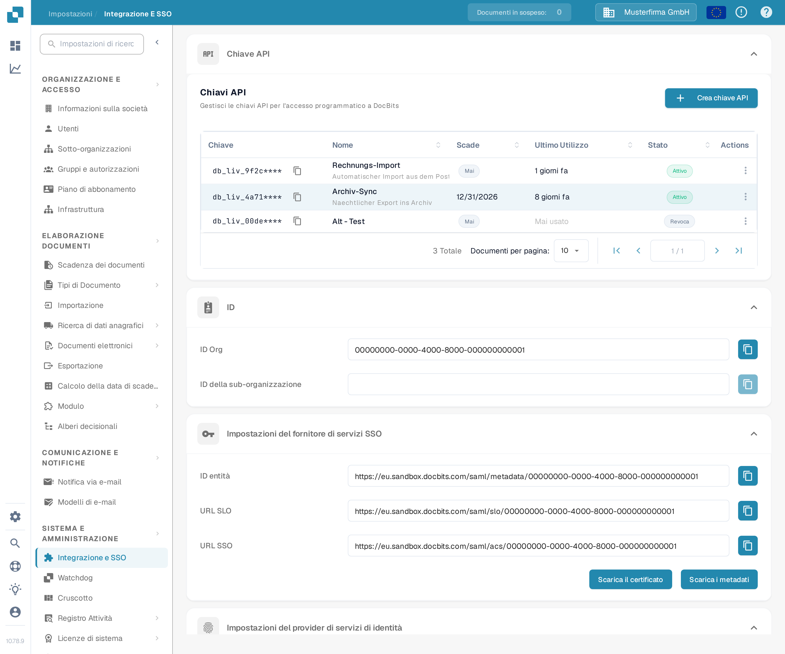

# V2: SSO di Infor OS Portal

Usa questa guida se la tua organizzazione avvia DocBits da **Infor OS Portal V2**. Sono necessari un amministratore Infor e un amministratore DocBits. Tieni aperta una sessione di un amministratore DocBits esistente mentre testi l'SSO. I nomi del menu e dei campi Infor dipendono dalla release del tenant; verificateli con il vostro amministratore Infor.

## 1. Ottieni i valori SAML di DocBits

Nell'organizzazione DocBits corretta, apri **Impostazioni → Integrazione e SSO → Impostazioni del fornitore di servizi SSO**. Copia **ID entità**, **URL SSO** e **URL SLO**. Usa **Scarica il certificato** se il modulo del fornitore di servizi Infor richiede il certificato di firma. **Scarica i metadati** produce l'XML *service provider* di DocBits; non sono i metadati dell'identity provider Infor usati al punto 3. Gli URL nell'immagine Sandbox appartengono solo a questa organizzazione di test.

## 2. Aggiungi DocBits come fornitore di servizi in Infor

In Infor OS Portal, apri **OS → Sicurezza → Amministrazione della sicurezza → Fornitore di servizi**, se questo è il percorso del vostro tenant. Aggiungi un fornitore di servizi SAML e usa la seguente mappatura:

| Campo Infor | Valore DocBits |
| --- | --- |
| ID entità | ID entità |
| Endpoint SSO | URL SSO, l'endpoint di acquisizione asserzioni |
| Endpoint SLO | URL SLO, l'endpoint di disconnessione |
| Certificato di firma | Scarica il certificato, se richiesto |
| Formato / Mappatura Name ID | Indirizzo e-mail, dopo aver verificato che corrisponda all'utente DocBits |

La guida precedente indicava di inserire l'**URL SLO** nel campo **Endpoint SSO**. È errato: ogni URL va nel campo corrispondente. Salva il fornitore di servizi. La [guida Infor sui fornitori di servizi](https://docs.infor.com/inforos/latest/en-us/useradminlib_cloud/inforos_security/jho1449385888462.html) spiega la navigazione e il ruolo richiesto; la [guida Infor sui campi SAML](https://docs.infor.com/inforos/2026.09/en-us/useradminlib_cloud/mineeag/min1772650388038.html) spiega il ruolo degli endpoint.

## 3. Importa i metadati dell'identity provider Infor

Apri in Infor il fornitore di servizi salvato e scegli **Visualizza → Esporta metadati SAML** per l'identity provider Infor. Torna in DocBits, apri **Impostazioni → Integrazione e SSO → Impostazioni del fornitore di servizi di identità**. Inserisci l'**ID tenant** di Infor, scegli l'XML di Infor sotto **Caricare il file**, quindi seleziona **Configurare**. Conferma ID tenant e metadati con il vostro amministratore Infor. Non caricare qui l'XML service provider di DocBits del punto 1.

## 4. Aggiungi una tile DocBits in Infor OS Portal

In Infor OS Portal, apri **Portale → Applicazioni → Aggiungi applicazione**. Registra DocBits come applicazione non-Infor per il vostro tenant, fornisci un nome visualizzato, un'icona e un ID logico univoco, e imposta l'**URL dell'applicazione** con il vostro normale URL di accesso o avvio di DocBits. L'URL dell'applicazione del portale apre l'interfaccia utente; **non** è l'endpoint SAML SSO/ACS del punto 2. Segui la [guida Infor per le applicazioni non-Infor](https://docs.infor.com/inforos/latest/en-us/useradminlib_cloud/inforospag/lsm1436532874794.html) per modulo, opzioni di navigazione e permessi attuali. Concedi all'utente di test l'accesso all'applicazione del portale.

## 5. Verifica con un utente

Disconnettetevi in una sessione separata del browser, aprite la tile DocBits da Infor e confermate che l'e-mail dell'utente assegnato corrisponda all'account e all'organizzazione DocBits corretti. Verificate anche la disconnessione. Se una delle due prove fallisce, confrontate metadati Infor, URL SSO/SLO, certificato, Name ID e URL della tile del portale con i due amministratori. Mantenete aperta la sessione amministrativa originale fino al completamento del test.

**Ambito della verifica:** la schermata DocBits qui sopra è stata acquisita nell'organizzazione di test Sandbox in italiano. Non era disponibile un tenant Infor, quindi i menu del portale Infor, l'importazione dei metadati, la creazione della tile e l'SSO live non sono stati testati in questo aggiornamento. Le vecchie immagini Infor ospitate esternamente, inclusi allegati privati di posta, sono state rimosse; per quell'interfaccia usate la documentazione Infor collegata e il vostro amministratore del tenant.
