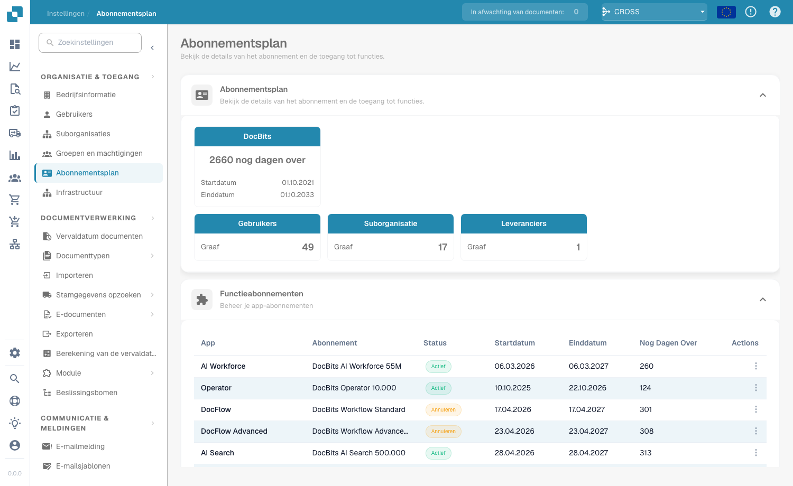
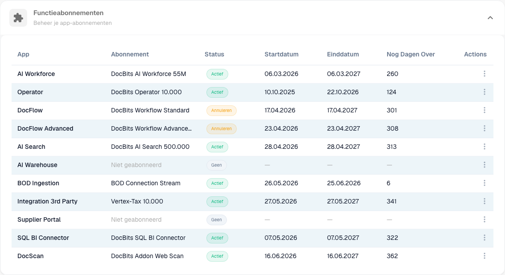
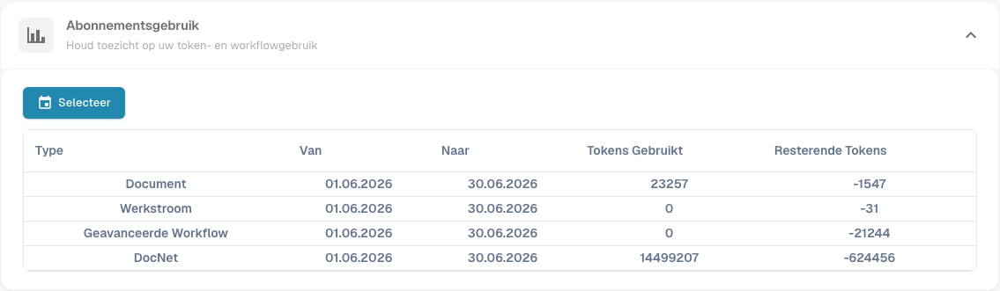

# Abonnement

<figure><figcaption>
Pagina Abonnement
</figcaption></figure>

De pagina **Abonnement** biedt een volledig overzicht van uw DocBits-abonnement op één plek: het abonnement zelf, de voor uw organisatie ingeschakelde app- en functie-abonnementen en uw tokengebruik. Open deze via **Instellingen → Organisatie en toegang → Abonnement**.

## Abonnement

De eerste kaart toont uw DocBits-abonnement — het aantal resterende dagen en de begin- en einddatum — samen met live tellingen voor uw organisatie:

| Kaart | Beschrijving |
|------|-------------|
| **DocBits** | Resterende dagen en de begin- en einddatum van uw abonnement. |
| **Gebruikers** | Het aantal gebruikers in uw organisatie. |
| **Suborganisatie** | Het aantal suborganisaties. |
| **Leveranciers** | Het aantal leveranciers. |

## Functie-abonnementen

<figure><figcaption></figcaption></figure>

In dit gedeelte staat elke DocBits-app en -functie en of deze voor uw organisatie is ingeschakeld.

| Kolom | Beschrijving |
|--------|-------------|
| **App** | De DocBits-app of -functie (bijv. AI Workforce, Operator, DocFlow, AI Search, BOD Ingestion, SQL BI Connector). |
| **Abonnement** | Het afgenomen abonnement voor die app. |
| **Status** | **Actief**, **Wordt opgezegd** (actief tot de einddatum en daarna beëindigd) of **Geen** wanneer de app niet is afgenomen. |
| **Begin / Einde** | De abonnementsperiode. |
| **Resterende dagen** | Dagen tot de einddatum. |
| **Acties** | Actiemenu per app. |

## Abonnementsgebruik

<figure><figcaption></figcaption></figure>

Houd uw token- en workflowgebruik over een geselecteerde periode bij. Gebruik de knop **Selecteren** om het datumbereik te kiezen.

| Kolom | Beschrijving |
|--------|-------------|
| **Type** | De gebruikscategorie — Document, Workflow, Geavanceerde workflow of DocNet. |
| **Van / Tot** | De periode waarover het gebruik wordt gerapporteerd. |
| **Gebruikte tokens** | In de periode verbruikte tokens. |
| **Resterende tokens** | Voor de periode beschikbare tokens. |
