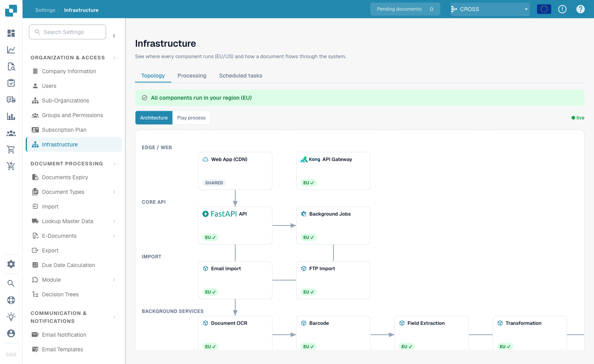
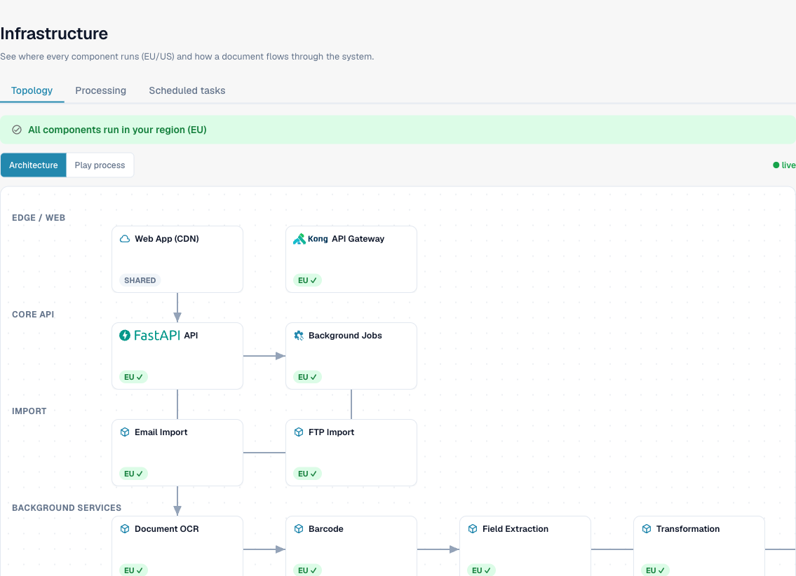
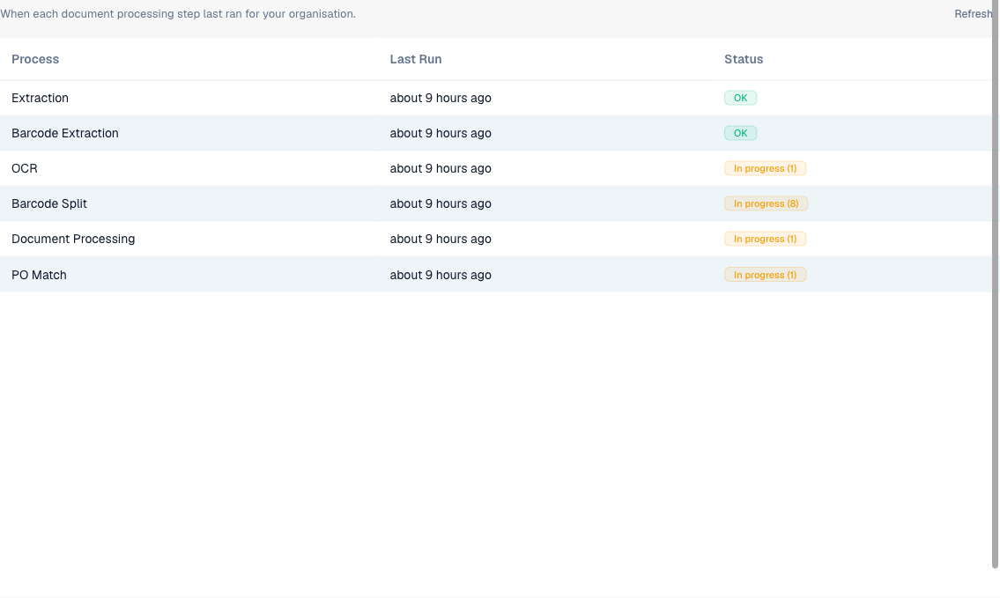
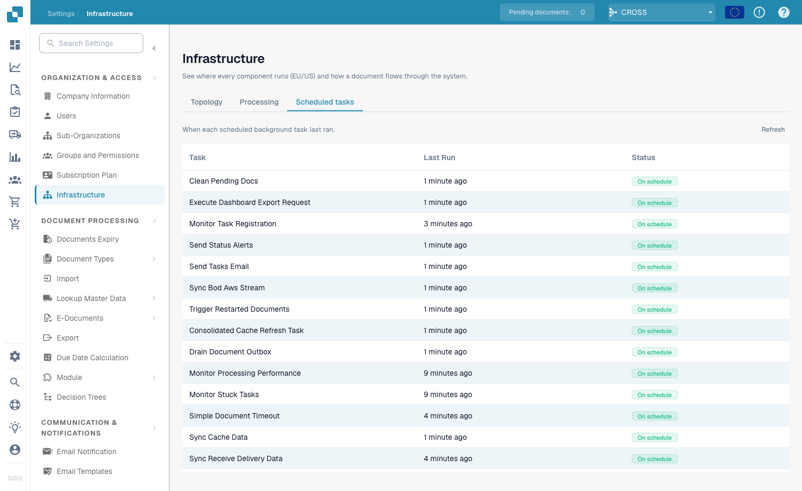

# Infrastructuur

De pagina **Infrastructuur** biedt beheerders een live overzicht van waar elk onderdeel van DocBits draait (EU of VS), hoe een document door het systeem stroomt en of de achtergrondverwerking gezond is. De pagina is alleen-lezen — er wordt hier niets geconfigureerd; ze beantwoordt de vraag: *"draait alles, en blijven mijn gegevens in mijn regio?"*

> **Toegang:** Infrastructuur is een pagina alleen voor beheerders. Open **Instellingen → Organisatie en Toegang → Infrastructuur**.

<figure><figcaption>
De Infrastructuurpagina, tabblad Topologie
</figcaption></figure>

De pagina is verdeeld in drie tabbladen:

| Tabblad | Beantwoordt |
|---------|-------------|
| **Topologie** | Waar draait elk onderdeel, en staat alles in mijn regio? |
| **Verwerking** | Draaien de verwerkingsstappen (OCR, extractie, PO-matching …) en zijn ze up-to-date? |
| **Geplande taken** | Worden de terugkerende achtergrondtaken volgens schema uitgevoerd? |

## Topologie

Het tabblad Topologie tekent het volledige DocBits-platform als een diagram, gegroepeerd in lagen — **Edge / Web**, **Core API**, **Import**, **Achtergronddiensten**, **Datastores** en **Authenticatie**. Elk vak is één onderdeel (de Web-app/CDN, de API-gateway, de OCR-worker, de database, enzovoort).

<figure><figcaption>
Elk onderdeel is gelabeld met de regio waarin het draait
</figcaption></figure>

### Regiotransparantie

Elk onderdeel draagt een regiobadge zodat u in één oogopslag de gegevensresidentie kunt bevestigen:

| Badge | Betekenis |
|-------|-----------|
| **EU ✓** / **US ✓** | Het onderdeel draait in de regio van uw organisatie. |
| **SHARED** | Een globaal onderdeel (bijv. de CDN) zonder één enkele regio — dit is verwacht en geen probleem. |
| **Regio-afwijking** | Het onderdeel draait in een *andere* regio dan uw organisatie. Het wordt gemarkeerd zodat u het bij de support kunt aankaarten. |

De banner bovenaan vat het resultaat samen: **"Alle onderdelen draaien in uw regio (EU)"** wanneer alles overeenkomt, of een waarschuwing als een kritiek onderdeel zich in een andere regio bevindt.

### Architectuur vs. Proces afspelen

Gebruik de schakelaar boven het diagram om van weergave te wisselen:

- **Architectuur** — de statische kaart van alle onderdelen en hoe ze met elkaar verbonden zijn.
- **Proces afspelen** — animeert de reis van een document door het systeem, stap voor stap, zodat u de volgorde ziet waarin onderdelen betrokken zijn.

De indicator **● live** geeft aan dat de gezondheidsinformatie in het diagram de actuele toestand van het systeem weergeeft.

### Optionele modules

Onderdelen die bij een optionele module horen (Volledige-tekst zoeken, DocFlow, Auto-Accounting, DocNet, PO-matching) tonen een badge **geactiveerd** of **gedeactiveerd**. Klikken op een gedeactiveerde module brengt u rechtstreeks naar de pagina waar u deze kunt inschakelen — **Instellingen → Module** voor de meeste modules, of **Documenttypen** voor PO-matching (die per documenttype wordt ingeschakeld).

## Verwerking

Het tabblad Verwerking toont de documentverwerkings-pijplijn voor **uw organisatie** — wanneer elke stap voor het laatst draaide en of het werk doorstroomt of zich opstapelt.

<figure><figcaption>
Verwerkingsstatus per stap voor uw organisatie
</figcaption></figure>

| Kolom | Beschrijving |
|-------|--------------|
| **Proces** | De verwerkingsstap — Documentverwerking, OCR, TR-OCR, Barcode-splitsing, Barcode-extractie, Extractie, PO-matching. |
| **Laatste run** | Hoe lang geleden de stap voor het laatst draaide. Beweeg de muis erover voor de exacte tijdstempel. *"Nooit uitgevoerd"* betekent dat nog geen document deze stap heeft bereikt. |
| **Status** | Een stoplicht-badge (zie hieronder). |

Statusbadges:

| Badge | Betekenis |
|-------|-----------|
| **OK** (groen) | Geen recente fouten en niets in de wacht — de stap is gezond. |
| **Bezig (N)** (oranje) | `N` documenten worden momenteel door deze stap verwerkt. |
| **Fout (N)** (rood) | `N` documenten zijn recent mislukt bij deze stap. |

Fouten en *bezig* zijn onafhankelijke signalen, dus een stap kan beide badges tegelijk tonen — zo ziet u een fout zelfs terwijl ander werk nog loopt. Gebruik **Vernieuwen** (rechtsboven) om de nieuwste cijfers op te halen.

## Geplande taken

Het tabblad Geplande taken somt de terugkerende achtergrondtaken op die DocBits draaiende houden (cache-verversingen, statuswaarschuwingen, document-time-outs, uitgaande synchronisaties en meer) en bevestigt dat elke taak op tijd wordt uitgevoerd.

<figure><figcaption>
Terugkerende achtergrondtaken en hun planningsstatus
</figcaption></figure>

| Kolom | Beschrijving |
|-------|--------------|
| **Taak** | De naam van de geplande taak. |
| **Laatste run** | Hoe lang geleden ze voor het laatst draaide. Beweeg de muis erover voor de exacte tijdstempel; *"Nooit uitgevoerd"* betekent dat ze nog niet is gestart. |
| **Status** | Planningsstatus (zie hieronder). |

Statuswaarden:

| Badge | Betekenis |
|-------|-----------|
| **Op schema** (groen) | De taak draait op het verwachte interval. |
| **Vertraagd** (rood) | De taak is niet uitgevoerd toen verwacht — de moeite waard om te onderzoeken of bij de support aan te kaarten. |
| **Onbekend** (grijs) | De planningsstatus kon niet worden bepaald. |

Gebruik **Vernieuwen** om de planningsstatus op aanvraag opnieuw te controleren.
