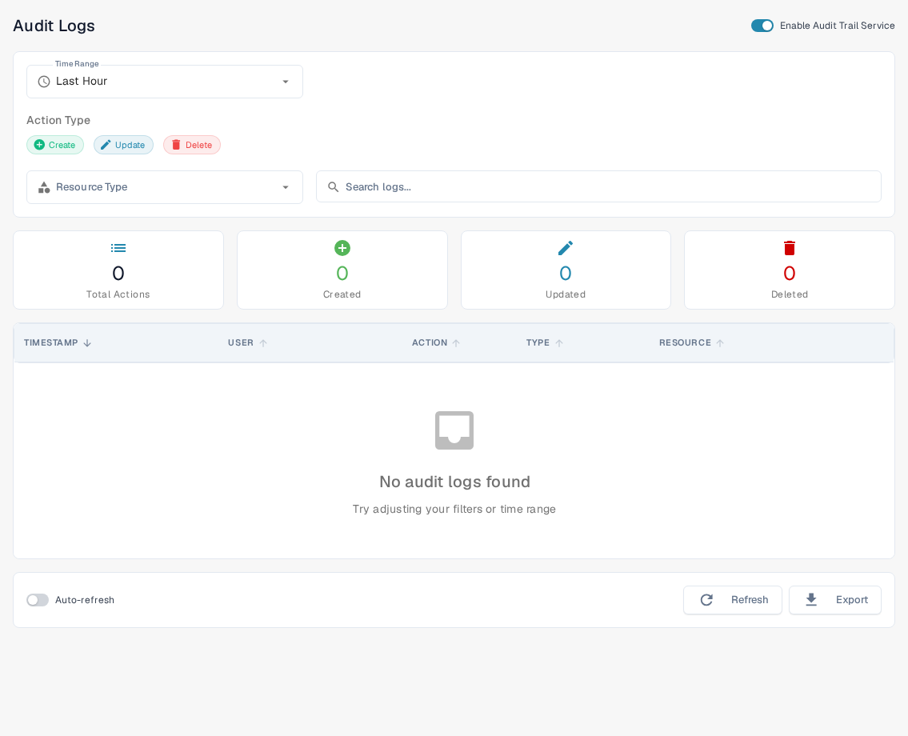
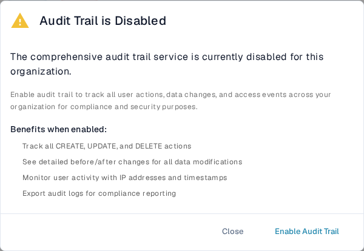

# Access Audit

<figure><figcaption>
The English Sandbox page before audit logging is enabled.
</figcaption></figure>

Access Audit records who created, changed, or deleted a resource and when. Open **Settings → Activity Logging → Access Audit** to review the log. Only enable the service for an organization when you intend to collect audit events.

## When audit logging is off

<figure><figcaption>
The dialog explains what will be recorded before you turn the service on.
</figcaption></figure>

The first visit in a browser session may show **Audit Trail is Disabled**. **Close** dismisses the dialog and leaves audit logging off. **Enable Audit Trail** turns it on for the current organization. On the page behind the dialog, **Enable Now** and the **Enable Audit Trail Service** switch also turn it on. These controls change the organization setting; they do not merely preview the feature.

While the service is off, the filters and log table cannot show events. The empty state explains how to enable logging. After enabling, use the switch to disable it again if required. Events are available only when the service is enabled and has collected data.

## Find an event

| Control | What it does |
|---|---|
| **Time Range** | Limit the list to a period such as Last Hour, Today, or Last 7 Days. |
| **Create**, **Update**, **Delete** | Include or exclude those kinds of action. |
| **Resource Type** | Limit results to a resource type, such as documents or settings. |
| **Search logs** | Search the visible audit entries by text. |
| **Refresh** | Load the latest matching entries once. |
| **Auto-refresh** | Keep the list updated automatically while the page is open. |
| **Export** | Download the current audit log data as a JSON file. |

The summary cards show total, created, updated, and deleted actions for the selected filters. In the table, **Timestamp** shows when an event happened, **User** identifies the actor, **Action** names the change, and **Resource** identifies the affected item. Open a row's details control to inspect the recorded change. If no events appear, check that the service is enabled and widen the time range before changing the other filters.
