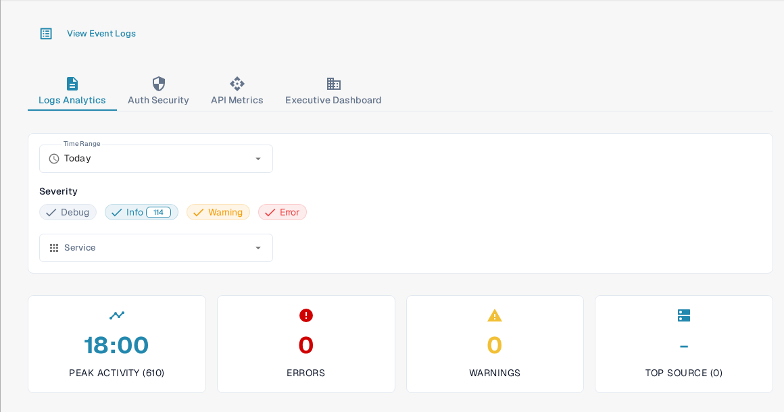

# Analytics

<figure><figcaption>
Use the tabs and filters to narrow the metrics you want to inspect.
</figcaption></figure>

The Analytics page helps you inspect log patterns, authentication events, API usage, and an executive overview. Start with **Logs Analytics**. Choose **View Event Logs** to open the underlying event list when you need to investigate an individual entry.

## Tabs

| Tab | Description |
|-----|-------------|
| **Logs Analytics** | Log severity distribution, timeline charts, and service breakdown. |
| **Auth Security** | Authentication events, login attempts, and security-related metrics. |
| **API Metrics** | API request volumes, response times, and error rates. |
| **Executive Dashboard** | Higher-level overview for organization administrators; other roles may not see this tab. |

## Filters

| Filter | Description |
|--------|-------------|
| **Time Range** | Select a time window (e.g., Today, Last 7 Days) for the displayed metrics. |
| **Severity** | Click Debug, Info, Warning, or Error to include or exclude that level. A number on a chip shows its current count. |
| **Service** | Choose the service whose events you want to inspect. |

## Summary Cards

Four summary cards appear below the filters:

| Card | Description |
|------|-------------|
| **Peak Activity** | Time of day with the highest log volume and total count. |
| **Errors** | Total error count for the selected period. |
| **Warnings** | Total warning count for the selected period. |
| **Top Source** | The service producing the most logs with its count. |

## Real User Monitoring (RUM)

Below the summary cards, RUM metrics show frontend performance data collected from real user browser sessions.

## Analytics Charts

In **Logs Analytics**, select one of the three chart buttons to change how the same filtered logs are displayed:

| View | Description |
|------|-------------|
| **Severity** | Pie chart showing log level distribution (Debug, Info, Warning, Error). |
| **Timeline** | Line chart showing log volume over time. |
| **Service** | Bar chart breaking down logs by service. |

If a chart says that no data is available, try a wider **Time Range** or fewer **Severity** filters. The figures in the screenshot belong to the synthetic Sandbox organization and will differ in your organization.
