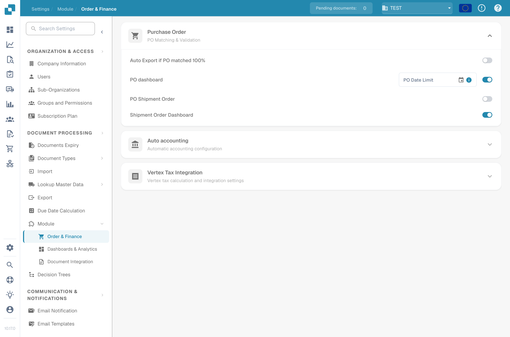

# Orientation dans la Nouvelle Interface

Cette page est une orientation rapide à l'interface actuelle de DocBits — où trouver les choses, comment fonctionne la navigation et comment utiliser les nouvelles aides. Utilisez-la comme référence si un écran semble différent de ce dont vous vous souvenez ou si vous ne trouvez pas immédiatement un paramètre.

## La barre latérale

La barre latérale principale liste chaque section de DocBits pour laquelle vous avez une autorisation. Deux façons de la contrôler :

* **Mode mini** — cliquez sur le bouton en haut de la barre latérale pour la réduire à des icônes seules. Survolez une icône avec la souris pour lire son nom. La barre se souvient si vous l'aviez dépliée ou repliée la dernière fois.
* **Personnaliser** — en bas de la barre dépliée, il y a une entrée **Personnaliser**. Utilisez-la pour réorganiser le menu, masquer les entrées que vous n'utilisez pas ou épingler en haut celles que vous ouvrez le plus souvent.

Pour la procédure complète de réorganisation, masquage et épinglage, voir [Barre Latérale Personnalisable](../../end-user-and-partner-section/end-user-section/customizable-sidebar.md).

## Où vivent les paramètres maintenant

Le menu Paramètres est regroupé par intention plutôt que par modèle de données. Si vous vous souvenez d'un paramètre mais ne le retrouvez plus, essayez le groupe correspondant ci-dessous :

| Vous cherchez… | Ouvrez Paramètres → |
|---|---|
| Nom de l'entreprise, logo, fuseau horaire, couleur de l'application | Entreprise & Utilisateurs → Informations sur l'entreprise |
| Utilisateurs, groupes, autorisations | Entreprise & Utilisateurs → Groupes, Utilisateurs et Autorisations |
| Clés API, connexions ERP, configurations d'export | Intégration |
| Types de document, champs, scripts, EDI, entraînement de modèle | Types de Document |
| Paramètres OCR, arbres de décision, listes de valeurs, gestionnaire de règles | Traitement de Document |
| Audit d'accès, analytique, index plein texte, journal d'événements | Journaux & Recherche |
| Portail fournisseur, Watchdog | Installation |

À l'intérieur de chaque groupe, les pages les plus utilisées sont placées en haut.

## Longues pages de paramètres — navigation par ancres

Les pages de paramètres comportant de nombreuses sections (comme les Paramètres Globaux ou la configuration d'un Type de Document) exposent désormais une liste de liens d'ancres dans l'en-tête. Cliquez sur une ancre pour sauter à cette section. L'URL se met à jour pendant le défilement, de sorte que le lien vers une section précise peut être partagé ou ajouté aux favoris.

## Trouver la documentation pendant que vous travaillez — icônes d'aide

La plupart des pages de paramètres, des boîtes de dialogue et des écrans d'outils affichent maintenant une petite icône **?** dans l'en-tête.

<figure><figcaption>
L'icône d'aide ouvre la page de documentation correspondante dans un nouvel onglet.
</figcaption></figure>

Un clic ouvre la page correspondante sur `docs.docbits.com` dans un nouvel onglet — sans devoir chercher la bonne page dans la documentation. L'icône respecte votre langue d'interface et ouvre la documentation traduite quand elle existe ; sinon, elle bascule sur l'anglais.

## Se connecter

L'écran de connexion, la réinitialisation du mot de passe et les points d'entrée SSO (Microsoft 365, Google, Infor OS) partagent la même mise en page que le reste de DocBits. Les erreurs apparaissent directement sous le champ qui les a déclenchées ; la réinitialisation du mot de passe et le lien d'aide se trouvent en bas du formulaire. Le déroulement est le même qu'avant — seule l'apparence a été mise à jour.

## Si quelque chose semble manquer

Si une page ou un paramètre semble avoir bougé et que vous ne le retrouvez pas :

1. Ouvrez la [Recherche Rapide Globale](../../end-user-and-partner-section/end-user-section/global-quick-search.md) avec <kbd>Cmd</kbd>/<kbd>Ctrl</kbd>+<kbd>K</kbd> et tapez le nom de la fonctionnalité — la Recherche Rapide indexe chaque page de l'application.
2. Ouvrez le [Plan du Site](../../end-user-and-partner-section/end-user-section/sitemap.md) sur `/sitemap` pour le catalogue complet et filtrable.
3. Utilisez l'icône d'aide sur l'écran le plus proche pour atterrir directement dans la documentation.
