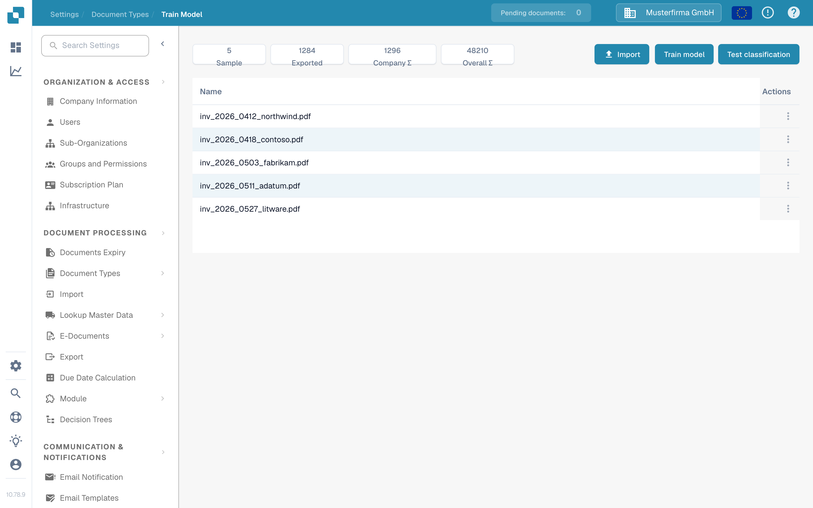

# Document Training

Training helps DocBits recognise the fields and tables used in your documents. Start with a representative, non-customer sample for the document type you want to improve.

1. Open **Settings** → **Document Types** and select the document type.
2. Open **Train Model**. Review the samples already listed before adding another one.
3. Use **Import** for an approved training sample. Follow the field or table guide below before starting a training run.
4. Use **Test classification** to inspect the result with a separate sample before relying on it for live documents.

<figure><figcaption>Current English Sandbox view for DocBits Documentation Test A. No records are listed in this example; no import, training run or classification test was performed.</figcaption></figure>

Continue with [Training Header Fields](training-header-fields.md) for individual fields, or [Training Line Fields/Table Training](training-line-fields-table-training/README.md) for table rows. If a model already exists, record its current behaviour before changing its training samples so you can compare the result afterwards.

