# Advanced Settings

In some documents, table structures can be complex—spanning multiple lines, containing grouped information, or including unnecessary extra rows. The _Advanced Settings_ in training mode allow you to fine-tune table extraction for such cases, improving accuracy and consistency.

To access these settings, activate **Training Mode** and click the **Settings** gear icon in the top action bar:

<figure>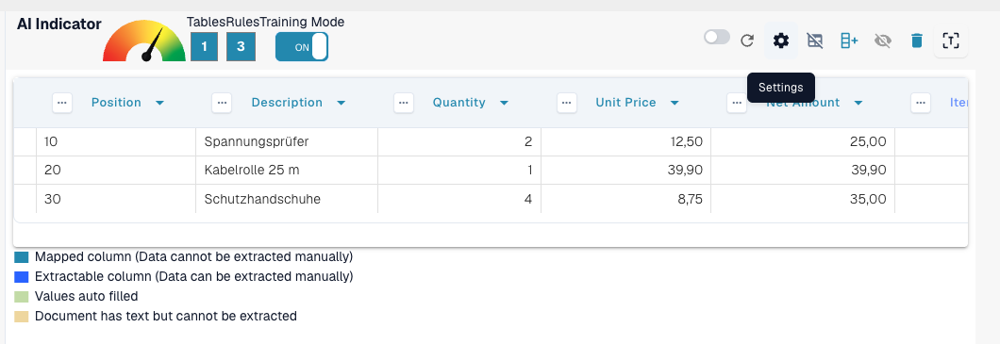<figcaption>
The Settings gear in the training mode action bar opens the Advanced Settings.
</figcaption></figure>

### Header Row Count

**Use this setting to define how many lines make up the table header.**

Some tables have multi-line headers. For example, this table’s header spans two lines:

<figure>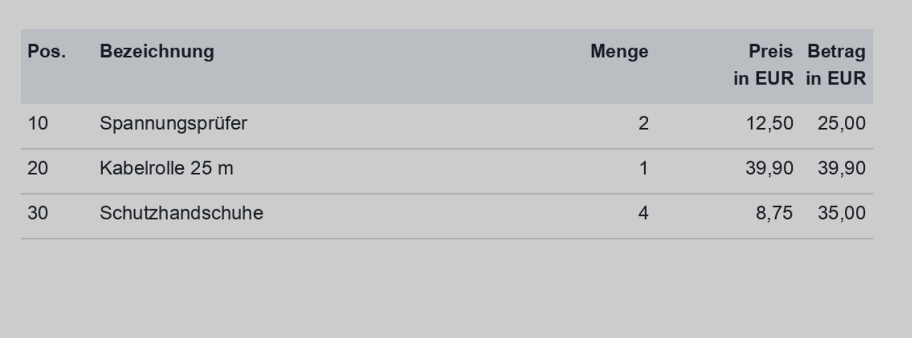<figcaption>
A table header that spans two lines.
</figcaption></figure>

Set the **Header row count** to match:

<figure>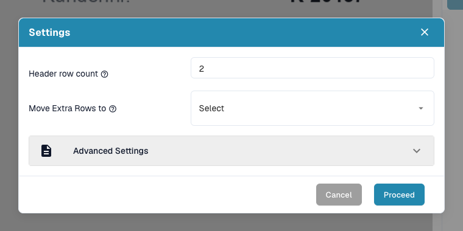<figcaption>
Header row count set to 2 in the Settings dialog.
</figcaption></figure>

#### Why is this important?

If you don’t set this, DocBits may treat the second line as data instead of part of the header, leading to extraction errors:

**Before:**

<figure>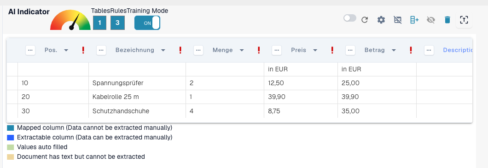<figcaption>
Before: the second header line is treated as data.
</figcaption></figure>

After:

<figure><figcaption>
After: header and data rows are separated correctly.
</figcaption></figure>

### Move Extra Rows to Trash

**Use this to discard unwanted multi-line entries, such as overflow descriptions.**

In this example, the description spills into multiple rows, but only the first line is relevant:

<figure>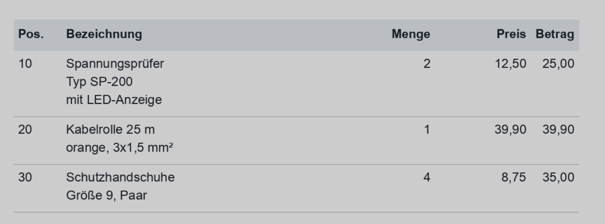<figcaption>
The description spills into several lines of which only the first is relevant.
</figcaption></figure>

Enable **Move Extra Rows to Trash** to remove the overflow:

<figure><figcaption>
Move Extra Rows to Trash enabled.
</figcaption></figure>

**Result after mapping:**

<figure><figcaption>
Result after mapping: only the relevant rows remain.
</figcaption></figure>

### Minimum Grouped Rows

**Use this when rows need to be grouped together under one main row (e.g. line items with multiple sub-lines).**

Here, only three out of six rows are relevant. Two key columns are mapped (e.g. Position, Description), while others are treated as custom fields.

Start by setting **Header row count** and the **Minimum grouped rows**:

<figure>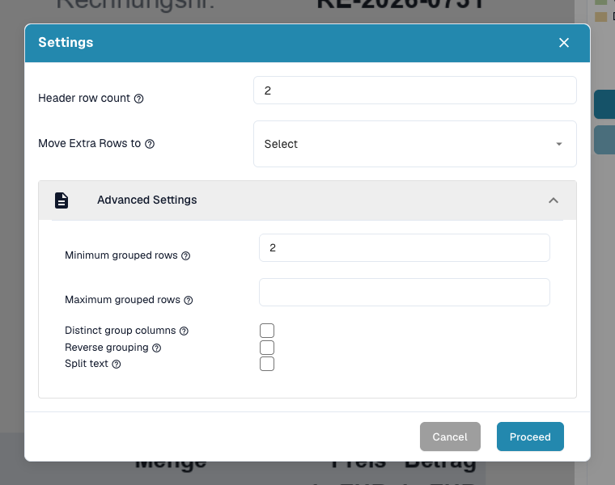<figcaption>
Header row count and Minimum grouped rows set in the Settings dialog.
</figcaption></figure>

Also enable **Move Extra Rows to Trash** to clean up irrelevant data:

<figure>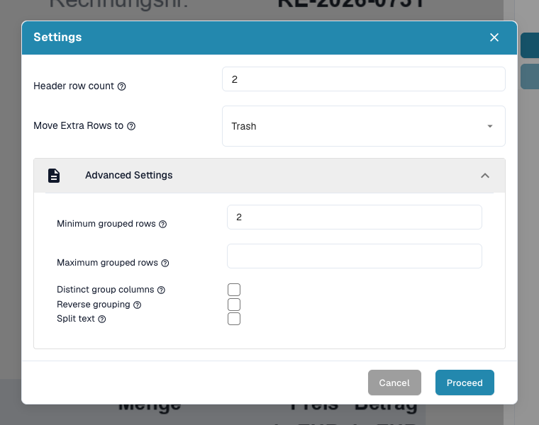<figcaption>
Move Extra Rows to Trash enabled in addition.
</figcaption></figure>

Then define the grouping key column, e.g. _Position_:

<figure>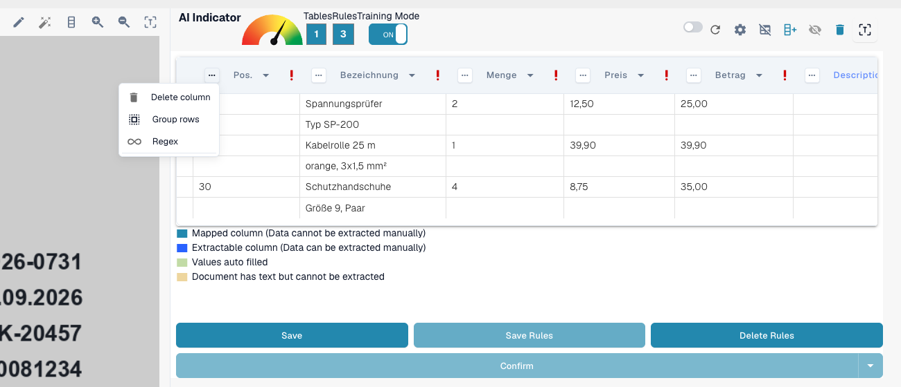<figcaption>
Choose Group rows in the column menu of the grouping key column (Position).
</figcaption></figure>

**Result:**

<figure>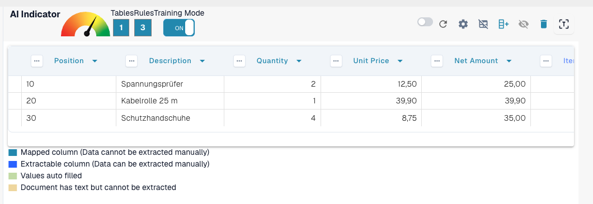<figcaption>
Result: the six physical rows are grouped into three line items.
</figcaption></figure>

### Reverse Grouping

**Use this when the grouping row appears&#x20;**_**after**_**&#x20;the rows it should group.**

If the row that should be grouped with other data appears _above_ the grouping key, enable this option:

<figure>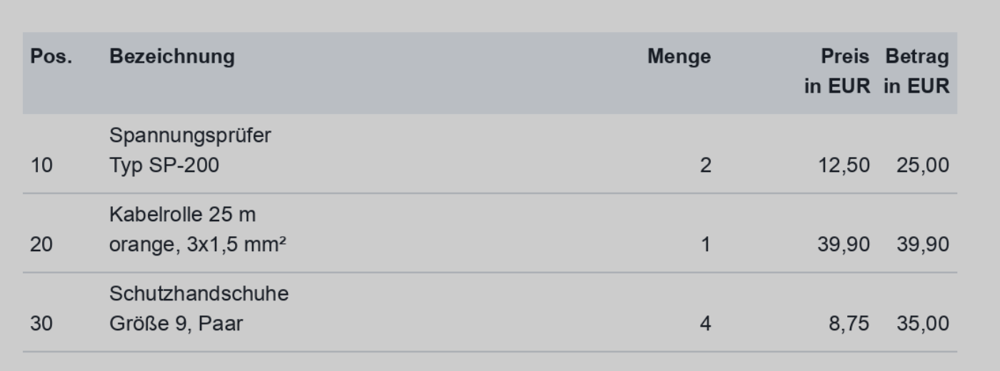<figcaption>
The grouping row appears after the rows it should group.
</figcaption></figure>

Enable **Reverse grouping**, group by a main column (e.g. Net amount), and use **Move Extra Rows to Trash** if needed:

<figure>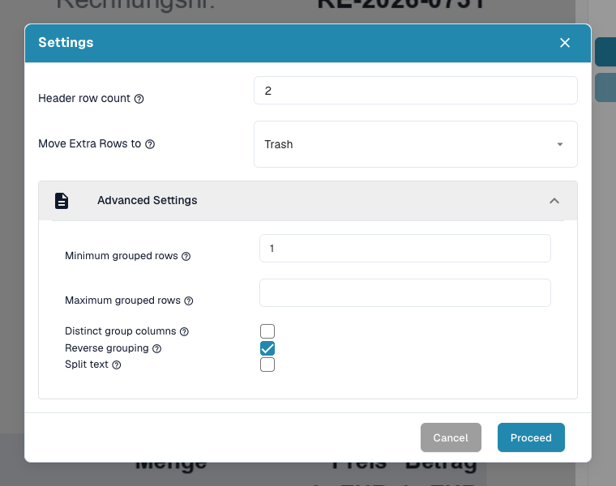<figcaption>
Reverse grouping enabled together with Move Extra Rows to Trash.
</figcaption></figure>

**Final result:**\

<figure>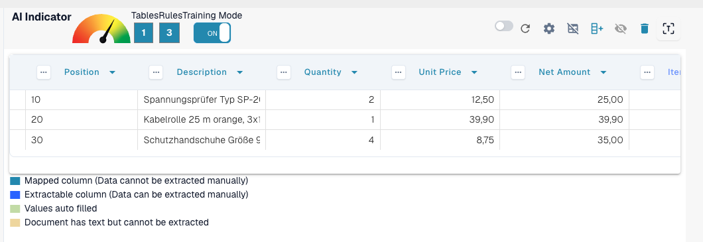<figcaption>
Final result with reverse grouping.
</figcaption></figure>

### Summary

Use the _Advanced Settings_ to teach DocBits how to accurately handle more complex or inconsistent table structures. These settings improve extraction precision by accounting for:

* Multi-line headers
* Multi-row descriptions
* Grouped line items
* Reverse order of grouped data

Enabling these options during training ensures DocBits remembers the correct layout for future documents from the same supplier.
