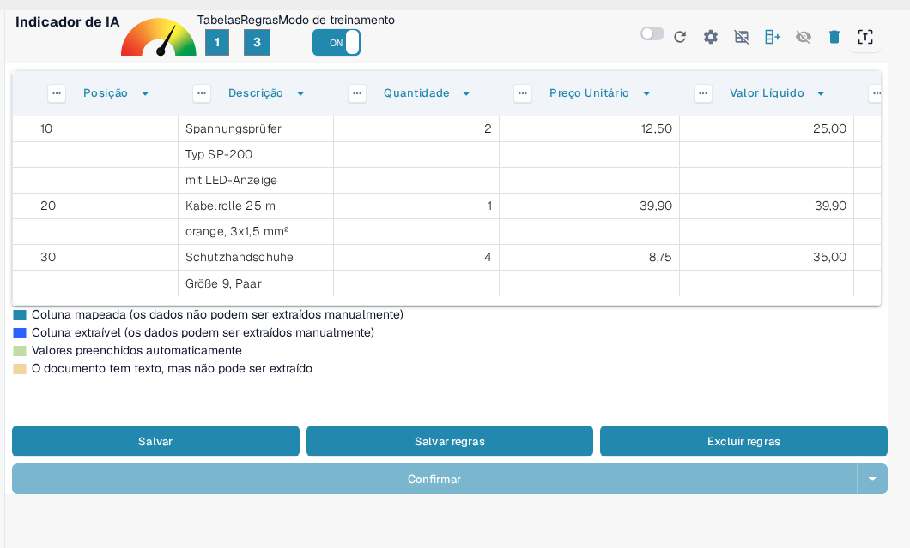
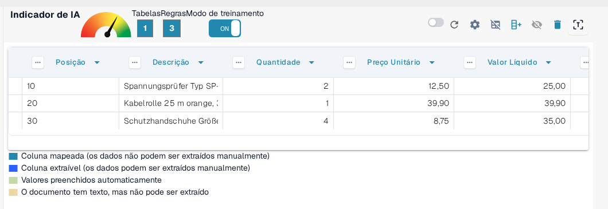
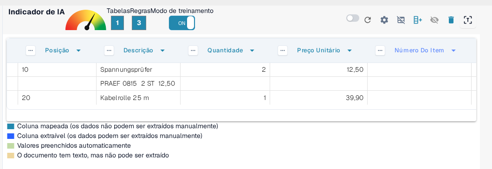
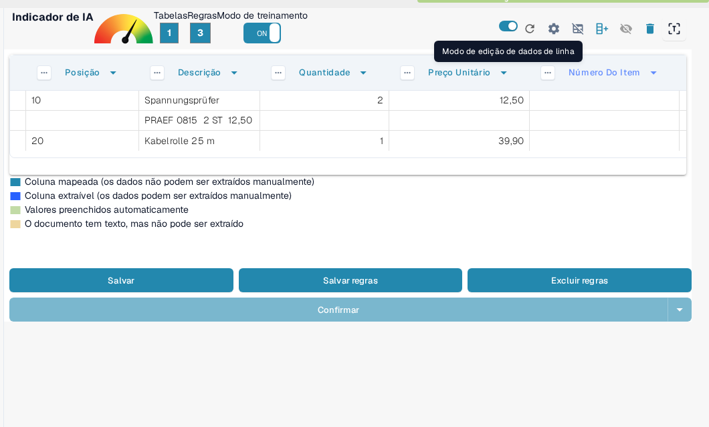
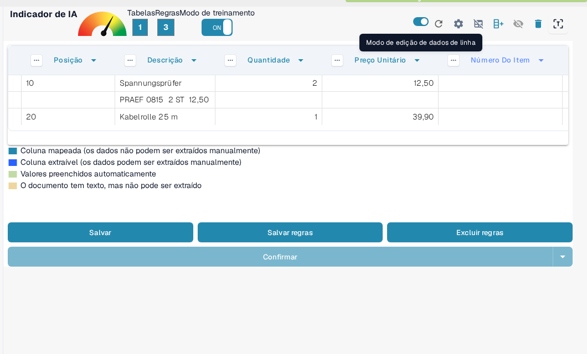

# Estruturação e Melhoria da Extração de Tabelas no DocBits

Uma vez que uma tabela é extraída e o mapeamento inicial das colunas é concluído, você pode aprimorar a qualidade e estrutura dos dados usando várias ferramentas integradas. Este guia o conduz por:

* Agrupamento de linhas
* Seleção manual de linhas
* Mapeamento de colunas
* Refinamento de cabeçalho usando regex

Essas ferramentas são especialmente úteis ao lidar com layouts de documentos complexos ou inconsistentes.

## 1. Agrupamento de Linhas

Documentos como faturas ou confirmações de pedidos frequentemente contêm entradas de tabela onde uma coluna (por exemplo, uma descrição) abrange várias linhas, enquanto outras colunas (por exemplo, quantidade ou preço) usam apenas uma linha.

Considere este exemplo de fatura alemã — a coluna "Bezeichnung" (descrição) abrange várias linhas:

<figure><figcaption>
Uma coluna de descrição que abrange várias linhas.
</figcaption></figure>

Inicialmente, o DocBits extrai cada linha separadamente:

<figure><figcaption>
O DocBits extrai cada linha separadamente no início.
</figcaption></figure>

Em seguida, você pode **agrupar linhas com base em uma coluna**, como "Posição". Isso mescla linhas relacionadas em uma entrada única e estruturada:

<figure><figcaption>
Após o agrupamento por Posição, as linhas relacionadas formam uma única entrada.
</figcaption></figure>

Quantas sublinhas são mescladas em uma entrada e como o agrupamento se comporta você define nas [Configurações Avançadas](advanced-settings.md) em **Mínimo de Linhas Agrupadas** e **Agrupamento Reverso**.

## 2. Seleção Manual de Linhas

Em alguns casos, o texto em um documento está distribuído por várias colunas em uma única linha, tornando difícil a atribuição automática.

Aqui está um exemplo em que a linha "PRAEF" se sobrepõe a **Bezeichnung**, **Menge**, **ME** e **Preis in EUR**:

<figure><figcaption>
Uma linha PRAEF que não se alinha à estrutura de colunas.
</figcaption></figure>

### Como Atribuir Valores Manualmente:

1.  **Ativar o Modo de Treinamento**

    <figure><figcaption>
Modo de treinamento ativado.
</figcaption></figure>
2.  **Ativar o Modo de Edição de Linha**

    <figure><figcaption>
Modo de edição de linha ativado.
</figcaption></figure>
3.  **Selecionar e Mapear Texto**\
    Clique na parte correta do texto e atribua-a a um cabeçalho de coluna **azul**.

    <figure><figcaption>
Os cabeçalhos de coluna azuis podem ser preenchidos manualmente.
</figcaption></figure>

> Nota: As colunas de cor violeta já estão mapeadas pelo sistema e não podem ser editadas manualmente.

Esse trabalho acontece no **modo de edição de dados de linha** (**Edição de dados de linha: Ativado**). O que você pode fazer nele e quando usá-lo em vez do **Modo de Treinamento** está descrito em [Training Line Fields/Table Training](README.md).

## 3. Mapeamento de Colunas

O mapeamento de colunas vincula seus dados extraídos aos cabeçalhos de coluna esperados, garantindo consistência e capacidade de exportação.

Para mapear ou remapear uma coluna:

1. Clique no cabeçalho da coluna na visualização de extração.
2. Escolha a coluna de destino correta no menu suspenso.

<figure><figcaption>
Escolha a coluna de destino no menu suspenso do cabeçalho.
</figcaption></figure>

Você pode ajustar o mapeamento quantas vezes forem necessárias.

Veja [Definindo Tabelas e Colunas](defining-tables-and-columns.md) para mais informações sobre a criação de tabelas e colunas.

## 4. Extrair de Acima / Abaixo

Alguns documentos são estruturados de forma que os valores relevantes da tabela não aparecem na mesma linha que outros dados. Nestes casos, o DocBits permite que você controle **de onde os dados devem ser extraídos**:

* **Extrair de Acima**: Use isso quando o valor para a linha atual aparece **na linha acima**.
* **Extrair de Abaixo**: Use isso quando o valor aparece **na linha abaixo** da linha atual.

**Onde Encontrar**

1. Entre no **Modo de Treinamento**.
2. Clique nos três pontos (⋯) em um cabeçalho de coluna.
3. Sob a opção **"Extrair De"**, escolha `Acima` ou `Abaixo` dependendo do layout do documento.

## 5. Formato de Quantidade

Algumas colunas, como **Quantidade** ou **Preço Unitário**, contêm valores numéricos ou de data que podem seguir convenções de formatação diferentes, dependendo da origem ou localidade do documento. O DocBits permite que você especifique o formato que esses valores devem seguir para garantir uma extração e interpretação precisas.

**Opções de Formato de Quantidade:**

* Defina o formato numérico ou de data esperado para a coluna, como EUA (MM/DD/AAAA, decimal com ponto), Polônia (DD.MM.AAAA, decimal com vírgula), Alemanha e outros.
* Isso ajuda o DocBits a analisar e padronizar corretamente os valores, mesmo que o documento use um formato regional diferente.

**Onde Encontrar**

1. Entre no **Modo de Treinamento**.
2. Clique nos três pontos (⋯) no cabeçalho de uma coluna suportada (por exemplo, Quantidade, Preço Unitário).
3. Sob a opção **Formato de Quantidade**, selecione o formato desejado que corresponda à localidade do seu documento.

## 6. Melhorando a Extração de Tabelas com Regex

## **O que Faz**

Essa funcionalidade permite que você defina um regex para cada cabeçalho de tabela, melhorando a precisão da extração e garantindo resultados corretos.

## **Como Usar**

1. Abra um documento do fornecedor para o qual deseja definir um regex.
2.  Navegue até a visualização de **Extração de Tabela**.

    
3. Ative o **Modo de Treinamento**.
4.  Selecione o cabeçalho da tabela que deseja refinar e escolha **Regex**.

    
5.  Uma janela pop-up aparecerá onde você pode inserir e definir seu regex.

    
6.  Clique em **Validar** para verificar o regex, depois em **Salvar Alterações** para aplicá-lo.

    
7. **Salve a regra e confirme** para aplicar as alterações.

Para salvar ou excluir regras treinadas de forma permanente, veja [Salvar e Excluir Regras](save-and-delete-rules.md).

## Quando Usar Cada Recurso

Use essas ferramentas para aumentar a precisão da extração e reduzir o trabalho manual:

* **Agrupamento**: Quando uma descrição ou qualquer coluna abrange várias linhas e precisa ser combinada para clareza.
* **Seleção Manual de Linhas**: Quando as linhas não estão estruturadas de forma limpa e partes do conteúdo caem nas colunas erradas.
* **Mapeamento de Colunas**: Quando os nomes das colunas detectados automaticamente não correspondem à sua estrutura ou precisam de refinamento.
* **Regras de Regex**: Quando os cabeçalhos de tabela variam ligeiramente entre documentos do mesmo fornecedor ou o OCR introduz inconsistências.

Guias relacionados nesta área:

* [Configurações Avançadas](advanced-settings.md) – agrupamento, linhas de cabeçalho e tratamento de linhas extras.
* [Definindo Tabelas e Colunas](defining-tables-and-columns.md) – criar tabelas e colunas para o treinamento.
* [Salvar e Excluir Regras](save-and-delete-rules.md) – aplicar ou remover permanentemente um layout treinado.
