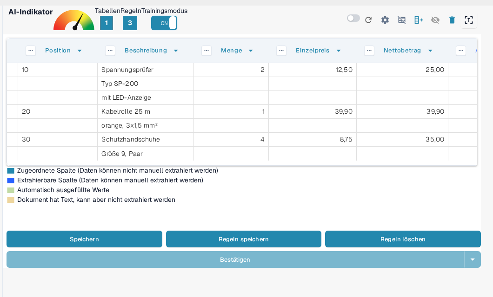
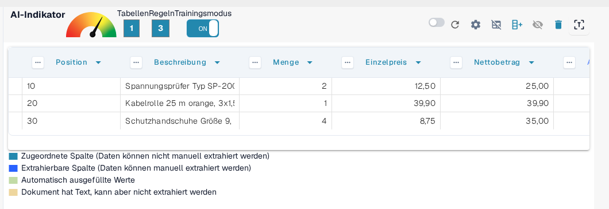
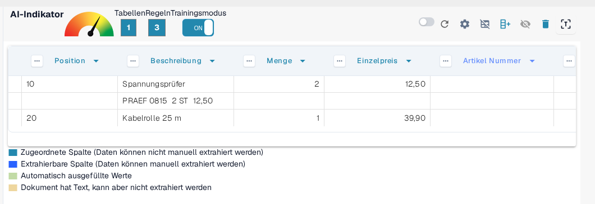
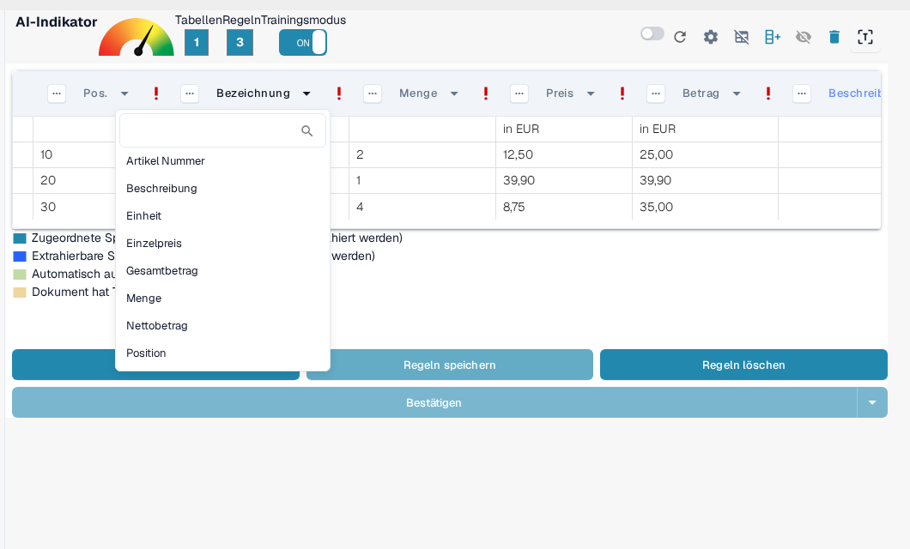

# Strukturierung und Verbesserung der Tabellenauswertung in DocBits

Sobald eine Tabelle extrahiert und die initiale Spaltenzuordnung abgeschlossen ist, können Sie die Qualität und Struktur der Daten mithilfe mehrerer integrierter Tools verbessern. Dieser Leitfaden führt Sie durch:

* Gruppierung von Zeilen
* Manuelle Zeilenauswahl
* Spaltenzuordnung
* Header-Verfeinerung mit Regex

Diese Tools sind besonders hilfreich bei komplexen oder inkonsistenten Dokumentlayouts.

## 1. Gruppierung von Zeilen

Dokumente wie Rechnungen oder Auftragsbestätigungen enthalten oft Tabelleneinträge, bei denen eine Spalte (z. B. eine Beschreibung) mehrere Zeilen umfasst, während andere Spalten (z. B. Menge oder Preis) nur eine Zeile verwenden.

Nehmen Sie dieses Beispiel einer deutschen Rechnung - die Spalte "Bezeichnung" erstreckt sich über mehrere Zeilen:

<figure><figcaption>
Eine Beschreibungsspalte, die sich über mehrere Zeilen erstreckt.
</figcaption></figure>

Zunächst extrahiert DocBits jede Zeile separat:

<figure><figcaption>
DocBits extrahiert zunächst jede Zeile separat.
</figcaption></figure>

Anschließend können Sie **Zeilen basierend auf einer Spalte gruppieren**, wie z. B. "Position". Dadurch werden zusammenhängende Zeilen zu einem einzigen strukturierten Eintrag zusammengeführt:

<figure><figcaption>
Nach der Gruppierung nach Position bilden die zusammengehörigen Zeilen einen Eintrag.
</figcaption></figure>

Wie viele Unterzeilen zu einem Eintrag zusammengefasst werden und wie die Gruppierung sich verhält, stellen Sie in den [erweiterten Einstellungen](advanced-settings.md) unter **Mindestanzahl gruppierte Zeilen** und **Umgekehrte Gruppierung** ein.

## 2. Manuelle Zeilenauswahl

In einigen Fällen ist der Text auf einem Dokument über mehrere Spalten in einer Zeile verteilt, was eine automatische Zuordnung erschwert.

Hier ist ein Beispiel, bei dem die Zeile "PRAEF" **Bezeichnung**, **Menge**, **ME** und **Preis in EUR** überlappt:

<figure><figcaption>
Eine PRAEF-Zeile, die nicht zum Spaltenaufbau passt.
</figcaption></figure>

Zeilenverschiebung

### Wie man Werte manuell zuweist:

1.  **Training-Modus aktivieren**

    <figure><figcaption>
Trainingsmodus aktiviert.
</figcaption></figure>
2.  **Aktivieren des Zeilenbearbeitungsmodus**\

    <figure><figcaption>
Bearbeitungsmodus für Zeilendaten aktiviert.
</figcaption></figure>

3.  **Text auswählen und zuordnen** Klicken Sie auf das richtige Textstück und weisen Sie es einem **blauen** Spaltenkopf zu.

    <figure><figcaption>
Blaue Spaltenüberschriften können manuell gefüllt werden.
</figcaption></figure>

> Hinweis: Violett markierte Spalten sind bereits systemmäßig zugeordnet und können nicht manuell bearbeitet werden.

Dieses Vorgehen gehört zum **Korrekturmodus**, in dem Sie Werte manuell berichtigen. Was Sie dort tun können und wann Sie ihn statt des Trainingsmodus einsetzen, lesen Sie unter [Training Line Fields/Table Training](README.md).

## 3. Spaltenzuordnung

Die Spaltenzuordnung verknüpft Ihre extrahierten Daten mit den erwarteten Spaltenüberschriften, um Konsistenz und Exportierbarkeit sicherzustellen.

Um eine Spalte zuzuordnen oder neu zuzuordnen:

1. Klicken Sie auf den Spaltenheader in der Extraktionsansicht.
2. Wählen Sie die korrekte Zielspalte aus dem Dropdown-Menü.

<figure><figcaption>
Wählen Sie die Zielspalte im Dropdown der Überschrift.
</figcaption></figure>

Sie können die Zuordnung so oft anpassen, wie es erforderlich ist.

Mehr dazu, wie Tabellen und Spalten grundsätzlich angelegt werden, steht unter [Definieren von Tabellen und Spalten](defining-tables-and-columns.md).

## 4. Extrahieren von oben / unten

Einige Dokumente sind so strukturiert, dass relevante Tabellenwerte nicht in derselben Zeile wie andere Daten erscheinen. In solchen Fällen ermöglicht DocBits Ihnen zu steuern, **von wo die Daten extrahiert werden sollen**:

* **Von oben extrahieren**: Verwenden Sie dies, wenn der Wert für die aktuelle Zeile **in der Zeile darüber** erscheint.
* **Von unten extrahieren**: Verwenden Sie dies, wenn der Wert **in der Zeile unterhalb** der aktuellen Zeile erscheint.

**Wo Sie es finden**

1. Betreten Sie den **Training-Modus**.
2. Klicken Sie auf die drei Punkte (⋯) auf einem Spaltenheader.
3. Wählen Sie unter der Option **"Extrahieren von"** `Oben` oder `Unten`, abhängig vom Dokumentenlayout.

## 5. Betragsformat

Einige Spalten, wie **Menge** oder **Stückpreis**, enthalten numerische oder Datumsangaben, die je nach Herkunft oder Sprachraum des Dokuments unterschiedlichen Formatkonventionen folgen können. DocBits ermöglicht es Ihnen, das Format festzulegen, dem diese Werte folgen sollen, um eine genaue Extraktion und Interpretation sicherzustellen.

**Betragsformatoptionen:**

* Definieren Sie das erwartete Zahlen- oder Datumsformat für die Spalte, wie z. B. US (MM/TT/JJJJ, Dezimaltrennzeichen mit Punkt), Polen (TT.MM.JJJJ, Dezimaltrennzeichen mit Komma), Deutschland und andere.
* Dies hilft DocBits, Werte korrekt zu analysieren und zu standardisieren, auch wenn das Dokument ein anderes regionales Format verwendet.

**Wo Sie es finden**

1. Betreten Sie den **Training-Modus**.
2. Klicken Sie auf die drei Punkte (⋯) im Header einer unterstützten Spalte (z. B. Menge, Stückpreis).
3. Wählen Sie unter der Option **Betragsformat** das gewünschte Format entsprechend dem Sprachraum Ihres Dokuments aus.

## 6. Verbesserung der Tabellenauswertung mit Regex

## **Was es tut**

Diese Funktion ermöglicht es Ihnen, für jede Tabellenüberschrift ein Regex zu definieren, um die Extraktionsgenauigkeit zu verbessern und korrekte Ergebnisse sicherzustellen.

## **Wie man es benutzt**

1. Öffnen Sie ein Dokument vom Lieferanten, für den Sie ein Regex definieren möchten.
2.  Navigieren Sie zur Ansicht **Tabellenauswertung**.

    
3. Aktivieren Sie den **Training-Modus**.
4.  Wählen Sie die Tabellenüberschrift, die Sie verfeinern möchten, und wählen Sie dann **Regex**.

    
5.  Es erscheint ein Popup, in dem Sie Ihr Regex eingeben und definieren können.

    
6.  Klicken Sie auf **Validieren**, um das Regex zu überprüfen, und dann auf **Änderungen speichern**, um es anzuwenden.

    
7. **Regel speichern und bestätigen**, um die Änderungen anzuwenden.

Wie Sie Ihre trainierten Regeln dauerhaft speichern oder wieder löschen, ist unter [Regeln speichern und löschen](save-and-delete-rules.md) beschrieben.

## Wann Sie jedes Feature verwenden sollten

Verwenden Sie diese Tools, um die Extraktionsgenauigkeit zu erhöhen und manuelle Arbeit zu reduzieren:

* **Gruppierung**: Wenn eine Beschreibung oder eine Spalte über mehrere Zeilen verläuft und für Klarheit kombiniert werden muss.
* **Manuelle Zeilenauswahl**: Wenn Zeilen nicht sauber strukturiert sind und Teile des Inhalts in falsche Spalten fallen.
* **Spaltenzuordnung**: Wenn die automatisch erkannten Spaltennamen nicht mit Ihrer Struktur übereinstimmen oder verfeinert werden müssen.
* **Regex-Regeln**: Wenn Tabellenüberschriften in Dokumenten desselben Lieferanten leicht variieren oder OCR Unstimmigkeiten einführt.

Weiterführende Anleitungen in diesem Bereich:

* [Erweiterte Einstellungen](advanced-settings.md) – Gruppierung, Kopfzeilen und Umgang mit zusätzlichen Zeilen.
* [Definieren von Tabellen und Spalten](defining-tables-and-columns.md) – Tabellen und Spalten anlegen.
* [Regeln speichern und löschen](save-and-delete-rules.md) – trainiertes Layout dauerhaft übernehmen oder verwerfen.
