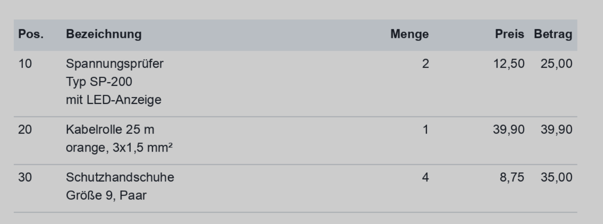
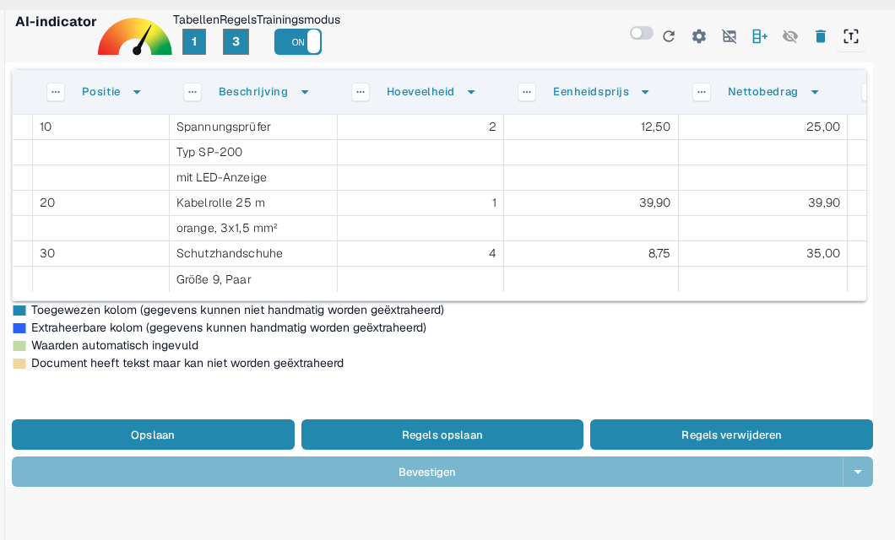
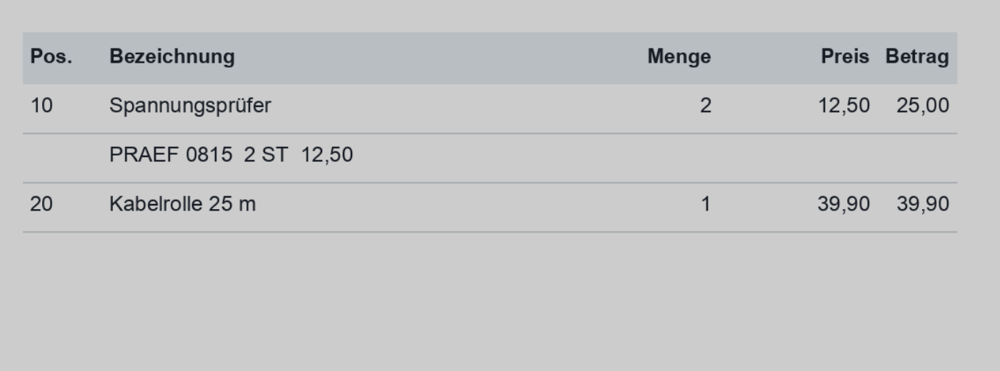
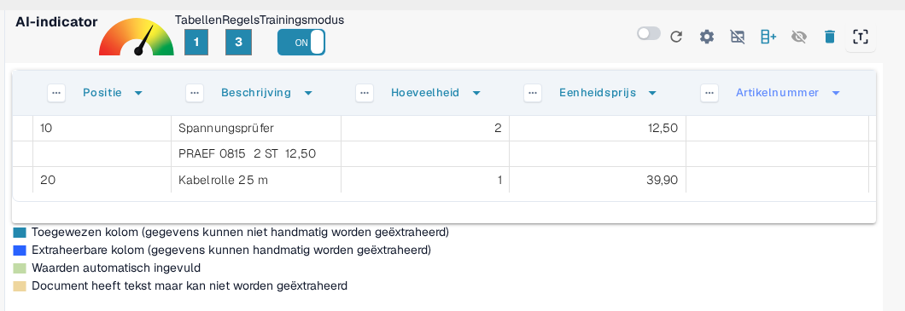
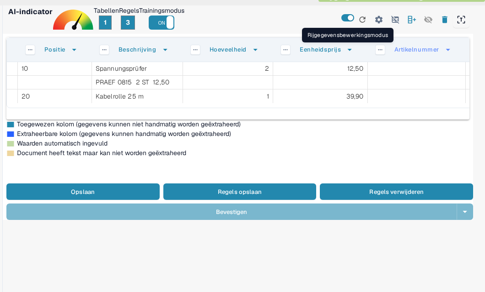
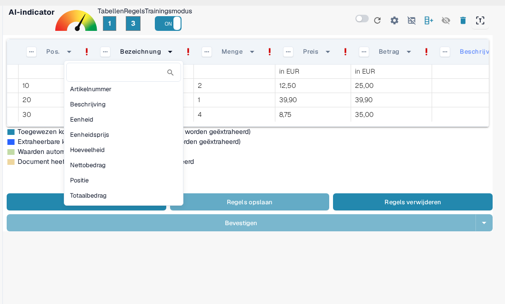

# Structureren en verbeteren van tabelextractie in DocBits

Zodra een tabel is geëxtraheerd en de initiële kolomtoewijzing is voltooid, kunt u de kwaliteit en structuur van de gegevens verbeteren met behulp van verschillende ingebouwde hulpmiddelen. Deze handleiding leidt u door:

* Rijen groeperen
* Handmatige rijselectie
* Kolommen toewijzen
* Kolomkoppen verfijnen met regex

Deze hulpmiddelen zijn vooral nuttig bij complexe of inconsistente documentindelingen.

## 1. Rijen Groeperen

Documenten zoals facturen of orderbevestigingen bevatten vaak tabelregels waarbij één kolom (bijvoorbeeld een omschrijving) meerdere regels beslaat, terwijl andere kolommen (bijvoorbeeld hoeveelheid of prijs) slechts één regel gebruiken.

Neem dit Duitse factuurvoorbeeld — de kolom "Bezeichnung" (omschrijving) beslaat meerdere rijen:

<figure><figcaption>
Een omschrijvingskolom die meerdere rijen beslaat.
</figcaption></figure>

In eerste instantie extraheert DocBits elke rij afzonderlijk:

<figure><figcaption>
DocBits extraheert eerst elke rij afzonderlijk.
</figcaption></figure>

U kunt vervolgens **rijen groeperen op basis van een kolom**, zoals "Positie". Dit voegt gerelateerde regels samen tot één gestructureerde invoer:

<figure><figcaption>
Na groepering op Positie vormen de gerelateerde regels één invoer.
</figcaption></figure>

Hoeveel subregels tot één invoer worden samengevoegd en hoe het groeperen zich gedraagt, stelt u in bij de [Geavanceerde instellingen](advanced-settings.md) onder **Minimum gegroepeerde rijen** en **Omgekeerde groepering**.

## 2. Handmatige Rijselectie

In sommige gevallen is de tekst op een document verdeeld over meerdere kolommen binnen één rij, waardoor automatische toewijzing moeilijk is.

Hier is een voorbeeld waarbij de regel "PRAEF" overlapt met **Bezeichnung**, **Menge**, **ME** en **Preis in EUR**:

<figure><figcaption>
Een PRAEF-regel die niet aansluit op de kolomstructuur.
</figcaption></figure>

### Waarden handmatig toewijzen:

1.  **Schakel de Trainingsmodus in**

    <figure><figcaption>
Trainingsmodus ingeschakeld.
</figcaption></figure>
2.  **Activeer de Rijgegevensbewerkingsmodus**

    <figure><figcaption>
Rijgegevensbewerkingsmodus geactiveerd.
</figcaption></figure>
3.  **Selecteer en Koppel Tekst**\
    Klik op het juiste stuk tekst en wijs het toe aan een **blauwe** kolomkop.

    <figure><figcaption>
Blauwe kolomkoppen kunnen handmatig worden ingevuld.
</figcaption></figure>

> Opmerking: Paarsgekleurde kolommen zijn al systeemtoegewezen en kunnen niet handmatig worden bewerkt.

Dit werk gebeurt in de **rijgegevensbewerkingsmodus** (**Rijgegevensbewerkingsmodus: Aan**). Wat u daar kunt doen en wanneer u die in plaats van de **Trainingsmodus** gebruikt, staat in [Training van regelvelden/tabeltraining](README.md).

## 3. Kolommen Toewijzen

Kolomtoewijzing koppelt uw geëxtraheerde gegevens aan de verwachte kolomkoppen, zodat consistentie en exporteerbaarheid zijn gegarandeerd.

Een kolom toewijzen of opnieuw toewijzen:

1. Klik op de kolomkop in de extractieweergave.
2. Kies de juiste doelkolom uit de vervolgkeuzelijst.

<figure><figcaption>
Kies de doelkolom in de vervolgkeuzelijst van de kolomkop.
</figcaption></figure>

U kunt de toewijzing zo vaak aanpassen als nodig is.

Zie [Tabellen en kolommen definiëren](defining-tables-and-columns.md) voor meer informatie over het maken van tabellen en kolommen.

## 4. Extraheren van Boven / Onder

Sommige documenten zijn zo opgebouwd dat relevante tabelwaarden niet op dezelfde rij als andere gegevens verschijnen. In die gevallen kunt u met DocBits bepalen **vanaf welke rij de gegevens moeten worden geëxtraheerd**:

* **Extraheren van Boven**: Gebruik dit wanneer de waarde voor de huidige rij **in de regel erboven** verschijnt.
* **Extraheren van Onder**: Gebruik dit wanneer de waarde **in de regel eronder** verschijnt.

**Waar u het vindt**

1. Ga naar de **Trainingsmodus**.
2. Klik op de drie puntjes (⋯) op een kolomkop.
3. Kies onder de optie **"Extraheren van"** `Boven` of `Onder`, afhankelijk van de documentindeling.

## 5. Bedrag Formaat

Sommige kolommen, zoals **Hoeveelheid** of **Eenheidsprijs**, bevatten numerieke of datumwaarden die verschillende opmaakconventies kunnen volgen, afhankelijk van de herkomst of locatie van het document. Met DocBits kunt u het formaat opgeven dat deze waarden moeten volgen om nauwkeurige extractie en interpretatie te garanderen.

**Opties voor Bedrag Formaat:**

* Definieer het verwachte getal- of datumformaat voor de kolom, zoals VS (MM/DD/JJJJ, decimaal met punt), Polen (DD.MM.JJJJ, decimaal met komma), Duitsland en andere.
* Dit helpt DocBits om waarden correct te parseren en te standaardiseren, zelfs als het document een andere regionale indeling gebruikt.

**Waar u het vindt**

1. Ga naar de **Trainingsmodus**.
2. Klik op de drie puntjes (⋯) op de kop van een ondersteunde kolom (bijvoorbeeld Hoeveelheid, Eenheidsprijs).
3. Selecteer onder de optie **Bedrag Formaat** het gewenste formaat dat overeenkomt met de locatie van uw document.

## 6. Tabelextractie verbeteren met Regex

## **Wat het doet**

Met deze functie definieert u voor elke tabelkop een regex, waardoor de extractie nauwkeuriger wordt en de juiste resultaten worden gegarandeerd.

## **Hoe u het gebruikt**

1. Open een document van de leverancier waarvoor u een regex wilt definiëren.
2.  Ga naar de weergave **Tabel Extractie**.

    
3. Schakel de **Trainingsmodus** in.
4.  Selecteer de tabelkop die u wilt verfijnen en kies vervolgens **Regex**.

    
5.  Er verschijnt een pop-up waarin u uw regex kunt invoeren en definiëren.

    
6.  Klik op **Valideren** om de regex te controleren en vervolgens op **Wijzigingen Opslaan** om deze toe te passen.

    
7. **Sla de regel op en bevestig** om de wijzigingen toe te passen.

Hoe u getrainde regels blijvend opslaat of verwijdert, staat in [Regels Opslaan en Verwijderen](save-and-delete-rules.md).

## Wanneer u elke functie gebruikt

Gebruik deze hulpmiddelen om de extractienauwkeurigheid te verhogen en handmatig werk te verminderen:

* **Groeperen**: Wanneer een omschrijving of een willekeurige kolom meerdere rijen beslaat en voor de duidelijkheid moet worden samengevoegd.
* **Handmatige Rijselectie**: Wanneer rijen niet netjes zijn gestructureerd en delen van de inhoud in de verkeerde kolommen terechtkomen.
* **Kolommen Toewijzen**: Wanneer de automatisch gedetecteerde kolomnamen niet overeenkomen met uw structuur of verfijning nodig hebben.
* **Regex-regels**: Wanneer tabelkoppen licht variëren tussen documenten van dezelfde leverancier of OCR inconsistenties introduceert.

Gerelateerde handleidingen in dit gebied:

* [Geavanceerde instellingen](advanced-settings.md) – groeperen, kopregels en omgaan met extra rijen.
* [Tabellen en kolommen definiëren](defining-tables-and-columns.md) – tabellen en kolommen maken voor de training.
* [Regels Opslaan en Verwijderen](save-and-delete-rules.md) – een getrainde indeling blijvend toepassen of loslaten.
