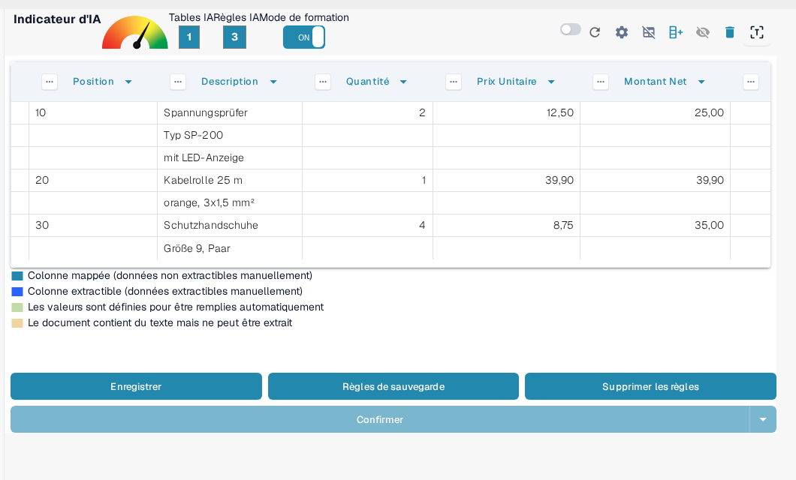
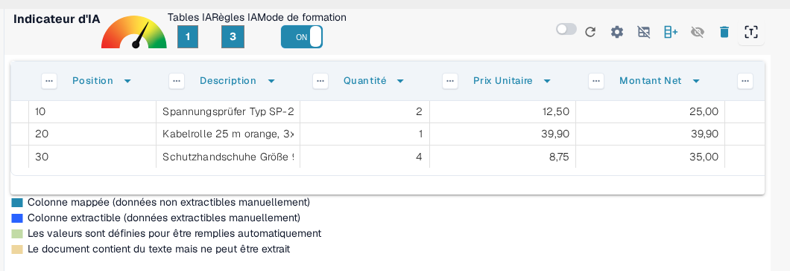
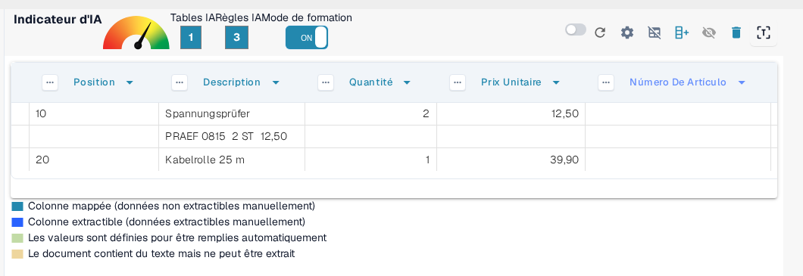
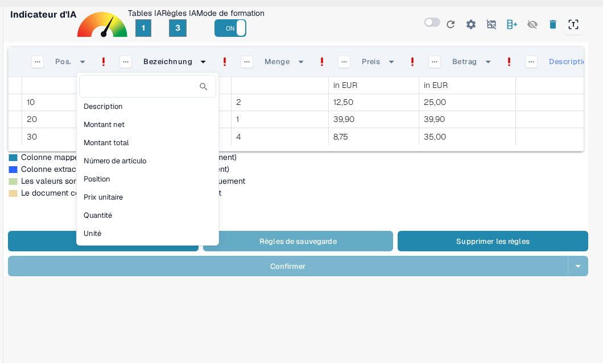

# Structuration et amélioration de l'extraction de table dans DocBits

Une fois qu'une table est extraite et que le mappage initial des colonnes est complet, vous pouvez améliorer la qualité et la structure des données en utilisant plusieurs outils intégrés. Ce guide vous accompagne à travers :

* Regroupement des lignes
* Sélection manuelle de lignes
* Mappage des colonnes
* Affinage de l'en-tête en utilisant des regex

Ces outils sont particulièrement utiles lorsqu'il s'agit de mises en page de documents complexes ou incohérentes.

## 1. Regroupement des lignes

Des documents tels que des factures ou des confirmations de commande contiennent souvent des entrées de table où une colonne (par exemple, une description) s'étend sur plusieurs lignes, tandis que d'autres colonnes (par exemple, quantité ou prix) n'utilisent qu'une seule ligne.

Prenons cet exemple de facture allemande — la colonne « Bezeichnung » (description) s'étend sur plusieurs lignes :

<figure><figcaption>
Une colonne de description qui s'étend sur plusieurs lignes.
</figcaption></figure>

Initialement, DocBits extrait chaque ligne séparément :

<figure><figcaption>
DocBits extrait d'abord chaque ligne séparément.
</figcaption></figure>

Vous pouvez ensuite **regrouper les lignes en fonction d'une colonne**, telle que « Position ». Cela fusionne les lignes liées en une seule entrée structurée :

<figure><figcaption>
Après le regroupement par « Position », les lignes liées forment une seule entrée.
</figcaption></figure>

Combien de sous-lignes sont fusionnées en une entrée et comment le regroupement se comporte se règle dans les [Paramètres avancés](advanced-settings.md) sous **Nombre minimum de lignes regroupées** et **Regroupement inversé**.

## 2. Sélection manuelle de lignes

Dans certains cas, le texte sur un document est réparti sur plusieurs colonnes dans une seule ligne, ce qui rend difficile l'attribution automatique.

Voici un exemple où la ligne « PRAEF » chevauche **Bezeichnung**, **Menge**, **ME**, et **Preis in EUR** :

<figure><figcaption>
Une ligne « PRAEF » qui ne s'aligne pas sur la structure des colonnes.
</figcaption></figure>

### Comment attribuer manuellement des valeurs :

1.  **Activer le mode de formation**

    <figure><figcaption>
Mode de formation activé.
</figcaption></figure>
2.  **Activer le mode d'édition des données de ligne**

    <figure><figcaption>
Mode d'édition des données de ligne activé.
</figcaption></figure>
3.  **Sélectionner et mapper le texte**\
    Cliquez sur la partie de texte correcte et attribuez-la à un en-tête de colonne **bleu**.

    <figure><figcaption>
Les en-têtes de colonne bleus peuvent être remplis manuellement.
</figcaption></figure>

> Remarque : Les colonnes de couleur violette sont déjà mappées par le système et ne peuvent pas être modifiées manuellement.

Ce travail se fait dans le **mode d'édition des données de ligne**. Ce que vous pouvez y faire et quand l'utiliser à la place du mode de formation est décrit sous [Formation des Champs de Ligne/Table de Formation](README.md).

## 3. Mappage des colonnes

Le mappage des colonnes relie vos données extraites aux en-têtes de colonnes attendus, garantissant ainsi la cohérence et l'exportabilité.

Pour mapper ou remapper une colonne :

1. Cliquez sur l'en-tête de colonne dans la vue d'extraction.
2. Choisissez la colonne cible correcte dans la liste déroulante.

<figure><figcaption>
Choisissez la colonne cible dans le menu déroulant de l'en-tête.
</figcaption></figure>

Vous pouvez ajuster le mappage autant de fois que nécessaire.

Pour savoir comment créer des tables et des colonnes, consultez [Définition des tables et des colonnes](defining-tables-and-columns.md).

## 4. Extraire d'au-dessus / d'en-dessous

Certains documents sont structurés de telle manière que les valeurs de table pertinentes n'apparaissent pas sur la même ligne que les autres données. Dans ces cas, DocBits vous permet de contrôler **d'où les données doivent être extraites** :

* **Extraire d'au-dessus** : Utilisez ceci lorsque la valeur pour la ligne actuelle apparaît **dans la ligne au-dessus**.
* **Extraire d'en-dessous** : Utilisez ceci lorsque la valeur apparaît **dans la ligne en dessous** de la ligne actuelle.

**Où le trouver**

1. Entrez en **Mode de formation**.
2. Cliquez sur les trois points (⋯) sur un en-tête de colonne.
3. Sous l'option **« Extraire de »**, choisissez `Au-dessus` ou `En-dessous` en fonction de la mise en page du document.

## 5. Format de montant

Certaines colonnes, telles que **Quantité** ou **Prix unitaire**, contiennent des valeurs numériques ou de date qui peuvent suivre différentes conventions de formatage en fonction de l'origine ou de la localisation du document. DocBits vous permet de spécifier le format que ces valeurs doivent suivre pour garantir une extraction et une interprétation précises.

**Options de format de montant :**

* Définissez le format de nombre ou de date attendu pour la colonne, tel que US (MM/JJ/AAAA, décimal avec point), Pologne (JJ.MM.AAAA, décimal avec virgule), Allemagne, et autres.
* Cela aide DocBits à analyser et standardiser correctement les valeurs même si le document utilise un format régional différent.

**Où le trouver**

1. Entrez en **Mode de formation**.
2. Cliquez sur les trois points (⋯) sur l'en-tête d'une colonne prise en charge (par exemple, Quantité, Prix unitaire).
3. Sous l'option **Format de montant**, sélectionnez le format souhaité correspondant à la localisation de votre document.

## 6. Amélioration de l'extraction de table avec Regex

## **Ce que cela fait**

Cette fonctionnalité vous permet de définir une regex pour chaque en-tête de table, améliorant la précision de l'extraction et garantissant des résultats corrects.

## **Comment l'utiliser**

1. Ouvrez un document du fournisseur pour lequel vous souhaitez définir une regex.
2.  Accédez à la vue **Extraction de table**.

    
3. Activez le **Mode de formation**.
4.  Sélectionnez l'en-tête de table que vous souhaitez affiner, puis choisissez **Regex**.

    
5.  Une fenêtre contextuelle apparaîtra où vous pouvez entrer et définir votre regex.

    
6.  Cliquez sur **Valider** pour vérifier la regex, puis sur **Enregistrer les modifications** pour l'appliquer.

    
7. **Enregistrez la règle et confirmez** pour appliquer les modifications.

Pour savoir comment enregistrer ou supprimer durablement vos règles entraînées, consultez [Enregistrer et Supprimer les Règles](save-and-delete-rules.md).

## Quand utiliser chaque fonctionnalité

Utilisez ces outils pour augmenter la précision de l'extraction et réduire le travail manuel :

* **Regroupement** : Lorsqu'une description ou toute colonne s'étend sur plusieurs lignes et doit être combinée pour plus de clarté.
* **Sélection manuelle de lignes** : Lorsque les lignes ne sont pas structurées proprement et que des parties du contenu tombent dans les mauvaises colonnes.
* **Mappage des colonnes** : Lorsque les noms de colonnes détectés automatiquement ne correspondent pas à votre structure ou nécessitent un affinement.
* **Règles Regex** : Lorsque les en-têtes de table varient légèrement d'un document à l'autre du même fournisseur ou que l'OCR introduit des incohérences.

## Guides connexes dans ce domaine

* [Paramètres avancés](advanced-settings.md) – regroupement, en-têtes et gestion des lignes supplémentaires.
* [Définition des tables et des colonnes](defining-tables-and-columns.md) – créer des tables et des colonnes pour la formation.
* [Enregistrer et Supprimer les Règles](save-and-delete-rules.md) – appliquer ou abandonner durablement une mise en page entraînée.
