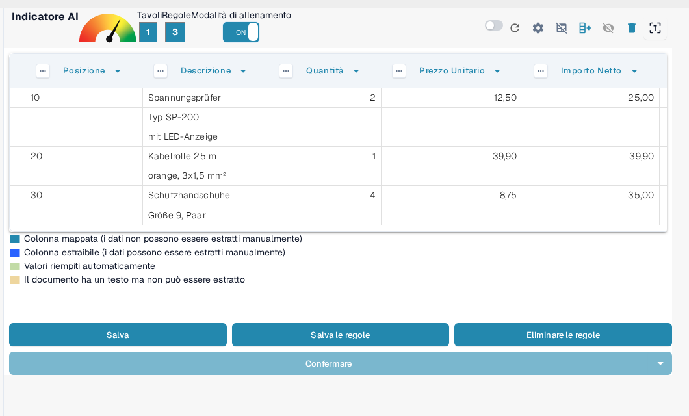
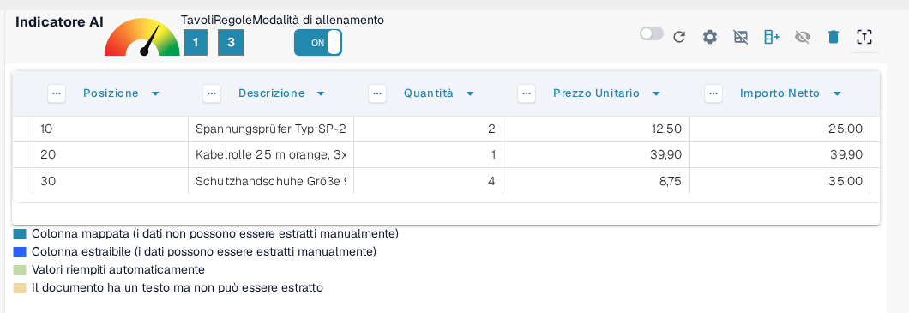
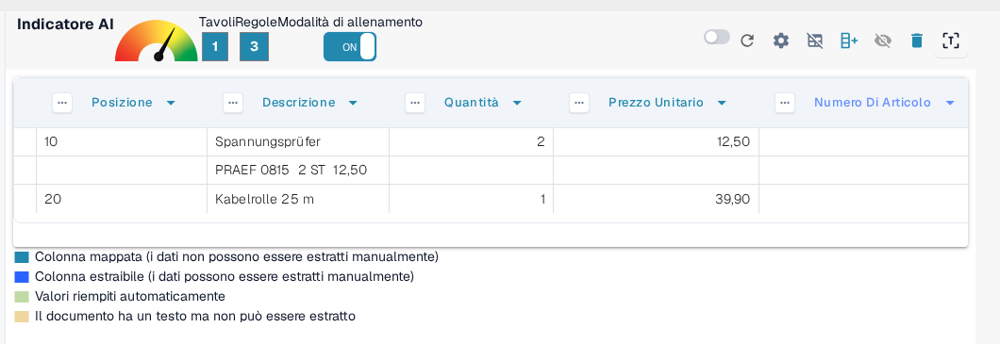
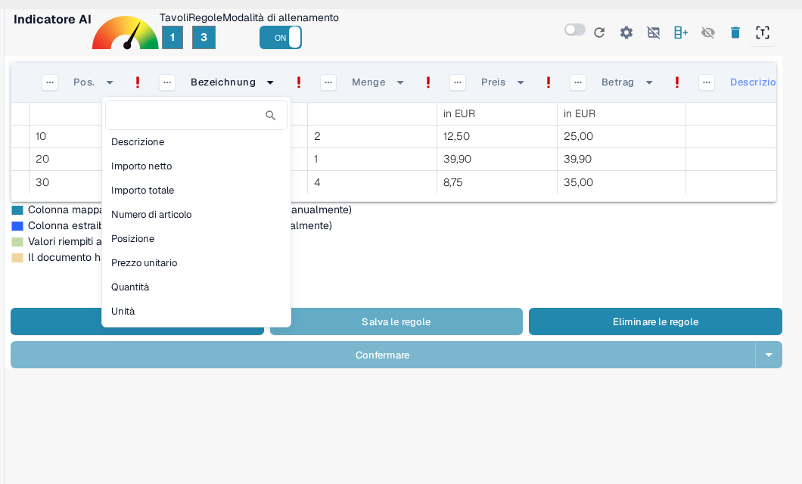

# Strutturazione e Miglioramento dell'Estrazione delle Tabelle in DocBits

Una volta che una tabella è stata estratta e il mapping iniziale delle colonne è completo, è possibile migliorare la qualità e la struttura dei dati utilizzando diversi strumenti integrati. Questa guida ti accompagna attraverso:

* Raggruppamento delle righe
* Selezione manuale delle righe
* Mapping delle colonne
* Perfezionamento dell'intestazione utilizzando regex

Questi strumenti sono particolarmente utili quando si tratta di layout di documenti complessi o non coerenti.

## 1. Raggruppamento delle Righe

Documenti come fatture o conferme d'ordine spesso contengono voci di tabella in cui una colonna (ad esempio, una descrizione) si estende su più righe, mentre altre colonne (ad esempio, quantità o prezzo) utilizzano una sola riga.

Prendi ad esempio questa fattura tedesca — la colonna "Bezeichnung" (descrizione) si estende su più righe:

<figure><figcaption>
Una colonna di descrizione che si estende su più righe.
</figcaption></figure>

Inizialmente, DocBits estrae ogni riga separatamente:

<figure><figcaption>
All’inizio DocBits estrae ogni riga separatamente.
</figcaption></figure>

Puoi quindi **raggruppare le righe in base a una colonna**, come ad esempio "Posizione." Questo unisce le righe correlate in un'unica voce strutturata:

<figure><figcaption>
Dopo il raggruppamento per Posizione le righe correlate formano un’unica voce.
</figcaption></figure>

Quante sottorighe vengono unite in una voce e come si comporta il raggruppamento è configurato nelle [Impostazioni Avanzate](advanced-settings.md), in **Numero Minimo di Righe Raggruppate** e **Raggruppamento Inverso**.

## 2. Selezione Manuale delle Righe

In alcuni casi, il testo su un documento è distribuito su più colonne in una singola riga, rendendo difficile l'assegnazione automatica.

Ecco un esempio in cui la riga "PRAEF" si sovrappone a **Bezeichnung**, **Menge**, **ME**, e **Preis in EUR**:

<figure><figcaption>
Una riga PRAEF che non segue la struttura delle colonne.
</figcaption></figure>

### Come Assegnare Manualmente i Valori:

1.  **Abilita la Modalità di Allenamento**

    <figure><figcaption>
Modalità di Allenamento attivata.
</figcaption></figure>
2.  **Attiva la Modalità Modifica Righe**

    <figure><figcaption>
Modalità di modifica delle righe attivata.
</figcaption></figure>
3.  **Seleziona e Mappa il Testo** Clicca sulla parte corretta del testo e assegnalo a un'intestazione di colonna **blu**.

    <figure><figcaption>
Le intestazioni di colonna blu possono essere compilate manualmente.
</figcaption></figure>

> Nota: Le colonne di colore viola sono già mappate dal sistema e non possono essere modificate manualmente.

Questa procedura appartiene alla **modalità di correzione**, in cui i valori vengono corretti manualmente. Cosa si può fare in questa modalità e quando usarla al posto della **Modalità di Allenamento** è descritto in [Training Line Fields/Table Training](README.md).

## 3. Mapping delle Colonne

Il mapping delle colonne collega i dati estratti alle intestazioni di colonna previste, garantendo coerenza ed esportabilità.

Per mappare o rimpiazzare una colonna:

1. Clicca sull'intestazione della colonna nella vista di estrazione.
2. Scegli la colonna di destinazione corretta dal menu a discesa.

<figure><figcaption>
Scegli la colonna di destinazione nel menu a discesa dell’intestazione.
</figcaption></figure>

Puoi regolare il mapping tutte le volte che è necessario.

Per maggiori dettagli su come si creano tabelle e colonne in generale, vedi [Definizione Tabelle e Colonne](defining-tables-and-columns.md).

## 4. Estrarre da Sopra / Sotto

Alcuni documenti sono strutturati in modo tale che i valori di tabella rilevanti non compaiano sulla stessa riga di altri dati. In questi casi, DocBits ti consente di controllare **da dove i dati dovrebbero essere estratti**:

* **Estrai da Sopra**: Usa questo quando il valore per la riga corrente appare **nella riga sopra**.
* **Estrai da Sotto**: Usa questo quando il valore appare **nella riga sotto** la riga corrente.

**Dove Trovarlo**

1. Entra in **Modalità di Allenamento**.
2. Clicca sui tre puntini (⋯) sull'intestazione di una colonna.
3. Sotto l'opzione **"Estrai Da"**, scegli `Sopra` o `Sotto` a seconda del layout del documento.

## 5. Formato dell'Importo

Alcune colonne, come **Quantità** o **Prezzo Unitario**, contengono valori numerici o di data che possono seguire diverse convenzioni di formattazione a seconda dell'origine o della località del documento. DocBits ti consente di specificare il formato che questi valori dovrebbero seguire per garantire un'estrazione e un'interpretazione accurate.

**Opzioni di Formato dell'Importo:**

* Definisci il formato numerico o di data previsto per la colonna, come US (MM/GG/AAAA, decimale con punto), Polonia (GG.MM.AAAA, decimale con virgola), Germania e altri.
* Questo aiuta DocBits a interpretare correttamente e standardizzare i valori anche se il documento utilizza un formato regionale diverso.

**Dove Trovarlo**

1. Entra in **Modalità di Allenamento**.
2. Clicca sui tre puntini (⋯) sull'intestazione di una colonna supportata (ad esempio, Quantità, Prezzo Unitario).
3. Sotto l'opzione **Formato dell'Importo**, seleziona il formato desiderato che corrisponde alla località del tuo documento.

## 6. Miglioramento dell'Estrazione delle Tabelle con Regex

## **Cosa Fa**

Questa funzionalità ti consente di definire una regex per ciascuna intestazione di tabella, migliorando l'accuratezza dell'estrazione e garantendo risultati corretti.

## **Come Usarlo**

1. Apri un documento dal fornitore per il quale desideri definire una regex.
2.  Passa alla vista **Estrazione della Tabella**.

    
3. Abilita la **Modalità di Allenamento**.
4.  Seleziona l'intestazione della tabella che desideri perfezionare, quindi scegli **Regex**.

    
5.  Comparirà un popup dove puoi inserire e definire la tua regex.

    
6.  Clicca su **Convalida** per controllare la regex, quindi su **Salva Modifiche** per applicarla.

    
7. **Salva la regola e conferma** per applicare le modifiche.

Come salvare o eliminare di nuovo in modo permanente le regole allenate è descritto in [Salvare ed Eliminare Regole](save-and-delete-rules.md).

## Quando Utilizzare Ciascuna Funzionalità

Utilizza questi strumenti per aumentare l'accuratezza dell'estrazione e ridurre il lavoro manuale:

* **Raggruppamento**: Quando una descrizione o qualsiasi colonna si estende su più righe e deve essere combinata per chiarezza.
* **Selezione Manuale delle Righe**: Quando le righe non sono strutturate correttamente e parti del contenuto finiscono nelle colonne sbagliate.
* **Mapping delle Colonne**: Quando i nomi delle colonne rilevati automaticamente non corrispondono alla tua struttura o necessitano di perfezionamento.
* **Regole Regex**: Quando le intestazioni delle tabelle variano leggermente tra documenti dello stesso fornitore o l'OCR introduce delle inconsistenze.

Guide correlate in quest’area:

* [Impostazioni Avanzate](advanced-settings.md) – raggruppamento, righe di intestazione e gestione delle righe extra.
* [Definizione Tabelle e Colonne](defining-tables-and-columns.md) – creare tabelle e colonne.
* [Salvare ed Eliminare Regole](save-and-delete-rules.md) – conservare o scartare in modo permanente il layout allenato.
