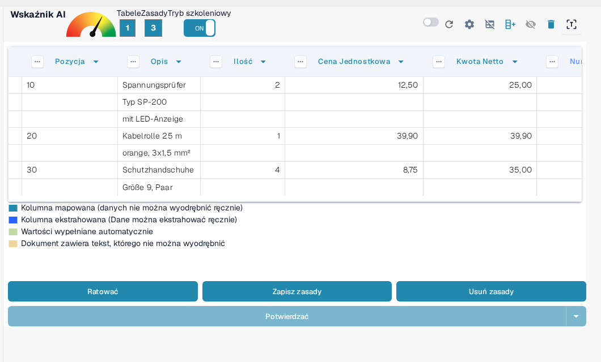
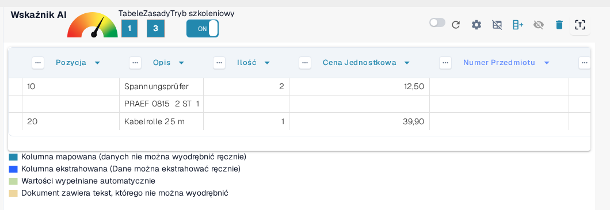
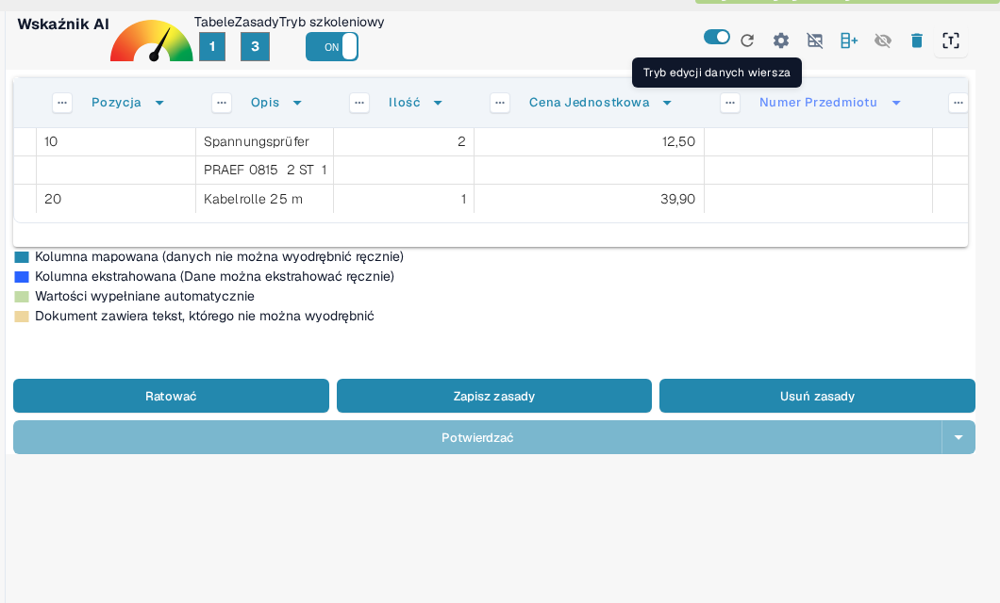
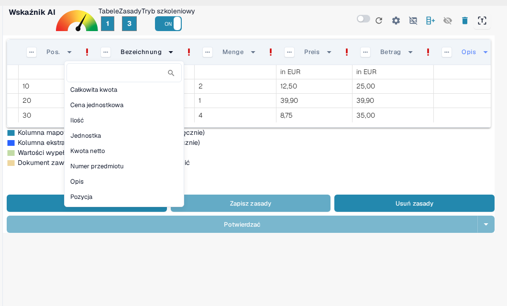

# Strukturyzacja i Poprawa Ekstrakcji Tabel w DocBits

Po wyekstrahowaniu tabeli i zakończeniu początkowego mapowania kolumn, możesz poprawić jakość i strukturę danych za pomocą kilku wbudowanych narzędzi. Ten przewodnik prowadzi Cię przez:

* Grupowanie wierszy
* Ręczny wybór wierszy
* Mapowanie kolumn
* Udoskonalanie nagłówków za pomocą regex

Te narzędzia są szczególnie pomocne przy pracy z złożonymi lub niekonsekwentnymi układami dokumentów.

## 1. Grupowanie Wierszy

Dokumenty takie jak faktury czy potwierdzenia zamówień często zawierają wpisy tabeli, w których jedna kolumna (np. opis) obejmuje kilka wierszy, podczas gdy inne kolumny (np. ilość lub cena) zajmują tylko jeden wiersz.

Weźmy jako przykład niemiecką fakturę — kolumna "Bezeichnung" (opis) obejmuje kilka wierszy:

<figure><figcaption>
Kolumna opisu rozciągająca się na kilka wierszy.
</figcaption></figure>

Początkowo DocBits wyodrębnia każdy wiersz osobno:

<figure><figcaption>
DocBits najpierw wyodrębnia każdy wiersz osobno.
</figcaption></figure>

Następnie możesz **grupować wiersze na podstawie kolumny**, takiej jak "Pozycja". To połączy powiązane linie w jedno, uporządkowane wpisy:

<figure><figcaption>
Po grupowaniu według Pozycji powiązane wiersze tworzą jeden wpis.
</figcaption></figure>

Ile podwierszy zostanie połączonych w jeden wpis i jak zachowuje się grupowanie, ustawisz w [Ustawieniach zaawansowanych](advanced-settings.md) pod **Minimalna liczba zgrupowanych wierszy** oraz **Grupowanie odwrócone**.

## 2. Ręczny Wybór Wierszy

W niektórych przypadkach tekst na dokumencie jest rozłożony na kilka kolumn w jednym wierszu, co sprawia, że trudno jest przypisać go automatycznie.

Oto przykład, gdzie linia "PRAEF" nakłada się na **Bezeichnung**, **Menge**, **ME** i **Preis in EUR**:

<figure><figcaption>
Wiersz PRAEF, który nie pasuje do struktury kolumn.
</figcaption></figure>

### Jak Ręcznie Przypisać Wartości:

1.  **Włącz Tryb szkoleniowy**

    <figure><figcaption>
Tryb szkoleniowy włączony.
</figcaption></figure>
2.  **Aktywuj Tryb edycji danych wiersza**

    <figure><figcaption>
Tryb edycji danych wiersza włączony.
</figcaption></figure>
3.  **Wybierz i Mapuj Tekst**\
    Kliknij odpowiedni fragment tekstu i przypisz go do **niebieskiego** nagłówka kolumny.

    <figure><figcaption>
Niebieskie nagłówki kolumn można wypełnić ręcznie.
</figcaption></figure>

> Uwaga: Kolumny o fiolecie są już zmapowane przez system i nie mogą być edytowane ręcznie.

Ta praca odbywa się w **Trybie edycji danych wiersza**. Co można w nim zrobić i kiedy używać go zamiast trybu szkoleniowego, opisano w [Szkolenie pól pozycji / Szkolenie tabeli](README.md).

## 3. Mapowanie Kolumn

Mapowanie kolumn łączy wyekstrahowane dane z oczekiwanymi nagłówkami kolumn, zapewniając spójność i możliwość eksportu.

Aby zmapować lub ponownie zmapować kolumnę:

1. Kliknij nagłówek kolumny w widoku ekstrakcji.
2. Wybierz właściwą kolumnę docelową z rozwijanego menu.

<figure><figcaption>
Wybierz kolumnę docelową z listy rozwijanej nagłówka.
</figcaption></figure>

Możesz dostosować mapowanie tak często, jak jest to potrzebne.

Aby dowiedzieć się, jak tworzyć tabele i kolumny, zobacz [Definiowanie Tabel i Kolumn](defining-tables-and-columns.md).

## 4. Wyodrębnianie Z Góry / Z Dole

Niektóre dokumenty są zorganizowane w taki sposób, że istotne wartości tabeli nie pojawiają się w tym samym wierszu co inne dane. W takich przypadkach DocBits pozwala kontrolować **skąd dane powinny być wyodrębnione**:

* **Wyodrębnij Z Góry**: Użyj tej opcji, gdy wartość dla bieżącego wiersza pojawia się **w linii powyżej**.
* **Wyodrębnij Z Dole**: Użyj tej opcji, gdy wartość pojawia się **w linii poniżej** bieżącego wiersza.

**Gdzie To Znaleźć**

1. Wejdź w **Tryb szkoleniowy**.
2. Kliknij trzy kropki (⋯) na nagłówku kolumny.
3. W opcji **"Wyodrębnij Z"** wybierz `Z Góry` lub `Z Dole`, w zależności od układu dokumentu.

## 5. Format Kwoty

Niektóre kolumny, takie jak **Ilość** lub **Cena Jednostkowa**, zawierają wartości numeryczne lub daty, które mogą być formatowane zgodnie z różnymi konwencjami w zależności od pochodzenia dokumentu lub lokalizacji. DocBits pozwala określić format, jaki powinny przyjąć te wartości, aby zapewnić dokładną ekstrakcję i interpretację.

**Opcje Formatu Kwoty:**

* Zdefiniuj oczekiwany format liczbowy lub daty dla kolumny, takie jak USA (MM/DD/RRRR, dziesiętny z kropką), Polska (DD.MM.RRRR, dziesiętny z przecinkiem), Niemcy i inne.
* Pomaga to DocBits poprawnie analizować i standaryzować wartości nawet jeśli dokument używa innego regionalnego formatu.

**Gdzie To Znaleźć**

1. Wejdź w **Tryb szkoleniowy**.
2. Kliknij trzy kropki (⋯) na nagłówku obsługiwanej kolumny (np. Ilość, Cena Jednostkowa).
3. W opcji **Format Kwoty** wybierz pożądany format odpowiadający lokalizacji Twojego dokumentu.

## 6. Udoskonalanie Ekstrakcji Tabeli za pomocą Regex

## **Co To Oznacza**

Ta funkcja pozwala zdefiniować regex dla każdego nagłówka tabeli, poprawiając dokładność ekstrakcji i zapewniając poprawne wyniki.

## **Jak To Używać**

1. Otwórz dokument od dostawcy, dla którego chcesz zdefiniować regex.
2.  Przejdź do widoku **Ekstrakcji Tabeli**.

    
3. Włącz **Tryb szkoleniowy**.
4.  Wybierz nagłówek tabeli, który chcesz ulepszyć, a następnie wybierz **Regex**.

    
5.  Pojawi się okno, w którym możesz wprowadzić i zdefiniować swój regex.

    
6.  Kliknij **Sprawdź poprawność**, aby zweryfikować regex, a następnie **Zapisz zmiany**, aby je zastosować.

    
7. **Zapisz regułę i potwierdź**, aby zastosować zmiany.

Aby dowiedzieć się, jak trwale zapisać lub usunąć wyszkolone reguły, zobacz [Zapisywanie i Usuwanie Reguł](save-and-delete-rules.md).

## Kiedy Korzystać z Każdej Funkcji

Użyj tych narzędzi, aby zwiększyć dokładność ekstrakcji i zmniejszyć pracę manualną:

* **Grupowanie**: Gdy opis lub dowolna kolumna obejmuje kilka wierszy i musi być połączona dla jasności.
* **Ręczny Wybór Wierszy**: Gdy wiersze nie są czysto zorganizowane, a części treści trafiają do niewłaściwych kolumn.
* **Mapowanie Kolumn**: Gdy automatycznie wykryte nazwy kolumn nie pasują do Twojej struktury lub wymagają ulepszenia.
* **Reguły Regex**: Gdy nagłówki tabel różnią się nieznacznie w dokumentach od tego samego dostawcy lub OCR wprowadza niekonsekwencje.

## Powiązane przewodniki w tym obszarze

* [Ustawienia zaawansowane](advanced-settings.md) – grupowanie, nagłówki i obsługa dodatkowych wierszy.
* [Definiowanie Tabel i Kolumn](defining-tables-and-columns.md) – tworzenie tabel i kolumn do szkolenia.
* [Zapisywanie i Usuwanie Reguł](save-and-delete-rules.md) – trwałe zastosowanie lub odrzucenie wyszkolonego układu.
