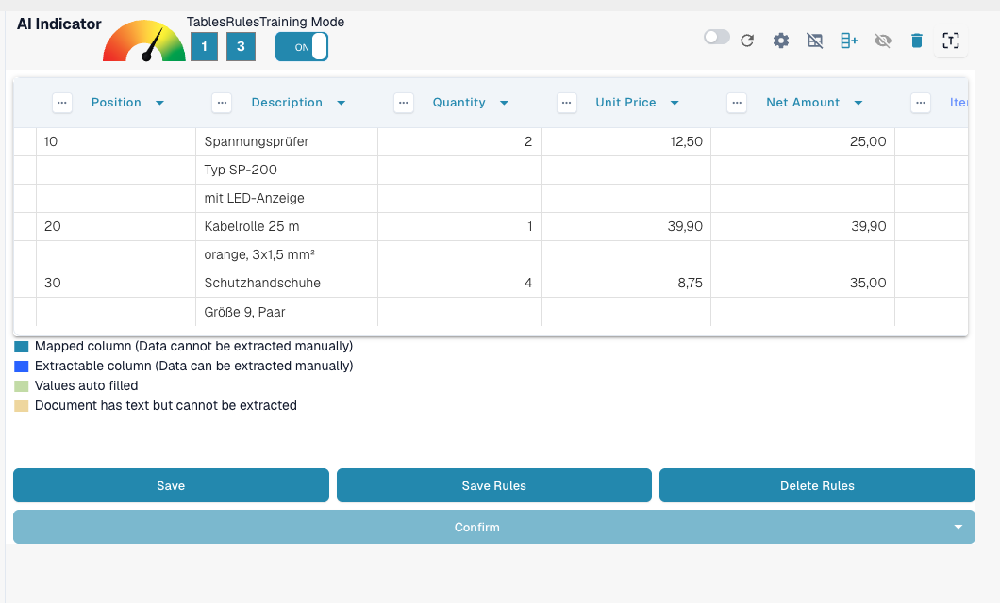
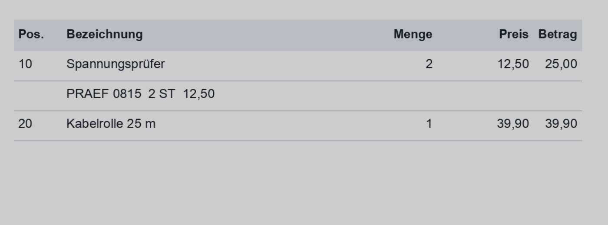
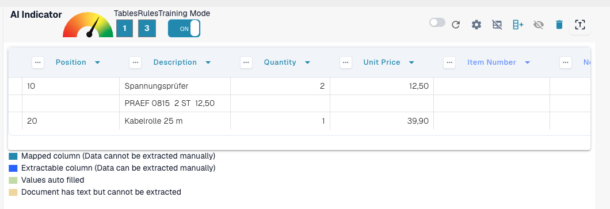
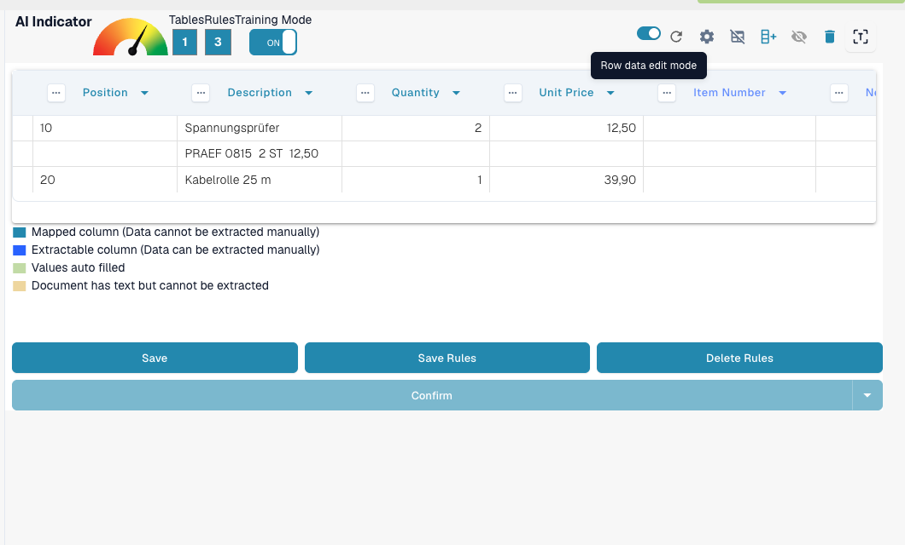
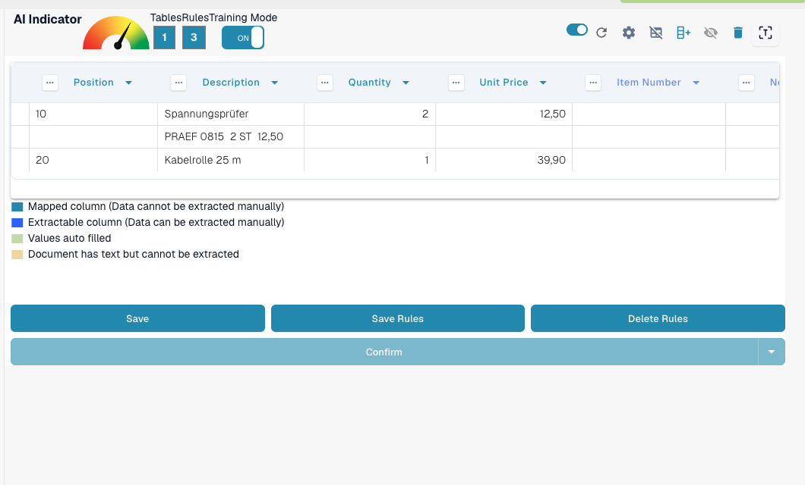
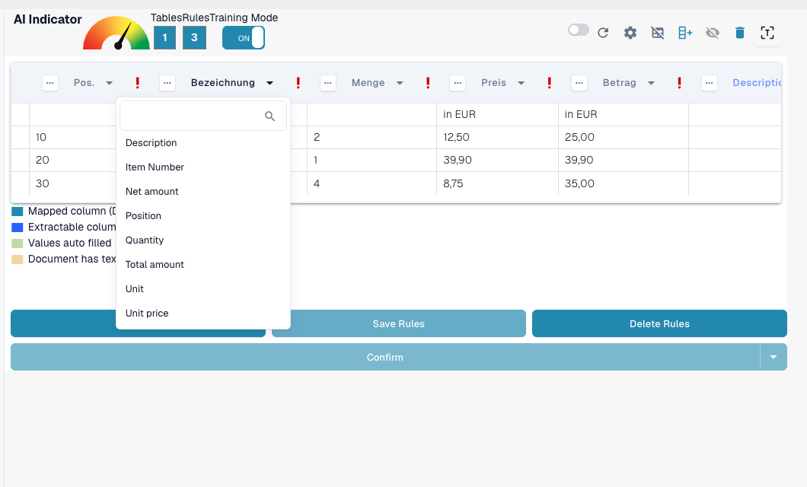

# Structuring and Improving Table Extraction in DocBits

Once a table is extracted and the initial column mapping is complete, you can enhance the quality and structure of the data using several built-in tools. This guide walks you through:

* Grouping rows
* Manual row selection
* Column mapping
* Header refinement using regex

These tools are especially helpful when dealing with complex or inconsistent document layouts.

### 1. Grouping Rows

Documents like invoices or order confirmations often contain table entries where one column (e.g., a description) spans multiple lines, while other columns (e.g., quantity or price) only use one line.

Take this German invoice example — the “Bezeichnung” (description) column spans multiple rows:

<figure><figcaption>
A description column that spans several rows.
</figcaption></figure>

Initially, DocBits extracts each row separately:

<figure><figcaption>
DocBits first extracts each row separately.
</figcaption></figure>

You can then **group rows based on a column**, such as “Position.” This merges related lines into a single, structured entry:

<figure><figcaption>
After grouping by Position the related lines form one entry.
</figcaption></figure>

### 2. Manual Row Selection

In some cases, the text on a document is spread across several columns in a single row, making it difficult to assign automatically.

Here’s an example where the “PRAEF” line overlaps **Bezeichnung**, **Menge**, **ME**, and **Preis in EUR**:

<figure><figcaption>
A PRAEF line that does not align with the column structure.
</figcaption></figure>

#### 🔧 How to Manually Assign Values:

1.  **Enable Training Mode**

    <figure><figcaption>
Training Mode enabled.
</figcaption></figure>
2.  **Activate Row Edit Mode**

    <figure><figcaption>
Row edit mode activated.
</figcaption></figure>
3.  **Select and Map Text**\
    Click the correct piece of text and assign it to a **blue** column header.

    <figure><figcaption>
Blue column headers can be filled manually.
</figcaption></figure>

> Note: Violet-colored columns are already system-mapped and cannot be manually edited.

### 3. Mapping Columns

Column mapping links your extracted data to the expected column headers, ensuring consistency and exportability.

To map or remap a column:

1. Click the column header in the extraction view.
2. Choose the correct target column from the dropdown.

<figure><figcaption>
Choose the target column in the header dropdown.
</figcaption></figure>

You can adjust the mapping as often as needed.

### 4. Extract From Above / Below

Some documents are structured in a way where relevant table values don't appear on the same row as other data. In these cases, DocBits allows you to control **where the data should be extracted from**:

* **Extract from Above**: Use this when the value for the current row appears **in the line above**.
* **Extract from Below**: Use this when the value appears **in the line beneath** the current row.

**Where to Find It**

1. Enter **Training Mode**.
2. Click the three dots (⋯) on a column header.
3. Under the **"Extract From"** option, choose `Above` or `Below` depending on the document layout.

### 5. Amount Format

Some columns, such as **Quantity** or **Unit Price**, contain numeric or date values that may follow different formatting conventions depending on the document's origin or locale. DocBits allows you to specify the format these values should follow to ensure accurate extraction and interpretation.

**Amount Format Options:**

* Define the expected number or date format for the column, such as US (MM/DD/YYYY, decimal with dot), Poland (DD.MM.YYYY, decimal with comma), Germany, and others.
* This helps DocBits correctly parse and standardize values even if the document uses a different regional format.

**Where to Find It**

1. Enter **Training Mode**.
2. Click the three dots (⋯) on the header of a supported column (e.g., Quantity, Unit Price).
3. Under the **Amount Format** option, select the desired format matching your document's locale.

### 6. Improving Table Extraction with Regex

### **What It Does**

This feature allows you to define a regex for each table header, improving extraction accuracy and ensuring correct results.

### **How to Use It**

1. Open a document from the supplier for which you want to define a regex.
2.  Navigate to the **Table Extraction** view.\\

    <figure><figcaption></figcaption></figure>
3. Enable **Training Mode**.
4.  Select the table header you want to refine, then choose **Regex**.\\

    <figure><figcaption></figcaption></figure>
5.  A popup will appear where you can enter and define your regex.\\

    <figure><figcaption></figcaption></figure>
6.  Click **Validate** to check the regex, then **Save Changes** to apply it.\\

    <figure><figcaption></figcaption></figure>
7. **Save the rule and confirm** to apply the changes.

### When to Use Each Feature

Use these tools to increase extraction accuracy and reduce manual work:

* **Grouping**: When a description or any column spans multiple rows and needs to be combined for clarity.
* **Manual Row Selection**: When rows aren’t structured cleanly, and parts of the content fall into the wrong columns.
* **Column Mapping**: When the automatically detected column names don’t match your structure or need refinement.
* **Regex Rules**: When table headers vary slightly across documents from the same supplier or OCR introduces inconsistencies.
