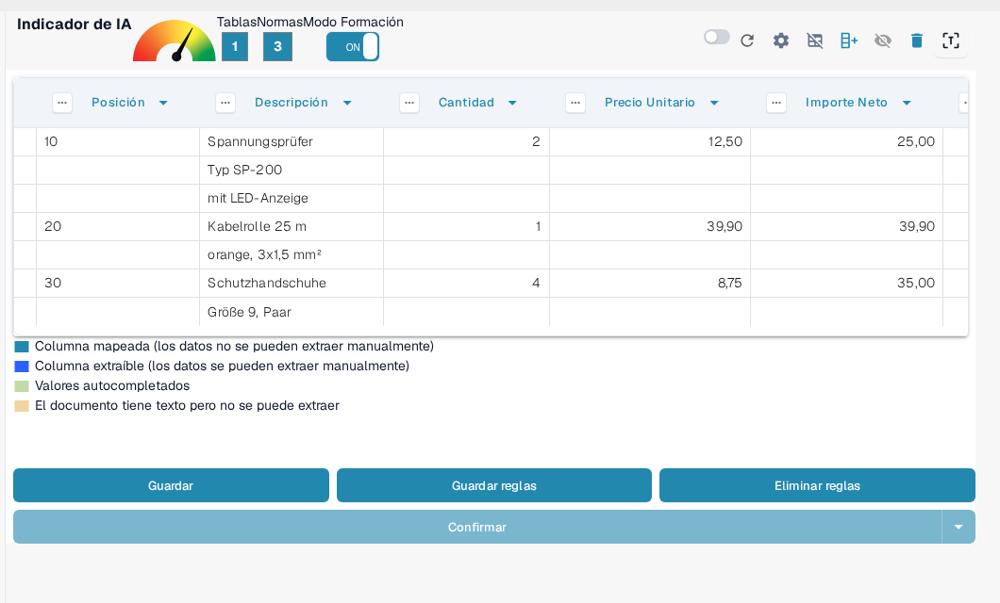
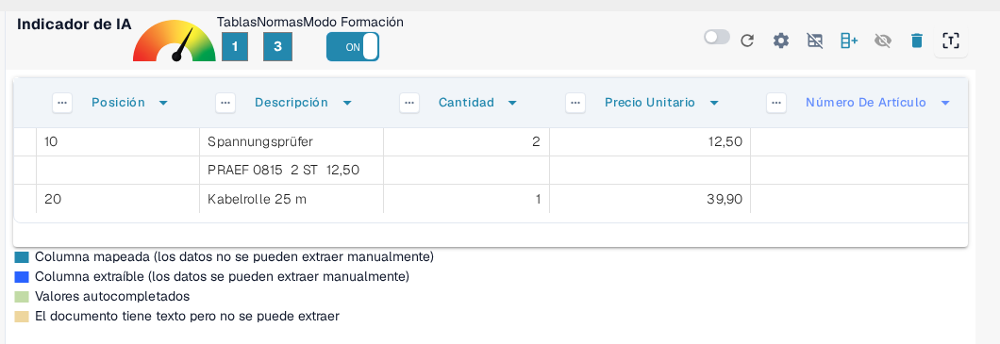
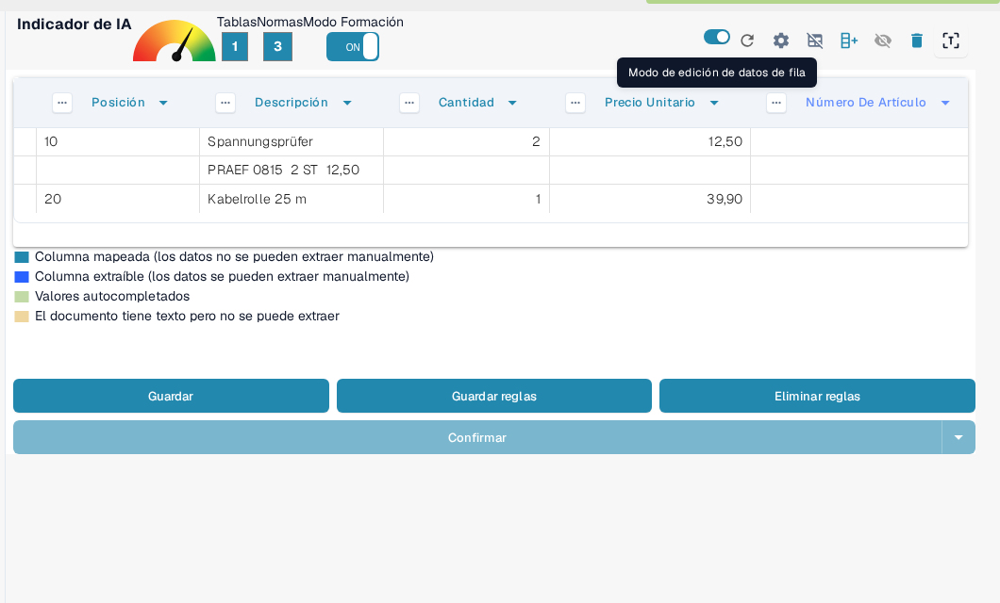
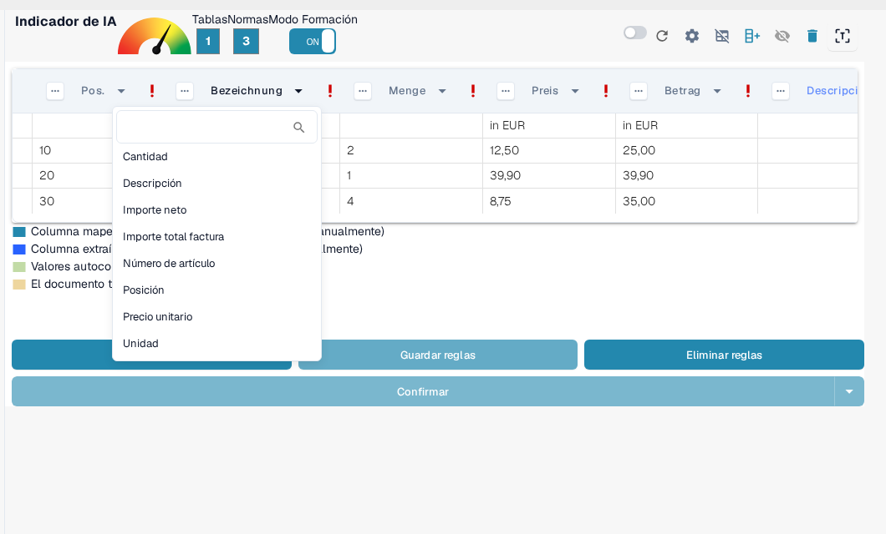

# Estructuración y Mejora de la Extracción de Tablas en DocBits

Una vez que se extrae una tabla y se completa el mapeo inicial de columnas, puedes mejorar la calidad y estructura de los datos utilizando varias herramientas integradas. Esta guía te lleva a través de:

* Agrupación de filas
* Selección manual de filas
* Mapeo de columnas
* Refinamiento de encabezados usando regex

Estas herramientas son especialmente útiles al tratar con diseños de documentos complejos o inconsistentes.

## 1. Agrupación de Filas

Documentos como facturas o confirmaciones de pedidos a menudo contienen entradas de tabla donde una columna (por ejemplo, una descripción) abarca varias líneas, mientras que otras columnas (por ejemplo, cantidad o precio) solo utilizan una línea.

Toma este ejemplo de factura en alemán: la columna "Bezeichnung" (descripción) abarca varias filas:

<figure><figcaption>
Una columna de descripción que abarca varias filas.
</figcaption></figure>

Inicialmente, DocBits extrae cada fila por separado:

<figure><figcaption>
DocBits extrae primero cada fila por separado.
</figcaption></figure>

Luego puedes **agrupar filas basadas en una columna**, como "Posición". Esto fusiona líneas relacionadas en una entrada única y estructurada:

<figure><figcaption>
Tras agrupar por Posición, las líneas relacionadas forman una sola entrada.
</figcaption></figure>

Cuántas sublíneas se combinan en una entrada y cómo se comporta la agrupación se configura en la [Configuración Avanzada](advanced-settings.md), en **Mínimo de filas agrupadas** y **Agrupamiento Inverso**.

## 2. Selección Manual de Filas

En algunos casos, el texto en un documento se extiende a través de varias columnas en una sola fila, lo que dificulta la asignación automática.

Aquí tienes un ejemplo donde la línea "PRAEF" se superpone a **Bezeichnung**, **Menge**, **ME** y **Preis in EUR**:

<figure><figcaption>
Una línea PRAEF que no coincide con la estructura de columnas.
</figcaption></figure>

### Cómo Asignar Valores Manualmente:

1.  **Activar el Modo Formación**

    <figure><figcaption>
Modo Formación activado.
</figcaption></figure>

2.  **Activar el Modo de Edición de Filas**

    <figure><figcaption>
Modo de edición de datos de fila activado.
</figcaption></figure>

3.  **Seleccionar y Mapear Texto** Haz clic en la pieza de texto correcta y asígnala a un encabezado de columna **azul**.

    <figure><figcaption>
Los encabezados de columna azules se pueden rellenar manualmente.
</figcaption></figure>

> Nota: Las columnas de color violeta ya están mapeadas por el sistema y no pueden editarse manualmente.

Este procedimiento pertenece al **modo de corrección**, en el que corriges valores manualmente. Qué puedes hacer allí y cuándo usarlo en lugar del **Modo Formación** se describe en [Entrenamiento de Campos de Línea / Tabla de Entrenamiento](README.md).

## 3. Mapeo de Columnas

El mapeo de columnas vincula tus datos extraídos con los encabezados de columna esperados, asegurando consistencia y exportabilidad.

Para mapear o remapear una columna:

1. Haz clic en el encabezado de columna en la vista de extracción.
2. Elige la columna de destino correcta en el menú desplegable.

<figure><figcaption>
Elige la columna de destino en el menú desplegable del encabezado.
</figcaption></figure>

Puedes ajustar el mapeo tantas veces como sea necesario.

Más información sobre cómo se crean tablas y columnas en general en [Definición de Tablas y Columnas](defining-tables-and-columns.md).

## 4. Extraer de Arriba / Abajo

Algunos documentos están estructurados de manera que los valores de tabla relevantes no aparecen en la misma fila que otros datos. En estos casos, DocBits te permite controlar **de dónde se deben extraer los datos**:

* **Extraer de Arriba**: Úsalo cuando el valor para la fila actual aparece **en la línea superior**.
* **Extraer de Abajo**: Úsalo cuando el valor aparece **en la línea debajo** de la fila actual.

**Dónde Encontrarlo**

1. Ingresa al **Modo Formación**.
2. Haz clic en los tres puntos (⋯) en un encabezado de columna.
3. Bajo la opción **"Extraer de"**, elige `Arriba` o `Abajo` dependiendo del diseño del documento.

## 5. Formato de Monto

Algunas columnas, como **Cantidad** o **Precio Unitario**, contienen valores numéricos o de fecha que pueden seguir diferentes convenciones de formato dependiendo del origen o la configuración regional del documento. DocBits te permite especificar el formato que estos valores deben seguir para garantizar una extracción e interpretación precisas.

**Opciones de Formato de Monto:**

* Define el formato numérico o de fecha esperado para la columna, como EE. UU. (MM/DD/AAAA, decimal con punto), Polonia (DD.MM.AAAA, decimal con coma), Alemania y otros.
* Esto ayuda a DocBits a analizar y estandarizar correctamente los valores incluso si el documento utiliza un formato regional diferente.

**Dónde Encontrarlo**

1. Ingresa al **Modo Formación**.
2. Haz clic en los tres puntos (⋯) en el encabezado de una columna compatible (por ejemplo, Cantidad, Precio Unitario).
3. Bajo la opción **Formato de Monto**, selecciona el formato deseado que coincida con la configuración regional de tu documento.

## 6. Mejorando la Extracción de Tablas con Regex

## **Qué Hace**

Esta función te permite definir una expresión regular (regex) para cada encabezado de tabla, mejorando la precisión de la extracción y garantizando resultados correctos.

## **Cómo Usarlo**

1. Abre un documento del proveedor para el cual deseas definir un regex.
2.  Navega a la vista de **Extracción De Tabla**.

    
3. Habilita el **Modo Formación**.
4.  Selecciona el encabezado de tabla que deseas refinar, luego elige **Regex**.

    
5.  Aparecerá un popup donde puedes ingresar y definir tu regex.

    
6.  Haz clic en **Validar** para verificar el regex, luego en **Guardar Cambios** para aplicarlo.

    
7. **Guarda la regla y confirma** para aplicar los cambios.

Cómo guardar o volver a eliminar tus reglas entrenadas de forma permanente se describe en [Guardar y Eliminar Reglas](save-and-delete-rules.md).

## Cuándo Usar Cada Función

Utiliza estas herramientas para aumentar la precisión de la extracción y reducir el trabajo manual:

* **Agrupación**: Cuando una descripción o cualquier columna abarca varias filas y necesita combinarse para mayor claridad.
* **Selección Manual de Filas**: Cuando las filas no están estructuradas de manera limpia y partes del contenido caen en las columnas incorrectas.
* **Mapeo de Columnas**: Cuando los nombres de columna detectados automáticamente no coinciden con tu estructura o necesitan refinamiento.
* **Reglas de Regex**: Cuando los encabezados de tabla varían ligeramente entre documentos del mismo proveedor o el OCR introduce inconsistencias.

Guías relacionadas en esta área:

* [Configuración Avanzada](advanced-settings.md) – agrupación, filas de encabezado y tratamiento de filas adicionales.
* [Definición de Tablas y Columnas](defining-tables-and-columns.md) – crear tablas y columnas.
* [Guardar y Eliminar Reglas](save-and-delete-rules.md) – conservar o descartar de forma permanente el diseño entrenado.
