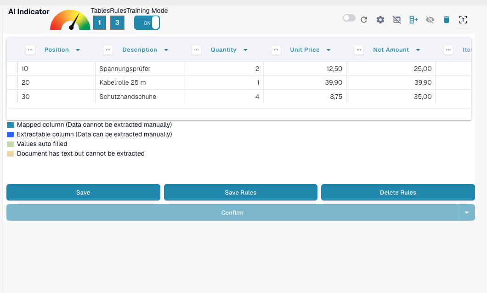
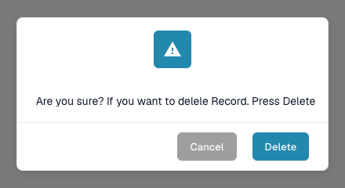

# Save and Delete Rules

Once you’ve completed the training or correction of a table, it’s important to **save your rules** so that DocBits can apply them automatically to future documents from the same supplier.

### Saving Rules

After defining all columns and corrections:

1. Click the **SAVE RULES** button at the top.
2. A rule counter will confirm how many extraction rules have been saved.

This ensures DocBits will automatically use your trained layout the next time it sees a similar document.

<figure><figcaption>
Save Rules stores the rules; the counter shows how many rules exist.
</figcaption></figure>

### Deleting Rules

You can remove saved rules using the **DELETE RULES** button if they were configured incorrectly or if the document layout has changed significantly.

<mark style="color:red;">**Warning**</mark>: Deleting rules affects all documents from the same supplier with the same layout. You will need to **retrain the table extraction from scratch**.

<figure><figcaption>
Deleting rules has to be confirmed.
</figcaption></figure>
