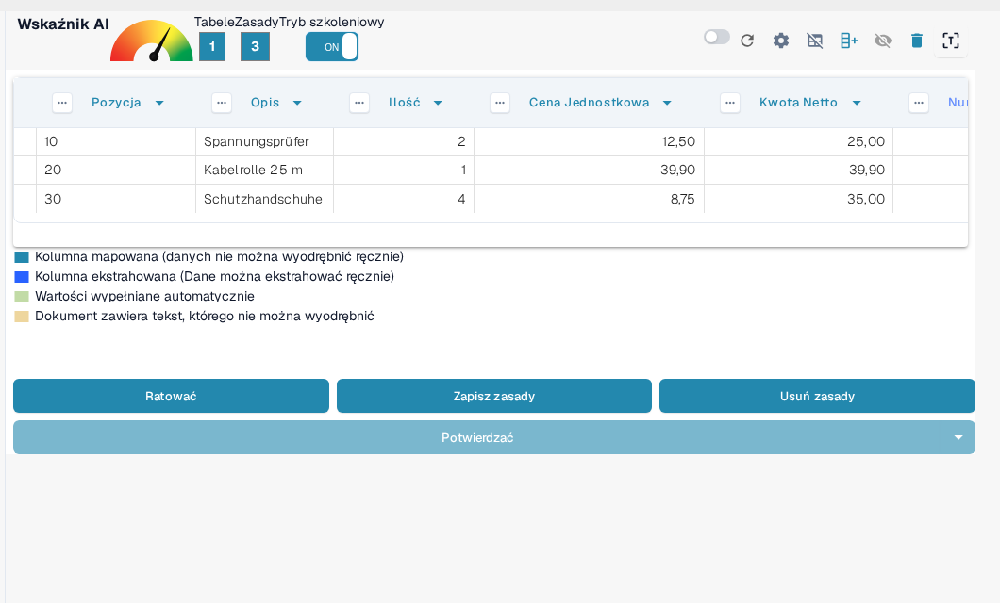
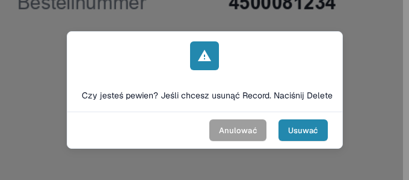

# Zapisywanie i Usuwanie Reguł

Po zakończeniu szkolenia lub korekty tabeli ważne jest **zapisanie swoich reguł**, aby DocBits mógł automatycznie zastosować je do przyszłych dokumentów od tego samego dostawcy.

### Zapisywanie Reguł

Po zdefiniowaniu wszystkich kolumn i korekt:

1. Kliknij przycisk **Zapisz zasady** na górze.
2. Licznik reguł potwierdzi, ile reguł ekstrakcji zostało zapisanych.

To zapewnia, że DocBits automatycznie użyje Twojego przeszkolonego układu, gdy następnym razem zobaczy podobny dokument.

<figure><figcaption>
Zapisz zasady zapisuje reguły; licznik pokazuje, ile reguł istnieje.
</figcaption></figure>

Przycisk **Ratować** zapisuje zmiany w otwartym dokumencie, natomiast **Zapisz zasady** przechowuje układ dla przyszłych dokumentów od tego samego dostawcy. Jak definiować i mapować kolumny, opisano w sekcji [Definiowanie Tabel i Kolumn](defining-tables-and-columns.md).

### Usuwanie Reguł

Możesz usunąć zapisane reguły przyciskiem **Usuń zasady**, jeśli zostały skonfigurowane nieprawidłowo lub jeśli układ dokumentu znacznie się zmienił.

<mark style="color:red;">**Ostrzeżenie**</mark>: usunięcie reguł dotyczy wszystkich dokumentów od tego samego dostawcy o tym samym układzie. Konieczne będzie **ponowne przeszkolenie ekstrakcji tabeli od zera**.

<figure><figcaption>
Usunięcie reguł trzeba potwierdzić.
</figcaption></figure>

Jak uruchomić **Tryb szkoleniowy** i ponownie przeszkolić ekstrakcję tabeli, opisano w sekcji [Szkolenie Pól Linii/Szkolenie Tabeli](README.md); jak poprawić ekstrakcję, opisano w sekcji [Strukturyzacja i Poprawa Ekstrakcji Tabel w DocBits](improving-table-extraction-with-regex.md).
