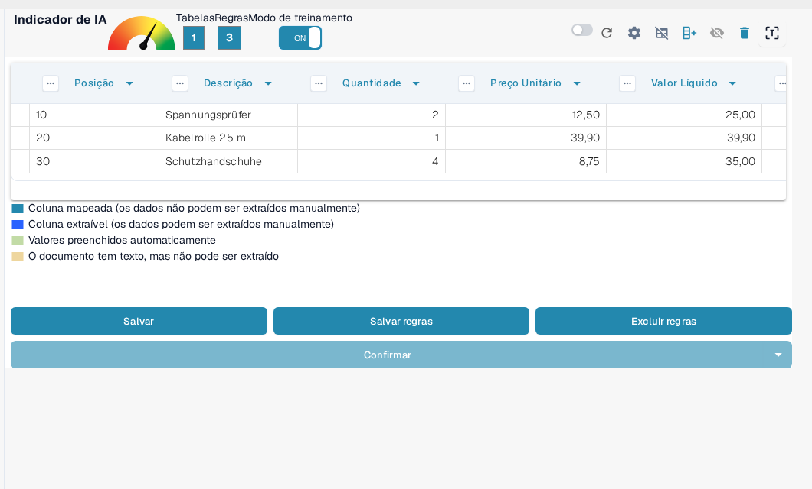
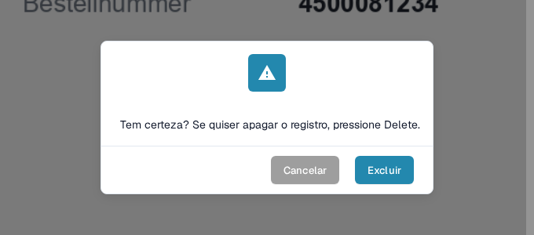

# Salvar e Excluir Regras

Depois de concluir o treinamento ou a correção de uma tabela, é importante **salvar suas regras** para que o DocBits possa aplicá-las automaticamente a documentos futuros do mesmo fornecedor.

### Salvando Regras

Após definir todas as colunas e correções:

1. Clique no botão **Salvar regras** na parte superior.
2. Um contador de regras confirmará quantas regras de extração foram salvas.

Isso garante que o DocBits usará automaticamente o layout treinado na próxima vez que encontrar um documento semelhante.

<figure><figcaption>
**Salvar regras** grava as regras; o contador mostra quantas regras existem.
</figcaption></figure>

O botão **Salvar** grava as alterações no documento aberto, enquanto **Salvar regras** armazena o layout para documentos futuros do mesmo fornecedor. Como definir e mapear colunas está descrito em [Definindo Tabelas e Colunas](defining-tables-and-columns.md).

### Excluindo Regras

Você pode remover as regras salvas usando o botão **Excluir regras** se elas foram configuradas incorretamente ou se o layout do documento mudou significativamente.

<mark style="color:red;">**Aviso**</mark>: excluir regras afeta todos os documentos do mesmo fornecedor com o mesmo layout. Você precisará **retreinar a extração da tabela do zero**.

<figure><figcaption>
A exclusão das regras precisa ser confirmada.
</figcaption></figure>

Como iniciar o **Modo de treinamento** e treinar novamente a extração da tabela está descrito na seção [Treinamento de Campos de Linha/Treinamento de Tabelas](README.md); como melhorar a extração está descrito em [Estruturação e Melhoria da Extração de Tabelas no DocBits](improving-table-extraction-with-regex.md).
