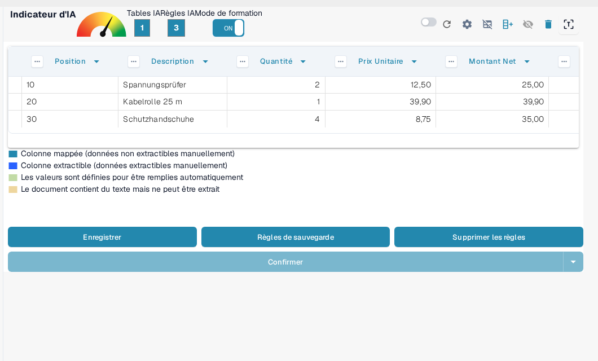
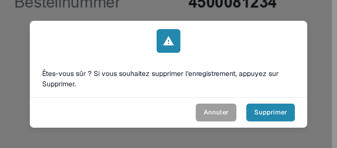

# Enregistrer et Supprimer les Règles

Une fois que vous avez terminé la formation ou la correction d'un tableau, il est important de **sauvegarder vos règles** afin que DocBits puisse les appliquer automatiquement aux futurs documents du même fournisseur.

### Enregistrer les Règles

Après avoir défini toutes les colonnes et corrections :

1. Cliquez sur le bouton **Règles de sauvegarde** en haut.
2. Un compteur de règles confirmera combien de règles d'extraction ont été enregistrées.

Cela garantit que DocBits utilisera automatiquement votre mise en page entraînée la prochaine fois qu'il verra un document similaire.

<figure><figcaption>
Règles de sauvegarde conserve les règles ; le compteur indique combien de règles existent.
</figcaption></figure>

Comment créer et mapper les colonnes au préalable est décrit dans [Définition des tables et des colonnes](defining-tables-and-columns.md) ; comment améliorer l'extraction, dans [Structuration et amélioration de l'extraction de table dans DocBits](improving-table-extraction-with-regex.md).

### Supprimer les Règles

Vous pouvez supprimer les règles enregistrées à l'aide du bouton **Supprimer les règles** si elles ont été configurées de manière incorrecte ou si la mise en page du document a changé de manière significative.

<mark style="color:red;">**Attention**</mark> : Supprimer les règles affecte tous les documents du même fournisseur avec la même mise en page. Vous devrez **reformer l'extraction du tableau à partir de zéro**.

<figure><figcaption>
La suppression des règles doit être confirmée.
</figcaption></figure>

Pour savoir comment démarrer le mode de formation et reformer l'extraction du tableau, consultez [Formation des Champs de Ligne/Table de Formation](README.md).
