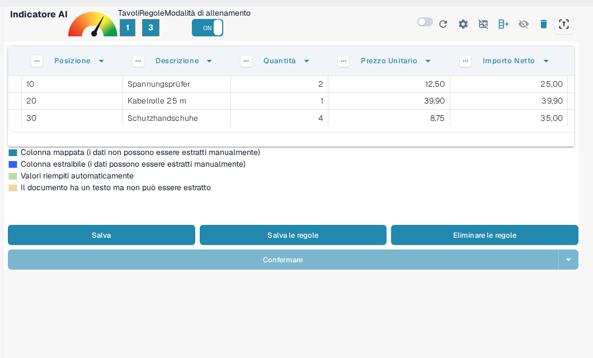
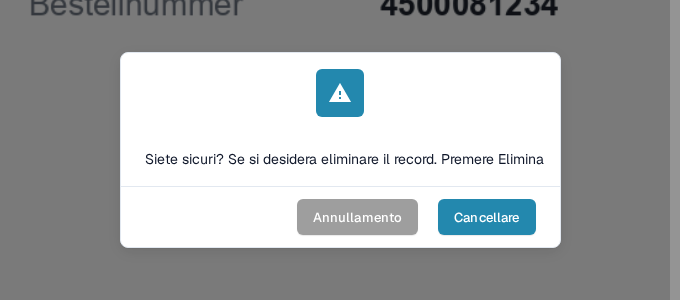

# Salvare ed Eliminare Regole

Una volta completato l'addestramento o la correzione di una tabella, è importante **salvare le regole** in modo che DocBits possa applicarle automaticamente ai documenti futuri dello stesso fornitore.

### Salvare le regole

Dopo aver definito tutte le colonne e le correzioni:

1. Fare clic sul pulsante **Salva le regole** in alto.
2. Un contatore delle regole conferma quante regole di estrazione sono state salvate.

In questo modo DocBits utilizzerà automaticamente il layout addestrato alla prossima ricezione di un documento simile.

<figure><figcaption>
Il pulsante Salva le regole memorizza le regole; il contatore indica quante regole esistono.
</figcaption></figure>

Come definire e mappare le colonne in anticipo è descritto in [Definizione Tabelle e Colonne](defining-tables-and-columns.md); come migliorare l'estrazione è descritto in [Strutturazione e Miglioramento dell'Estrazione delle Tabelle in DocBits](improving-table-extraction-with-regex.md).

### Eliminare le regole

È possibile rimuovere le regole salvate usando il pulsante **Eliminare le regole** se sono state configurate in modo errato o se il layout del documento è cambiato in modo significativo.

<mark style="color:red;">**Avviso**</mark>: l'eliminazione delle regole riguarda tutti i documenti dello stesso fornitore con lo stesso layout. Sarà necessario **addestrare di nuovo l'estrazione della tabella da zero**.

<figure><figcaption>
L'eliminazione delle regole deve essere confermata.
</figcaption></figure>

Come avviare la modalità di allenamento e riaddestrare l'estrazione della tabella è descritto in [Campi di addestramento Linee/Tabella di addestramento](README.md).
