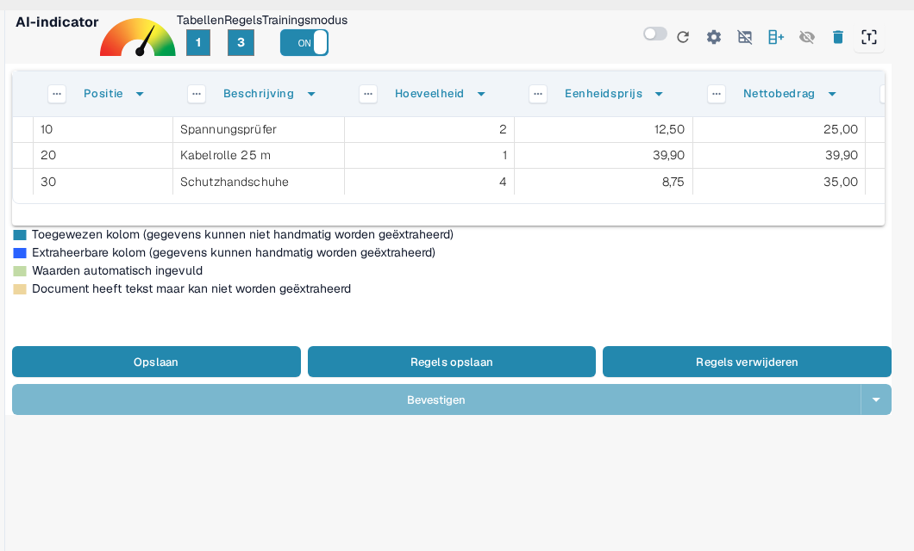
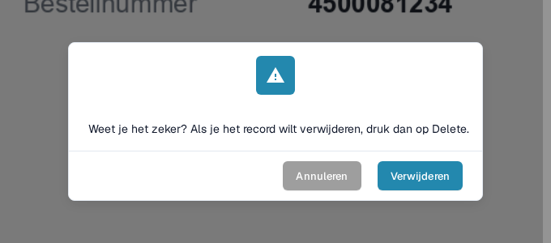

# Regels Opslaan en Verwijderen

Zodra u de training of correctie van een tabel heeft voltooid, is het belangrijk om **uw regels op te slaan** zodat DocBits ze automatisch kan toepassen op toekomstige documenten van dezelfde leverancier.

### Regels Opslaan

Nadat u alle kolommen en correcties heeft gedefinieerd:

1. Klik op de knop **REGELS OPSLAAN** bovenaan.
2. Een regelteller bevestigt hoeveel extractieregels er zijn opgeslagen.

Dit zorgt ervoor dat DocBits automatisch uw getrainde lay-out zal gebruiken de volgende keer dat het een vergelijkbaar document ziet.

<figure><figcaption>
Regels opslaan bewaart de regels; de teller laat zien hoeveel regels er zijn.
</figcaption></figure>

Hoe u de kolommen vooraf aanmaakt en toewijst, staat in [Tabellen en kolommen definiëren](defining-tables-and-columns.md); hoe u de extractie verbetert, in [Tabel-extractie structureren en verbeteren in DocBits](improving-table-extraction-with-regex.md).

### Regels Verwijderen

U kunt opgeslagen regels verwijderen met de knop **REGELS VERWIJDEREN** als ze verkeerd geconfigureerd waren of als de lay-out van het document aanzienlijk is gewijzigd.

<mark style="color:red;">**Waarschuwing**</mark>: Het verwijderen van regels heeft invloed op alle documenten van dezelfde leverancier met dezelfde lay-out. U moet **de tabel extractie opnieuw trainen vanaf nul**.

<figure><figcaption>
Het verwijderen van regels moet worden bevestigd.
</figcaption></figure>

Hoe u de trainingsmodus start en de tabel extractie opnieuw traint, staat in [Training van regelvelden/tabel](README.md).
