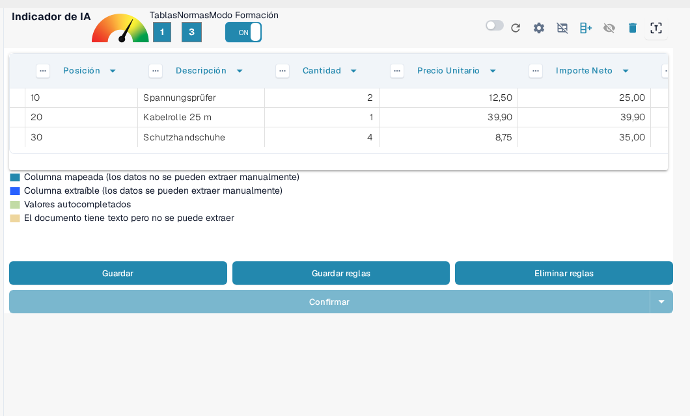
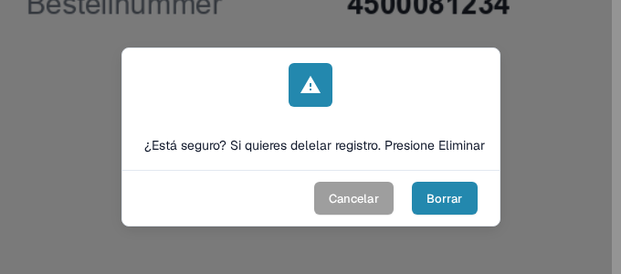

# Guardar y Eliminar Reglas

Una vez que hayas completado el entrenamiento o la corrección de una tabla, es importante **guardar tus reglas** para que DocBits pueda aplicarlas automáticamente a futuros documentos del mismo proveedor.

### Guardar Reglas

Después de definir todas las columnas y correcciones:

1. Haz clic en el botón **GUARDAR REGLAS** en la parte superior.
2. Un contador de reglas confirmará cuántas reglas de extracción se han guardado.

Esto asegura que DocBits utilizará automáticamente tu diseño entrenado la próxima vez que vea un documento similar.

<figure><figcaption>
Guardar reglas almacena las reglas; el contador muestra cuántas reglas existen.
</figcaption></figure>

### Eliminar Reglas

Puedes eliminar reglas guardadas utilizando el botón **ELIMINAR REGLAS** si fueron configuradas incorrectamente o si el diseño del documento ha cambiado significativamente.

<mark style="color:red;">**Advertencia**</mark>: Eliminar reglas afecta a todos los documentos del mismo proveedor con el mismo diseño. Necesitarás **reentrenar la extracción de la tabla desde cero**.

<figure><figcaption>
La eliminación de reglas debe confirmarse.
</figcaption></figure>
