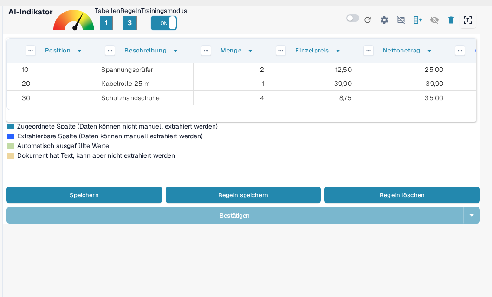
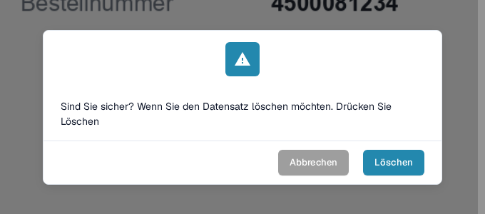

# Regeln speichern und löschen

Nachdem Sie das Training oder die Korrektur einer Tabelle abgeschlossen haben, ist es wichtig, **Ihre Regeln zu speichern**, damit DocBits sie automatisch auf zukünftige Dokumente desselben Lieferanten anwenden kann.

### Regeln speichern

Nachdem alle Spalten und Korrekturen definiert wurden:

1. Klicken Sie oben auf die Schaltfläche **Regeln speichern**.
2. Ein Regelzähler bestätigt, wie viele Extraktionsregeln gespeichert wurden.

Dies stellt sicher, dass DocBits Ihr trainiertes Layout automatisch beim nächsten Mal verwendet, wenn es ein ähnliches Dokument sieht.

<figure><figcaption>
Regeln speichern legt die Regeln ab; der Zähler zeigt, wie viele Regeln vorhanden sind.
</figcaption></figure>

Wie Sie Spalten im Vorfeld anlegen und zuordnen, ist unter [Definieren von Tabellen und Spalten](defining-tables-and-columns.md) beschrieben; wie Sie die Extraktion verbessern, unter [Strukturierung und Verbesserung der Tabellenauswertung in DocBits](improving-table-extraction-with-regex.md).

### Regeln löschen

Sie können gespeicherte Regeln mithilfe der Schaltfläche **Regeln löschen** entfernen, wenn sie falsch konfiguriert wurden oder wenn sich das Layout des Dokuments erheblich geändert hat.

<mark style="color:red;">**Warnung**</mark>: Das Löschen von Regeln wirkt sich auf alle Dokumente desselben Lieferanten mit demselben Layout aus. Sie müssen die **Extraktion der Tabelle von Grund auf neu trainieren**.

<figure><figcaption>
Das Löschen von Regeln muss bestätigt werden.
</figcaption></figure>

Wie Sie den Trainingsmodus starten und die Tabellenauswertung erneut trainieren, lesen Sie unter [Schulung Linienfelder/Tabelle Schulung](README.md).
