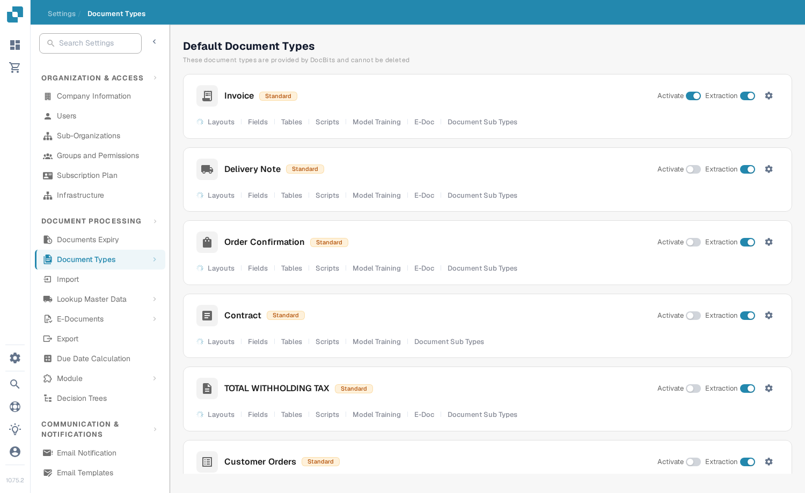
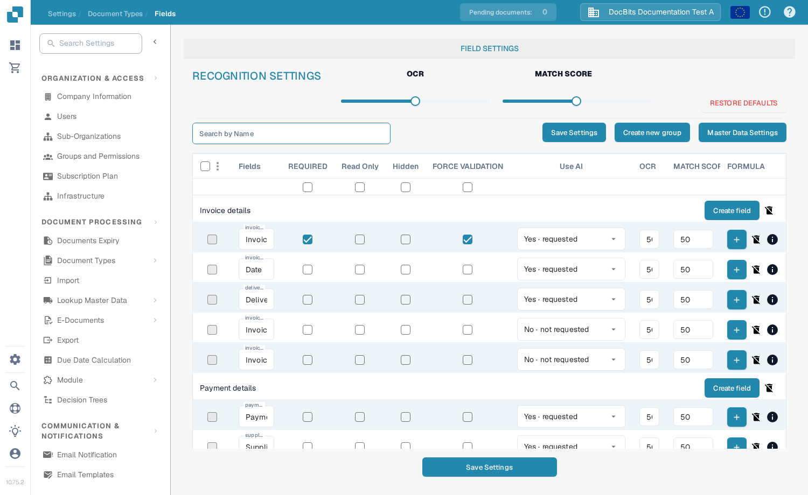
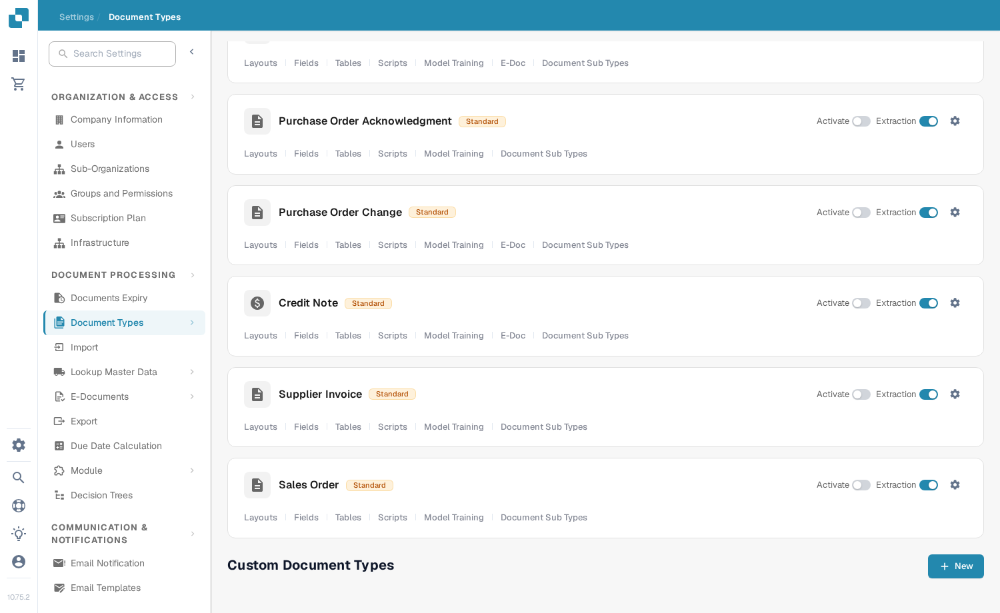

# Document Types

Document types tell DocBits which kinds of documents your organisation works with. An administrator can find them under **Settings → Document Types** in the **Document Processing** section of the settings menu.

The page shows **Default Document Types**, which DocBits provides and you cannot delete, followed by **Custom Document Types** created for your organisation. Each type has its own card.

<figure><figcaption>
Choose a document type card to configure that type.
</figcaption></figure>

## What you can do on a card

| Control | What it does |
| --- | --- |
| **Activate** | Makes this document type available or unavailable in your organisation. A blue switch is on; a grey switch is off. |
| **Extraction** | Chooses the extraction mode: **Flex** when on or **Fix** when off. It does not simply switch extraction on or off. Hover over the switch to see its current mode. |
| **Settings** (gear) | Opens **More Settings** for this type. Expand a category there to view its options. The categories depend on the document type. |
| **Layouts** | Opens the layout configuration. See [Layout Builder](layout-builder.md) for the next steps. |
| **Fields** | Opens the fields and recognition settings for this type. See [Fields](../../settings/global-settings/document-types/fields/README.md) for how to configure them. |
| **Tables** | Opens the table column configuration for this type. |
| **Scripts** | Opens processing scripts when this feature is available. |
| **Model Training** | Opens model training for this type. |
| **E-Doc** | Opens electronic document settings when the type supports them. |
| **Document Sub Types** | Opens the subtypes for this document type. |

You may see more links, such as validation or transformation rules, depending on your organisation's features. Choose the link on the card for the type you want to change.

## Edit fields and recognition settings

Click **Fields** on a card to view its field groups. At the top of that page, **OCR** and **Match Score** set recognition thresholds, **Restore Defaults** resets those thresholds, and **Search by Name** finds a field. Use **Create new group** to organise fields and **Create field** within a group to add one. **Master Data Settings** opens the related master data configuration.

Each field row has controls such as **Required**, **Read Only**, **Hidden**, **Force Validation**, **Use AI**, OCR, Match Score and Formula. Review the [Fields guide](../../settings/global-settings/document-types/fields/README.md) before changing individual values. Click **Save Settings** on the Fields page to keep your changes.

<figure><figcaption>
The Fields page has its own Save Settings button.
</figcaption></figure>

## Create a custom document type

Scroll to **Custom Document Types** and click **+ New**. Follow [Adding/Editing Document Types](../../settings/global-settings/document-types/adding-editing-document-types.md) to set up the new type.

<figure><figcaption>
Use New under Custom Document Types to begin creating a type.
</figcaption></figure>
