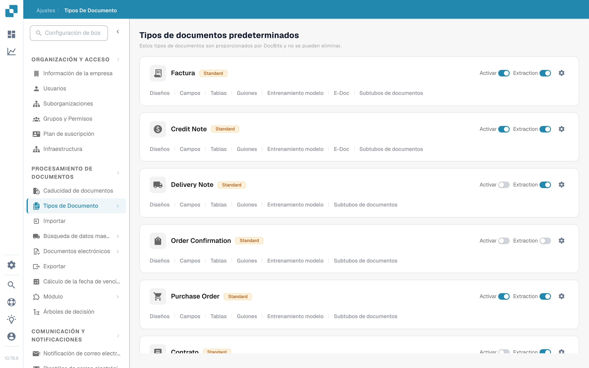
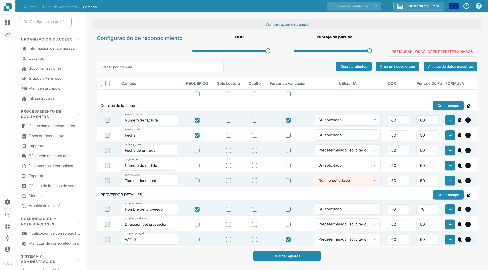
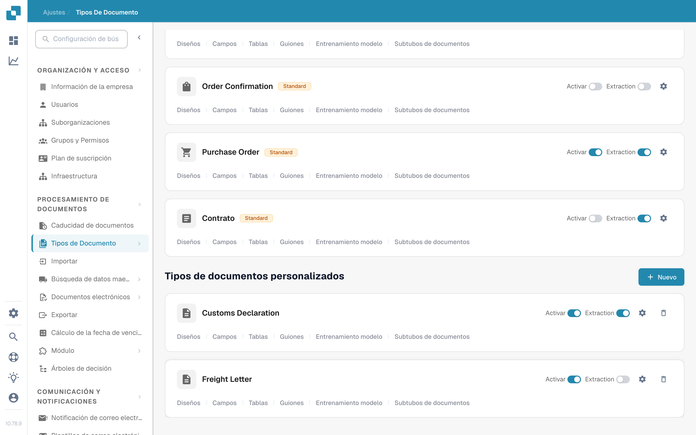

# Tipos de documentos

Los tipos de documentos indican a DocBits con qué clases de documentos trabaja su organización. Un administrador los encuentra en **Ajustes → Tipos de Documento**, dentro de la sección **Procesamiento de Documentos** del menú de ajustes.

La página muestra **Tipos de documentos predeterminados**, que DocBits proporciona y que no se pueden eliminar, seguidos de **Tipos de documentos personalizados**, creados para su organización. Cada tipo tiene su propia tarjeta.

<figure><figcaption>
Elija la tarjeta de un tipo de documento para configurar ese tipo.
</figcaption></figure>

## Qué puede hacer en una tarjeta

| Control | Qué hace |
| --- | --- |
| **Activar** | Activa o desactiva este tipo de documento en su organización. Un interruptor azul está activado; uno gris, desactivado. |
| **Extraction** | Elige el modo de extracción: **Flex** cuando está activado o **Fix** cuando está desactivado. No se limita a activar o desactivar la extracción. Pase el cursor sobre el interruptor para ver su modo actual. |
| **Ajustes** (icono de engranaje) | Abre **Más ajustes** de este tipo. Despliegue una categoría para ver sus opciones. Las categorías dependen del tipo de documento. |
| **Diseños** | Abre la configuración de diseños. Consulte [Constructor de Diseño](layout-builder.md) para los siguientes pasos. |
| **Campos** | Abre los campos y los ajustes de reconocimiento de este tipo. Consulte [Campos](../../settings/global-settings/document-types/fields/README.md) para configurarlos. |
| **Tablas** | Abre la configuración de columnas de tabla de este tipo. |
| **Guiones** | Abre los scripts de procesamiento cuando esta función está disponible. |
| **Entrenamiento modelo** | Abre el entrenamiento del modelo de este tipo. |
| **E-Doc** | Abre los ajustes de documentos electrónicos cuando el tipo los admite. |
| **Subtubos de documentos** | Abre los subtipos de este tipo de documento. |

Según las funciones de su organización, puede ver enlaces adicionales, como reglas de validación o de transformación. Elija el enlace de la tarjeta del tipo que quiera cambiar.

## Editar campos y ajustes de reconocimiento

Haga clic en **Campos** en una tarjeta para ver sus grupos de campos. En la parte superior de esa página, **Configuración de OCR** y **Puntaje de partido** definen los umbrales de reconocimiento, **Restaurar los valores predeterminados** restablece esos umbrales y **Buscar por nombre** encuentra un campo. Use **Crea un nuevo grupo** para organizar los campos y **Crear campo** dentro de un grupo para añadir uno. **Ajustes de datos maestros** abre la configuración de datos maestros relacionada.

Cada fila de campo tiene controles como **Requerido**, **Solo lectura**, **Oculto**, **Forzar la validación**, **Utilizar IA**, OCR, **Puntaje de partido** y **Fórmula**. Revise la [guía de Campos](../../settings/global-settings/document-types/fields/README.md) antes de cambiar valores individuales. Haga clic en **Guardar ajustes** en la página de Campos para conservar sus cambios.

<figure><figcaption>
La página de Campos tiene su propio botón Guardar ajustes.
</figcaption></figure>

## Crear un tipo de documento personalizado

Desplácese hasta **Tipos de documentos personalizados** y haga clic en **+ Nuevo**. Siga [Agregar/Editar Tipos de Documentos](../../settings/global-settings/document-types/adding-editing-document-types.md) para configurar el nuevo tipo.

<figure><figcaption>
Use Nuevo en Tipos de documentos personalizados para empezar a crear un tipo.
</figcaption></figure>
