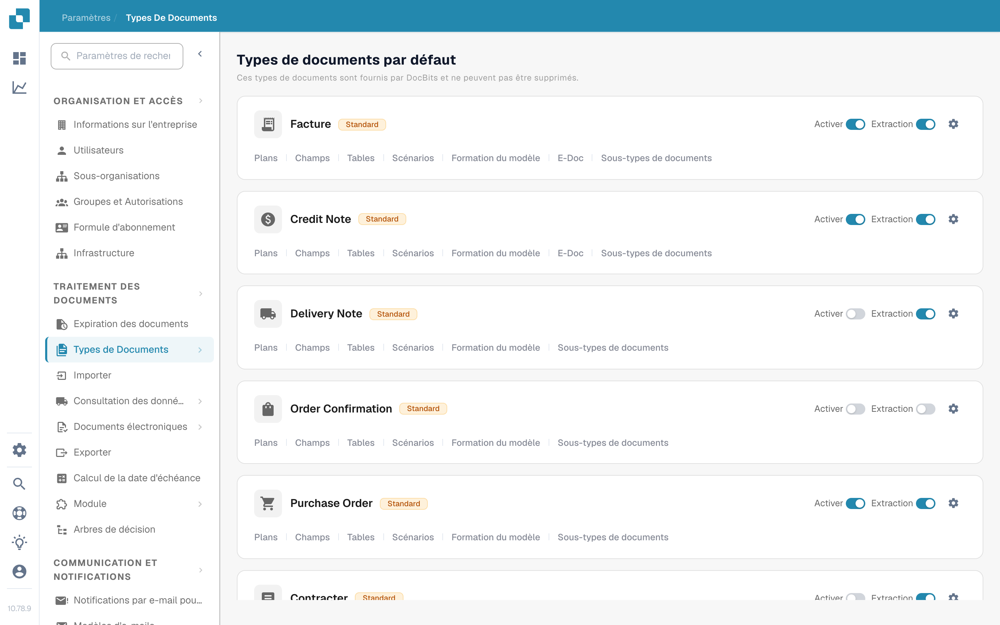
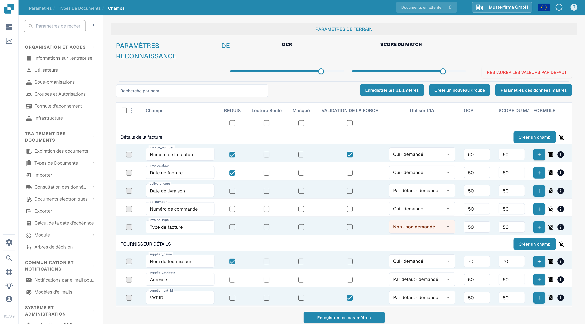
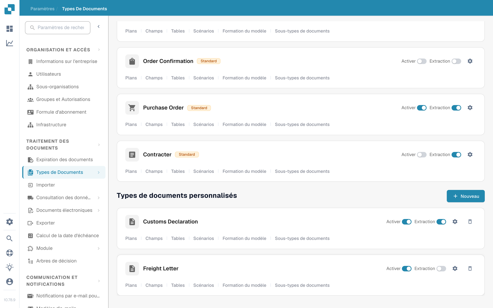

# Types de Document

Les types de documents indiquent à DocBits les types de documents utilisés par votre organisation. Un administrateur les trouve sous **Paramètres → Types de Documents** dans la section **Traitement des Documents** du menu des paramètres.

La page affiche d'abord les **Types de documents par défaut**, fournis par DocBits et impossibles à supprimer, puis les **Types de documents personnalisés** créés pour votre organisation. Chaque type possède sa propre carte.

<figure><figcaption>
Choisissez la carte d'un type de document pour configurer ce type.
</figcaption></figure>

## Ce que vous pouvez faire sur une carte

| Commande | Ce qu'elle fait |
| --- | --- |
| **Activer** | Rend ce type de document disponible ou indisponible dans votre organisation. Un interrupteur bleu est activé ; un interrupteur gris est désactivé. |
| **Extraction** | Choisit le mode d'extraction : **Flex** quand l'interrupteur est activé, **Fix** quand il est désactivé. Ce n'est pas un simple interrupteur marche/arrêt de l'extraction. Survolez l'interrupteur pour voir son mode actuel. |
| **Paramètres** (roue d'engrenage) | Ouvre **Plus de paramètres** pour ce type. Déroulez une catégorie pour voir ses options. Les catégories dépendent du type de document. |
| **Plans** | Ouvre la configuration des mises en page. Voir [Layout Builder](layout-builder.md) pour les étapes suivantes. |
| **Champs** | Ouvre les champs et les paramètres de reconnaissance de ce type. Voir le guide [Champs](../../settings/global-settings/document-types/fields/README.md) pour les configurer. |
| **Tables** | Ouvre la configuration des colonnes de tableau pour ce type. |
| **Scénarios** | Ouvre les scripts de traitement lorsque cette fonctionnalité est disponible. |
| **Formation du modèle** | Ouvre la formation du modèle pour ce type. |
| **E-Doc** | Ouvre les paramètres de documents électroniques lorsque le type les prend en charge. |
| **Sous-types de documents** | Ouvre les sous-types de ce type de document. |

Selon les fonctionnalités de votre organisation, vous verrez peut-être d'autres liens, par exemple des règles de validation ou de transformation. Choisissez le lien de la carte du type que vous souhaitez modifier.

## Modifier les champs et les paramètres de reconnaissance

Cliquez sur **Champs** sur une carte pour afficher ses groupes de champs. En haut de cette page, **OCR** et **Score du Match** définissent les seuils de reconnaissance, **Restaurer les valeurs par défaut** réinitialise ces seuils, et **Recherche par nom** permet de trouver un champ. Utilisez **Créer un nouveau groupe** pour organiser les champs et **Créer un champ** dans un groupe pour en ajouter un. **Paramètres des données maîtres** ouvre la configuration des données maîtres associée.

Chaque ligne de champ dispose de commandes telles que **Requis**, **Lecture seule**, **Masqué**, **Validation forcée**, **Utiliser l'IA**, OCR, Score du Match et Formule. Consultez le [guide des Champs](../../settings/global-settings/document-types/fields/README.md) avant de modifier des valeurs individuelles. Cliquez sur **Enregistrer les paramètres** sur la page Champs pour conserver vos modifications.

<figure><figcaption>
La page Champs possède son propre bouton Enregistrer les paramètres.
</figcaption></figure>

## Créer un type de document personnalisé

Faites défiler jusqu'à **Types de documents personnalisés** et cliquez sur **+ Nouveau**. Suivez [Ajouter/Modifier des Types de Documents](../../settings/global-settings/document-types/adding-editing-document-types.md) pour configurer le nouveau type.

<figure><figcaption>
Utilisez Nouveau sous Types de documents personnalisés pour commencer à créer un type.
</figcaption></figure>
