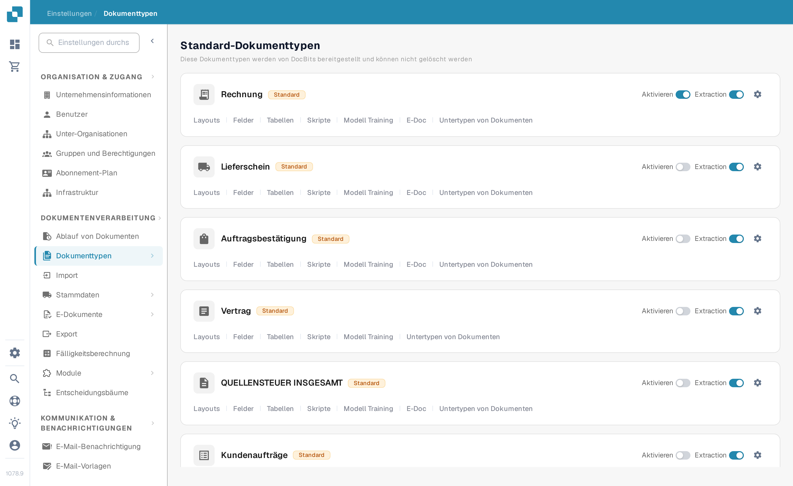
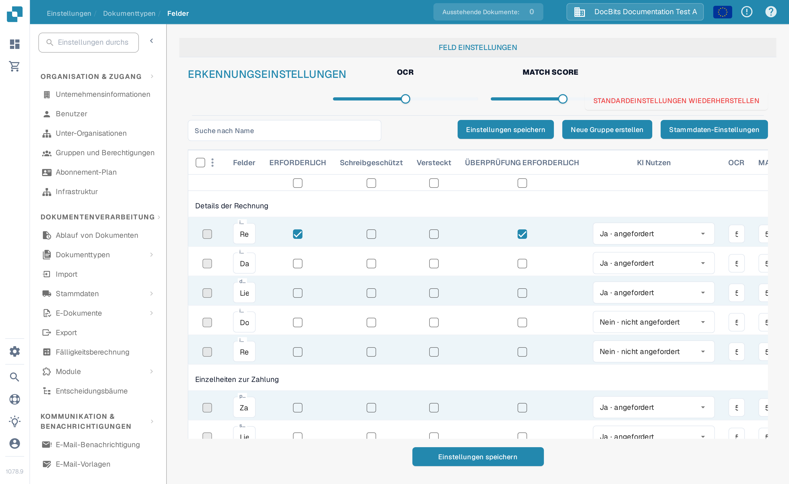
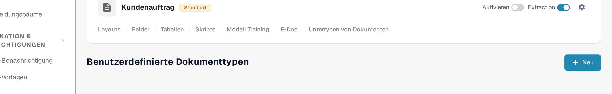

# Dokumenttypen

Dokumenttypen geben an, mit welchen Dokumentarten Ihre Organisation arbeitet. Administratoren finden sie unter **Einstellungen → Dokumenttypen** im Bereich **Dokumentenverarbeitung** des Einstellungsmenüs.

Die Seite zeigt zuerst **Standard-Dokumenttypen**, die DocBits bereitstellt und die Sie nicht löschen können, darunter **Benutzerdefinierte Dokumenttypen**, die für Ihre Organisation erstellt wurden. Jeder Typ hat eine eigene Karte.

<figure><figcaption>
Wählen Sie die Karte eines Dokumenttyps aus, um diesen Typ zu konfigurieren.
</figcaption></figure>

## Das können Sie auf einer Karte tun

| Bedienelement | Funktion |
| --- | --- |
| **Aktivieren** | Macht diesen Dokumenttyp in Ihrer Organisation verfügbar oder deaktiviert ihn. Ein blauer Schalter steht auf An, ein grauer auf Aus. |
| **Extraction** | Wählt den Extraktionsmodus: **Flex** bei aktiviertem, **Fix** bei deaktiviertem Schalter. Der Schalter schaltet die Extraktion nicht einfach ein oder aus. Fahren Sie mit der Maus über den Schalter, um den aktuellen Modus zu sehen. |
| **Einstellungen** (Zahnrad) | Öffnet **Weitere Einstellungen** für diesen Typ. Klappen Sie dort eine Kategorie auf, um ihre Optionen zu sehen. Die Kategorien hängen vom Dokumenttyp ab. |
| **Layouts** | Öffnet die Layout-Konfiguration. Die nächsten Schritte beschreibt [Layout-Builder](layout-builder.md). |
| **Felder** | Öffnet die Felder und Erkennungseinstellungen für diesen Typ. Wie Sie diese konfigurieren, steht im Leitfaden [Felder](../../settings/global-settings/document-types/fields/README.md). |
| **Tabellen** | Öffnet die Tabellenspalten-Konfiguration für diesen Typ. |
| **Skripte** | Öffnet die Verarbeitungsskripte, wenn diese Funktion verfügbar ist. |
| **Modell Training** | Öffnet das Modell-Training für diesen Typ. |
| **E-Doc** | Öffnet die Einstellungen für elektronische Dokumente, wenn der Typ diese unterstützt. |
| **Untertypen von Dokumenten** | Öffnet die Untertypen dieses Dokumenttyps. |

Je nach Funktionen Ihrer Organisation sehen Sie weitere Links, etwa für Validierungs- oder Transformationsregeln. Wählen Sie den Link auf der Karte des Typs, den Sie ändern möchten.

## Felder und Erkennungseinstellungen bearbeiten

Klicken Sie auf einer Karte auf **Felder**, um die Feldgruppen des Typs zu sehen. Oben auf dieser Seite setzen **OCR** und **MATCH SCORE** die Erkennungs-Schwellenwerte, **STANDARDEINSTELLUNGEN WIEDERHERSTELLEN** setzt diese Werte zurück, und **Suche nach Name** findet ein Feld. Mit **Neue Gruppe erstellen** ordnen Sie Felder in Gruppen, und **Feld erstellen** fügt innerhalb einer Gruppe ein Feld hinzu. **Stammdaten-Einstellungen** öffnet die zugehörige Stammdaten-Konfiguration.

Jede Feldzeile enthält Bedienelemente wie **ERFORDERLICH**, **Schreibgeschützt**, **Versteckt**, **ÜBERPRÜFUNG ERFORDERLICH**, **KI Nutzen**, OCR, Match Score und Formel. Lesen Sie den [Felder-Leitfaden](../../settings/global-settings/document-types/fields/README.md), bevor Sie einzelne Werte ändern. Klicken Sie auf der Felder-Seite auf **Einstellungen speichern**, damit Ihre Änderungen erhalten bleiben.

<figure><figcaption>
Die Felder-Seite hat einen eigenen Knopf „Einstellungen speichern“.
</figcaption></figure>

## Einen eigenen Dokumenttyp anlegen

Scrollen Sie zu **Benutzerdefinierte Dokumenttypen** und klicken Sie auf **Neu**. Wie Sie den neuen Typ einrichten, beschreibt [Dokumenttypen hinzufügen/bearbeiten](../../settings/global-settings/document-types/adding-editing-document-types.md).

<figure><figcaption>
Beginnen Sie unter „Benutzerdefinierte Dokumenttypen“ mit **Neu**, um einen Typ anzulegen.
</figcaption></figure>
