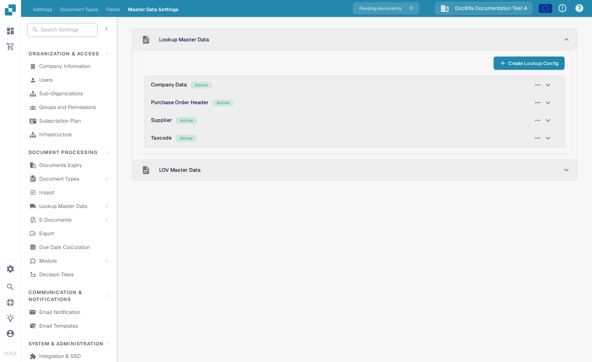
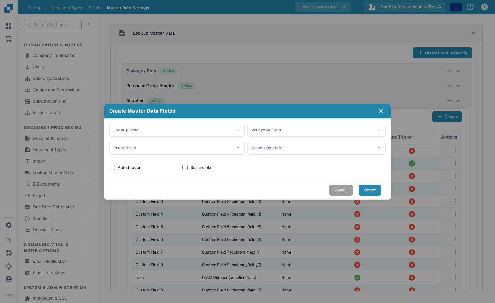

# Fuzzy Data Configuration with Master Data

Use a master-data lookup to recognise a supplier from values on an invoice. The lookup searches an imported dataset and can fill the document's supplier fields. Configure each document type separately. The example here uses **Invoice** in the synthetic **DocBits Documentation Test A** organization.

## Open the lookup settings

1. Open **Settings → Document Processing → Document Types**.
2. Select **Invoice → Fields → Master Data Settings**.
3. Expand **Lookup Master Data**. The test organization shows **Company Data**, **Purchase Order Header**, **Supplier**, and **Taxcode**. Your organization may have additional configurations.

<figure><figcaption>
Select a lookup group to inspect its fields or choose Create Lookup Config for a new one.
</figcaption></figure>

The **Active** label shows that a configuration is enabled. Use the three-dot menu to inspect available actions such as activating, deactivating, duplicating, or editing a configuration. Default configurations can be viewed but cannot be edited or deleted; a custom configuration has more actions. Do not deactivate a lookup until you have checked which document fields depend on it.


The relevant supplier master data must be imported before a lookup can find it. See [Importing Master Data](../../../infor-integration-and-configuration/importing-customer-master-data/README.md) and [Master Data Settings](../../settings/global-settings/document-types/fields/master-data-settings.md) for the broader setup.


## Create a lookup configuration

Select **Create Lookup Config**. Enter a **Lookup Name**, choose a **Lookup Dataset Name**, and set **Context Type** to **HEADER** for document fields or **LINE** for a table. For **LINE**, also choose the relevant table as **Context Detail**. Set **Conflict Handler** to decide what happens when several records match. **Match All** requires every used search field to match the same record; with it off, one matching field can be enough.

<figure><figcaption>
The dialog was opened for documentation; no configuration was created.
</figcaption></figure>

The conflict choices are **Best Score**, **Return None**, and **Return First**. Use **Return None** when a person should decide between ambiguous suppliers; review the worked examples below before choosing **Best Score** or **Match All**.

## Choose fields for supplier recognition

Expand **Supplier** to see its mappings. The table shows the dataset **Lookup Field**, its **Validation Field** on the document, optional **Parent Field**, and whether **Searchable** or **Auto Trigger** is enabled. In Test A, Supplier Name is searchable and Supplier Number is an auto trigger; those flags may differ in another organization.

<figure><figcaption>
Check which fields can participate in supplier recognition before changing the match rule.
</figcaption></figure>

To add a mapping, select **Create** inside the expanded group, then choose **Lookup Field**, **Validation Field**, optional **Parent Field**, and **Search Operator**. The operator determines how text is compared; use **Exact** for a strict identifier and consider **Smart** or **Contains** only when partial text should match. **Auto Trigger** starts a lookup after that document field receives a value. **Searchable** includes it in search and makes manual lookup available during validation. Select **Create** only after checking the mapping.

<figure><figcaption>
The form was inspected without saving a new field.
</figcaption></figure>

The worked examples below explain how these flags, Match All, and the conflict handler interact. No live supplier-recognition result was generated for this documentation check.

### **How DocBits Picks One Supplier**

When a document arrives, DocBits searches your master data for the supplier. Three settings decide the result. This section explains them step by step, with examples.

#### **Step 1 — Which fields are used for the search**

DocBits uses a field for the search only when both points are true:

* the field is ticked **Searchable** or **Auto Trigger** in the lookup configuration, and
* the field has a value on the document.

How the value got into the field does not matter. A trained field, a field filled by AI and a value typed by a user are all treated the same.


**Searchable does two things.** It shows the blue search icon in the validation screen, **and** it adds the field to the automatic supplier search. A field that you only want to search by hand should stay unticked.


#### **Step 2 — One search, not one search per field**

DocBits does **not** search each field on its own. It builds **one** search over all used fields. **Match All** decides how they are combined:

* **Match All off** (default) → "find every supplier that matches the Tax ID **OR** the supplier name". This gives a **longer** list.
* **Match All on** → "find every supplier that matches the Tax ID **AND** the supplier name". This gives a **shorter** list.

Keep in mind that the search operators **Smart** and **Contains** look for a part of the text. The name "Meier" also finds "Meier Bau GmbH" and "Meier & Sons Ltd". A supplier name therefore often finds several suppliers.

#### **Step 3 — What happens when the list has more than one supplier**

The **Conflict Handler** decides:

* **Best Score** → takes the supplier that matches the most fields. Never leaves the supplier empty.
* **Return None** → leaves the supplier empty, so that a user picks it.
* **Return First** → takes the first supplier of the list.

#### **Examples**

In all examples the document carries a Tax ID and a supplier name, and both fields are **Searchable**.

<table><thead><tr><th width="150">Tax ID finds</th><th width="150">Name finds</th><th width="150">Match All off + Return None</th><th width="150">Match All on + Return None</th><th width="150">Match All off + Best Score</th></tr></thead><tbody>
<tr><td>only A</td><td>A and B</td><td>empty</td><td><strong>A</strong></td><td><strong>A</strong></td></tr>
<tr><td>A and B</td><td>only B</td><td>empty</td><td><strong>B</strong></td><td><strong>B</strong></td></tr>
<tr><td>A, B and C</td><td>C, D and E</td><td>empty</td><td><strong>C</strong></td><td><strong>C</strong></td></tr>
<tr><td>A, B and C</td><td>B, C and D</td><td>empty</td><td>empty</td><td>B or C, not reliable</td></tr>
<tr><td>only A</td><td>nothing</td><td><strong>A</strong></td><td>empty</td><td><strong>A</strong></td></tr>
</tbody></table>

How to read the table:

* **Rows 1 to 3** are the normal case. One field is unique, the other one is not. With **Match All off** the list holds several suppliers and **Return None** leaves the field empty. **Match All on** keeps only the supplier that matches both fields and finds it.
* **Row 4** has no unique supplier at all. Leaving it empty is correct. **Best Score** still picks one of them, which can be the wrong supplier.
* **Row 5** is the risk of **Match All on**. See the warning below.


**Match All can lose a supplier.** With **Match All on** every used field must match. If one field carries a value that does not exist in your master data — a typo, an old company name, a value read from the page — the whole search returns nothing and no supplier is found, even though the Tax ID alone would have found the right one.


#### **A supplier was recognised before and is not recognised any more**

Almost always one more field started to deliver a value. Check in this order:

1. Open the document. Which field of the lookup group now carries a value that used to be empty?
2. Open the lookup configuration. Is that field ticked **Searchable** or **Auto Trigger**? If yes, it now takes part in the search and makes the result list longer.
3. Choose one of the three ways out:
   * **The field should not take part in the search** → untick **Searchable** and **Auto Trigger** for that field. The field keeps its value on the document and is still shown to the user. This is the smallest change.
   * **The field should take part** → switch **Match All** on, but read the warning above first.
   * **You want a supplier in every case** → set the **Conflict Handler** to **Best Score**. Accept that it can pick the wrong supplier instead of leaving the field empty.

### **Final Step: Adding Fields to the Layout**

After configuring Fuzzy Data fields, **make sure to add them to the layout using the Layout Builder**. If fields are not added to the layout, they will not be available for use.

[Layout Builder](layout-builder.md)
