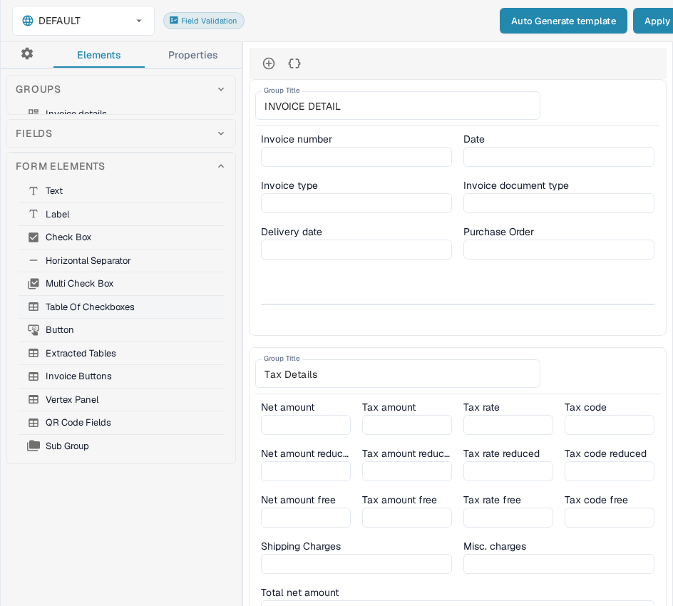
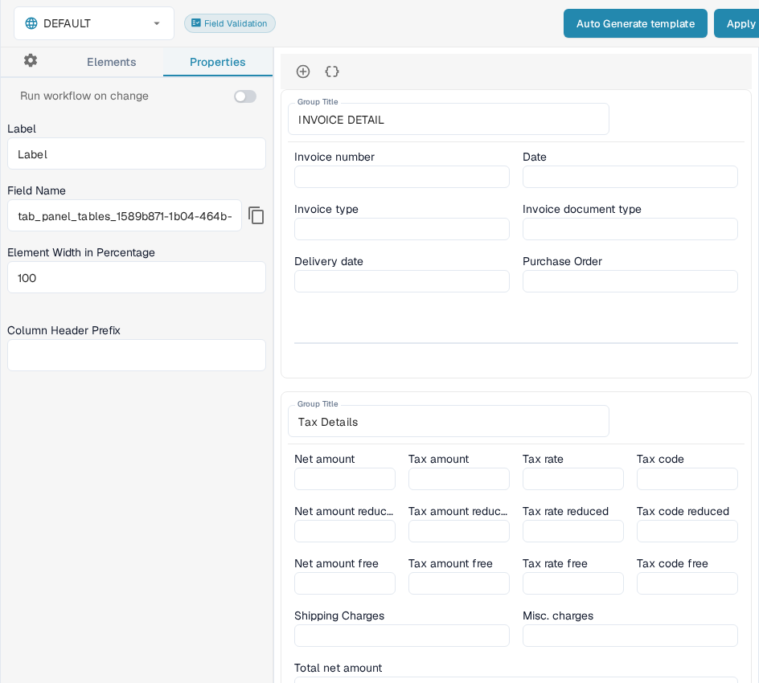

# Layout Builder

Use the Layout Builder to arrange the fields and controls that people see when they validate a document. Changes to the layout affect the selected document type and layout, so check your selection before saving.

## Open the layout

1. Open **Settings → Document Types**.
2. Select the document type you want to edit and open **Layout Builder**. For a document subtype, open that subtype's Layout Builder action.
3. Check the selection at the top left. The example below uses the **INVOICE** document type, the **DEFAULT** origin, and the **Field Validation** layout. If Layout Builder is unavailable, an administrator may need to enable the module for your organization.

<figure><figcaption>
Confirm the document type, origin, and layout before editing.
</figcaption></figure>

## Arrange groups and fields

The **Elements** tab contains three lists:

| List | Use it for |
| --- | --- |
| **Groups** | Arrange sections such as Invoice details, Payment details, and Purchase Order. |
| **Fields** | Add fields configured for the selected document type. Create or rename reusable document fields in [Document Types](README.md) first. |
| **Form Elements** | Add presentation and interaction controls such as Text, Label, Check Box, separators, tables, buttons, and subgroups. |

Select or drag an item into the central layout. The central area shows how the groups and fields are arranged. A group title tells the person validating the document what belongs in that section.

<figure><figcaption>
Open Form Elements to see the controls available for this layout.
</figcaption></figure>

## Change an element's properties

Select an element in the layout, then open **Properties** on the left. The options depend on the selected element. In the example shown, you can change its **Label**, inspect its **Field Name**, and set **Element Width in Percentage**. Use the width to give fields more or less space in a row; check the result in the central layout. For more detail, see [Configuring Field Properties](../../settings/global-settings/document-types/layout-manager/configuring-field-properties.md).

<figure><figcaption>
Select an element before changing its properties.
</figcaption></figure>

## Review and save

The right side of the Layout Builder is the document preview area. Its upload control can be used with an example document when a preview is needed. In this sandbox capture, the example document image did not load, so these screenshots demonstrate the editor and properties only.

Use **Save** at the top right when the arrangement is correct. **Auto Generate template** and **Use default template** can replace a custom layout; review the selected document type and layout before using either action. **Edit JSON** is for advanced configuration and should be used only when you understand the template format. For origin-specific layouts, see [Origin Layouts](origin-layouts.md).


The screenshots show synthetic settings in DocBits Documentation Test A with English selected in the application. No layout was saved or replaced while capturing them.

